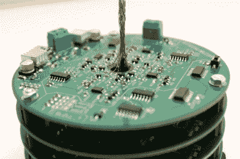

# 像蜡烛一样熄灭的 led 树

> 原文：<https://hackaday.com/2019/12/11/a-tree-of-leds-that-blows-out-like-a-candle/>

[Andrew]的 LED 圣诞树做工精美，本身就很棒，当然还有比看上去更好的地方。这种 LED 树可以像蜡烛一样被吹灭，它甚至开玩笑地挑战用户一口气吹灭所有的灯。

 你们中的一些人可能还记得一个有趣的例子，一个可以像蜡烛一样吹灭的[LED](https://hackaday.com/2018/08/21/an-led-you-can-blow-out-with-no-added-sensor/)使用 LED 本身作为传感器。与任何二极管一样，LED 两端的压降会随着温度的变化而发生微小变化。通过使用表面贴装 LED 和须状细线来最小化热质量，可以检测 LED 何时被点亮。

这里显示的 LED 树使用相同的基本原理，但有一些重要的变化。电子设备经过了重新设计和改进，最初的概念验证中使用的 Arduino 被抛弃，用于堆叠的定制 PCB。每块电路板的直径都小于 100 毫米，以便利用工厂对小型电路板的低成本优势。[Andrew]说，虽然这些电路板需要大量耗时的手工焊接和组装，但回报是五块电路板的价格仅为五美元(加上运费)，这是难以超越的。

观看下面嵌入的简短视频中的树木。

 [https://www.youtube.com/embed/KnDVYEF5fC8?version=3&rel=1&showsearch=0&showinfo=1&iv_load_policy=1&fs=1&hl=en-US&autohide=2&wmode=transparent](https://www.youtube.com/embed/KnDVYEF5fC8?version=3&rel=1&showsearch=0&showinfo=1&iv_load_policy=1&fs=1&hl=en-US&autohide=2&wmode=transparent)

