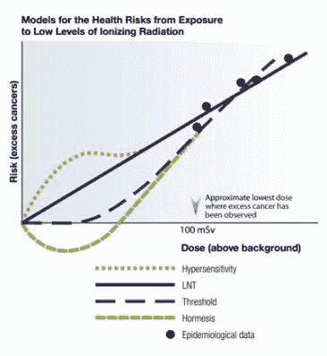
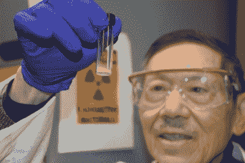
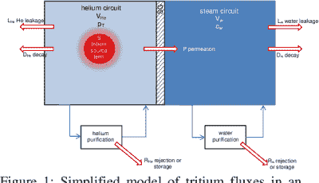

# 一个氚的故事:你应该有多害怕氢的老大哥？

> 原文：<https://hackaday.com/2021/10/12/a-tritium-story-how-afraid-should-you-be-of-hydrogens-big-brother/>

尽管氚存在于一切含水的物质中，但它并不是许多人在选择(极客)渠道之外所熟悉的同位素，例如戴着含氚徽章的 DEF CON，总是很出色的 NurdRage 组装的基于氚的原子电池，或者基于氚磷的发光立方体，或者是 T4 的。

氚是一种氢同位素，它与它的两个兄弟姐妹 ¹ H(氕)和 ² H(氘)有很多共同的特征，主要区别是氚( ³ H)不是一种稳定的同位素，半衰期约为 12.32 年，它会衰变为 ³ He。地球上大多数自然产生的氚来自宇宙辐射的快速中子(> 4.0 MeV)和大气氮之间的相互作用。

最近，由于日本福岛第一核电站宣布释放处理过的水，氚已经成为一个政治热点话题。这给许多人提出了一个问题，到底有多少氚是“太多”的，我们可能会注意到这种经过处理但仍然含氚的水被释放到海洋中。

## 贝克勒尔与等效剂量

The LNT model versus other models and measurements. (Source: CNSC)

在评估暴露于放射性的风险时，线性非阈值( [LNT](http://nuclearsafety.gc.ca/eng/resources/health/linear-non-threshold-model/index.cfm) )模型是最常用的。该模型基本上声称，在暴露于辐射和患癌症的机会以及可能由所述暴露引起的其他负面副作用之间存在完美的线性匹配。

最近的多项研究表明，事实并非如此简单。在不同类型的辐射对身体不同部位的不同影响和身体修复细胞损伤能力的作用之间，现实情况是我们看到一种更接近于通常所说的辐射兴奋作用的影响。这个理论认为，在低剂量下，辐射甚至是有益的。

尽管这看起来有些牵强，但对小鼠模型的研究，如 [Bannister 等人(2016)](https://meridian.allenpress.com/radiation-research/article-abstract/186/6/539/192936/Environmentally-Relevant-Chronic-Low-Dose-Tritium) 和 [Khan 等人(2021)](https://www.mdpi.com/1422-0067/22/14/7303/htm) ，显示暴露于氚的β辐射后脾脏没有细胞毒性或基因毒性(Bannister 等人)，或发现暴露于低剂量辐射后免疫系统上调(LDR、Khan 等人)。正如 Khan 等人指出的，文献中的现有证据表明 LDR 对人体免疫系统有积极影响，这可能对我们理解癌症治疗等有重大影响。

这些研究也让我们知道我们应该有多害怕，例如葡萄酒中的辐射，正如 Tonev 等人(2018)所研究的那样。在这里， ^(137) Cs， ^(40) K 和 ³ H 的水平被用来尝试和确定葡萄酒的年份，以帮助识别被冒充为更古老年份的葡萄酒。他们对 2001 年份的梅尔尼克(保加利亚)葡萄酒的检测结果是，铯的含量为 0.15 Bq/L，而 1986 年的含量为 44.6 Bq/L，这是由切尔诺贝利核电站 4 号核反应堆的辐射尘造成的。

同时， ³ H 水平在大约 7 到 63 Bq/L 之间波动，而天然钾-40 ( ^(40) K)在 15 到 20 Bq/L 之间波动。我们[可以使用加拿大核安全委员会(CNSC)提供的信息，将这个](http://nuclearsafety.gc.ca/eng/resources/health/health-studies/tritium/environmental_fate_of_tritium_in_the_atmosphere.cfm)与大气和地表水的自然 ³ H 水平进行比较，作为其[氚研究](http://nuclearsafety.gc.ca/eng/resources/health/tritium/tritium_studies.cfm)的一部分。雨水中的氚含量预计约为 0.6 Bq/L，而地表水的氚含量在 0.37 至 1.11 Bq/L 之间。

1945 年至 1976 年期间，大气层核武器试验提高了环境中的氚水平，估计产生了 1.7 x 10 ^(20) Bq 的氚。这种氚会以类似于天然(宇宙射线)氚的方式逐渐离开大气层，最终进入地表水，并从那里进入生物体和地下水。

在福岛第一核电站，大约有 860 TBq (0.86 x 10 ^(15) Bq)的氚被储存在许多升水中。氚本身是所谓的[氚化](https://en.wikipedia.org/wiki/Tritiated_water)水(HTO，T [2] O，或超重水)的一部分，它在化学上几乎与 H [2] O 和 D [2] O(含氘重水)没有区别，这就是为什么它不容易从 H [2] O 中分离出来的原因。基于重水的加拿大 CANDU 反应堆(HWR)在正常运行中每年释放大约 430 TBq，而像西屋的 T11 这样的 PWR

考虑到福岛第一核电站的氚水将在数年内逐渐释放，并被海水严重稀释，这应该表明，与世界各地正在运行的核电站释放的量相比，释放的量微不足道。那就没什么好担心的了。

## 海洋很大

PNNL scientist holding up vial with 5 grams of yellowcake recovered from seawater. (Source: PNNL)

大约四分之三的地球表面被水覆盖，有大量的水来稀释像氚水这样的东西，以及例如铀，据 [PNNL 报道，2018 年从海水中回收了](https://www.pnnl.gov/news/release.aspx?id=4514) 5 克黄饼(铀)。据估计，海水中至少有 40 亿吨铀，稀释到约十亿分之三，在未来的某个时间点回收会变得经济。

当谈到例如饮用水时，我们已经接受了其中总会有一定量的重金属、矿物质以及放射性同位素(例如氡、铀和氚)的说法。这就是为什么各国对饮用水中可接受的含量设定了限制。对于氚化水，这一数值相差很大，澳大利亚接受超过 76，000 Bq/L，而芬兰的目标是 100 Bq/L，即大约 5 升相当于 40k 的梅尔尼克葡萄酒。

这里值得注意的一点是，钾-40 的行为就像它的稳定钾形式一样，当它涉及到它的生物学作用时。这样一来，一个体重 70 公斤的成年人体，就会含有约 140 克的钾。以 0.0117%的自然发生率计算，这意味着每秒钟大约有 0.0164 克的同位素和大约 4,300 Bq 的β衰变。

由于 H 和 K 都是β辐射源，但只有钾以任何显著的方式进行生物积累，这在理论上使得吃香蕉比喝氚水更危险，即使 HTO 含量相对较高。不出所料，在世卫组织建议的饮用水中 0.01 MBq/L 的水平下， [Guéguen 等人(2018 年)](https://onlinelibrary.wiley.com/doi/full/10.1002/em.22200?af=R)报告称，对小鼠模型的组织没有明显的生理影响。

## 降低总是可能的

Figure 1: Simplified model of tritium fluxes in an HTR system coupled to a SG. (Credit: Fütterer et al. 2016)

氚的产生并不是核反应堆的目标，而是作为一种副作用出现的，压水反应堆(PWRs)在其主回路中使用[硼酸](https://en.wikipedia.org/wiki/Boric_acid)作为中子毒物，以帮助减缓核链式反应。硼-10 ( ^(10) B)有时可以捕获一个中子并产生 ⁴ He 和 ³ H，同样，在 CANDU 这样的重水反应堆(HWRs)中，氘也会捕获中子并转化为氚。

反应堆主回路中产生的大部分氚仍留在那里，并在某个时候被移除，用于商业和其他应用。因为氚是氢的同位素，所以它也有氢的另一个令人惊奇的特性:忽略试图控制它的能力。很像由于 T2 氢渗透，包含氚是一个问题，核反应堆也有在主回路中包含氚的问题。 [Fütterer 等人(2016)](https://www.semanticscholar.org/paper/Is-tritium-an-issue-for-high-temperature-reactors-F%C3%BCtterer-D%E2%80%99Agata/dc222934416ca76d5ec434a2d2dc96acbd4ba0d4) 详细报道了即将到来的第四代高温反应堆的这个问题，该反应堆使用氦气作为冷却剂。

通常，一些氚渗透到二次回路的点是通过热交换器。这些设备的传热效率很重要，这意味着薄壁(镍合金)。虽然这些热交换器能够抵抗氢扩散引起的脆化，但它们确实允许一些氢渗透进来，最终进入涡轮机和冷却水中，或者释放到附近的水体中，或者释放到冷却塔中的大气中。

由于重水反应堆和压水堆在主回路正常运行时会产生大量的氚，这意味着相对更多的氢(因此是氚)会渗透到二回路中。用于热交换器的新合金可以减少二次回路中渗透的氚的量，或者更有效的捕获机制可以使得二次回路中即使少量的氚也能够被过滤掉。

所有这些对于未来的核聚变反应堆也很重要，未来的核聚变反应堆通常使用氘-氚(D-T)燃料混合物，随着氢在工业和其他应用中的使用增加，所有这些也很重要。含有氢同位素是必不可少的，不管它是裂变反应堆中的废物、工业过程中的成分、燃料还是能量载体。

## 放射性世界

也许 LNT 模型最有害的部分是它制造了一种幻觉，认为零辐射的世界是可能的，或者至少是非常令人向往的。这就是媒体关于“氚的 TBqs 值”的声明没有进一步的背景和明显的空白，当涉及采访例如物理学家和该领域的其他专家(如国际原子能机构的那些专家)时，这些声明毫无用处。

虽然核电厂和其他人工来源(如废弃的氚电池和自发光标志)释放氚是不可取的，需要研究进一步限制其影响的方法，但这不是一个重大问题。毕竟，我们生活在一个本身具有放射性的星球上，受到大气层的保护，在很大程度上保护我们免受宇宙射线和其他辐射危害。

就像生活中的大多数事情一样，快乐的关键在于找到正确的视角。

【标题图片:夜晚的福岛第一核电站。(来源:东京电力公司)]