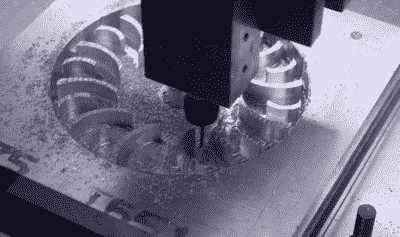

# 受 V2 火箭启发的蒸汽涡轮滑板即将面世

> 原文：<https://hackaday.com/2022/04/12/a-v2-rocket-inspired-steam-turbine-skateboard-is-just-around-the-corner/>

[Integza]从未忘记他无数次(有时非常粗略)的尝试，通过几乎所有可能的方式创造可用的推力，最新的视频(嵌入下方)[试图通过分解过氧化氢运行反应涡轮](https://www.youtube.com/watch?v=A1H2mFEsbNk)，没有失败。灵感来自于[二战 V2 火箭](https://hackaday.com/2019/02/05/operation-backfire-witness-to-the-rocket-age/)，它使用高锰酸钠分解过氧化氢。这产生了高压蒸汽，使涡轮旋转，进而驱动涡轮泵，将所需的大量酒精和液态氧送入燃烧室。

在对这种高锰酸盐-过氧化氢反应的初步测试被证明有些令人失望(和混乱)后，他转向了一种更可控的方法——使用汽油摩托车上的催化转化器代替混乱的高锰酸盐。这奏效了，所以下一个任务是建造涡轮机。很自然，这是 3D 打印的，最终的设计似乎在压缩空气作为动力源的情况下工作得很好。在扩大设计规模，并转向数控加工铝，它开始看起来有点严重。最终测试显示，涡轮机正在通过其步伐，从新的贵金属催化剂设置运行，但从视频中可以看出，还有工作要做。

 似乎有相当数量的液态过氧化物通过进入涡轮，这显然是不可取的。也许接下来的变化应该是垂直安装催化剂，以防止液体轻易离开，以及增加一些挡板来控制液体的流动，以迫使它在反应容器内循环？我们迫不及待地想看看这将走向何方，希望蒸汽涡轮驱动的滑板想法实际上是可行的？谁知道呢？但我们相信[Integza]会找到办法的！

利用蒸汽动力，有不止一种方法来获得可用的旋转功，[比如使用往复式发动机](https://hackaday.com/2021/12/22/you-can-3d-print-a-working-reciprocating-steam-engine/)，这可以扩展到[一个整机车间](https://hackaday.com/2015/08/19/steam-powered-machine-shop/)，而沸水(或催化分解过氧化氢)提供高压气体，[只用沸腾的液氮](https://hackaday.com/2021/07/28/liquid-nitrogen-isnt-suitable-for-steam-engines/)怎么样？可能不会。

 [https://www.youtube.com/embed/A1H2mFEsbNk?version=3&rel=1&showsearch=0&showinfo=1&iv_load_policy=1&fs=1&hl=en-US&autohide=2&wmode=transparent](https://www.youtube.com/embed/A1H2mFEsbNk?version=3&rel=1&showsearch=0&showinfo=1&iv_load_policy=1&fs=1&hl=en-US&autohide=2&wmode=transparent)

