# B-17 的虚拟之旅

> 原文：<https://hackaday.com/2019/09/24/a-virtual-tour-of-the-b-17/>

波音 B-17“飞行堡垒”可以说是第二次世界大战最知名的飞机。因在德国上空进行大胆的日间战略轰炸而臭名昭著，1939 年至 1945 年间生产了超过 12，000 架这种四引擎轰炸机。由于这种飞机在战斗中的幸存率很高，大约 60%的人熬过了战争，回到了美国的家，却在所谓的“坟场”被集中起来，最终被切碎并作为废品出售。今天，世界上还剩下不到 50 架完好的波音 B-17，其中只有 11 架还能飞行。

其中一架是 1945 年 4 月 7 日制造的 B-17G*九-O-九*。这架特殊的飞机建造得太晚了，以至于看不到任何战斗，尽管在 20 世纪 50 年代，她安装了各种仪器，并暴露于三次单独的核爆炸中进行研究。它实际上也不是真正的*909*，最初的在柏林上空完成十八次轰炸后被废弃。没有自己的战斗记录，这架轰炸机被涂得看起来像真正的*909*，以纪念其从未损失一名机组人员的令人难以置信的服役记录。

自 1986 年起，*玖-O-玖*就归科林斯基金会所有，他们将她作为活生生的历史展品来经营。作为自由之翼之旅的一部分，这种轰炸机与类似的标志性二战飞机一起在美国各地飞行，在各个机场停留，让公众有机会登上飞机，参观 20 世纪 40 年代中期战略轰炸技术的巅峰。财力雄厚的历史爱好者甚至可以在旅行中每一站的 30 分钟航班上预定一个座位。

我很幸运，最近自由之翼之旅经过我的区域，不能错过第一手体验这种不可思议的飞机的机会。我既是懦夫又是吝啬鬼，这一事实让我无法乘坐这架 74 岁的 909 号飞机，至少现在是这样，但我确保在这架精心修复的 B-17G 安全着陆时，在里面拍了很多照片。

## 前部

通过机头的舱门进入飞机，你会发现自己身处驾驶舱下方一个狭窄的机械舱里。这里的天花板很低，以至于不可能直立坐着，唯一的移动方式就是用手和膝盖爬来爬去。

这一部分有无数的电线、电缆和软管，其中一些有铭牌，说明它们与 B-17 的先进(当时)诺顿陀螺炸弹瞄准器有关。在本节中，您还将看到许多黄色大氧气瓶中的第一个，其中的内容物将被泵入机组人员的面罩中，以便他们能够在无压力的机舱中在高空飞行中生存。

从这里你可以窥视 B-17 的机头，那是投弹手和航海家工作的地方。这位导航员有自己的木桌，上面放着小型铰接灯，在仔细查看地图和油耗图表时会用到这些灯，以确定轰炸机的位置以及它需要返回的时间。投弹手有一把固定在地板上的小办公椅，他可以坐在那里俯视炸弹瞄准器。还有一个小面板，不仅可以让投弹手控制功能，如打开和关闭炸弹舱门，还可以显示关键信息，如空速和高度。

 [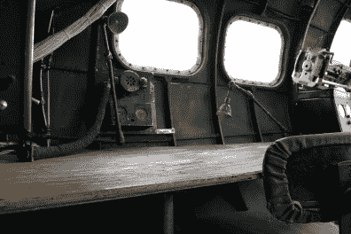](https://hackaday.com/2019/09/24/a-virtual-tour-of-the-b-17/b17_nose2/)  [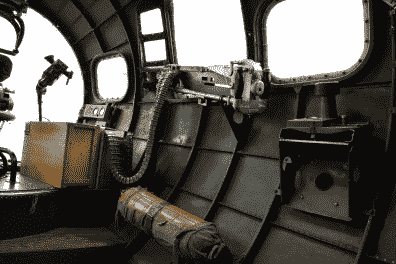](https://hackaday.com/2019/09/24/a-virtual-tour-of-the-b-17/b17_nose1/) 

当然，如果轰炸机发现自己受到攻击，这两个人也有责任为位于这个舱室的 B-17 防御武器配备人员。机头两侧各有一挺. 50 口径的 M2 布朗宁机枪，通过一个向前看的小孔开火，在庞巴迪座位的正下方有一个外部安装的“下巴”炮塔，可以从飞机内部远程控制。这种由 Bendix 公司设计的电动炮塔成为 B-17G 的标准配置，以修复轰炸机出色防御能力中的一个关键弱点。

## 驾驶舱

 穿过爬行空间向飞机尾部行进，可以登上飞行甲板。这是工程师应该驻扎的地方，也是许多有趣功能的所在地，如飞机的主断路器面板。工程师的工作是确保轰炸机的各种系统正常运行，如果有必要，尝试在飞行中进行维修。但就像导航员和投弹手一样，他也有双重责任，在必要时操作防御性武器。

[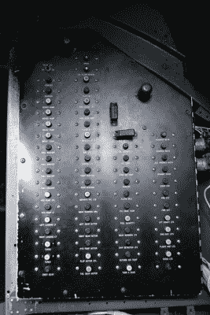](https://hackaday.com/wp-content/uploads/2019/09/b17_cockpit4.jpg)

Engineer’s Panel

在这种情况下，他可以爬上顶部安装的塔楼，获得 B-17 上空 360°的视野。这可以说是飞机上最有价值的防御位置，因为敌人的战斗机会倾向于从上方俯冲到轰炸机上。总的来说，工程师在 B-17 号上的位置对任务的成功极其重要。如果工程师变得无能为力，船员会很快发现自己处于非常糟糕的境地。

转回飞机的前部并向上走，你会发现自己在驾驶舱里。这种升高的位置为飞行员和副驾驶提供了驾驶飞机和目视确认四台莱特 R-1820-97“旋风”发动机状态所需的有利位置，每台发动机都能产生 1200 马力。

9-0-9 的驾驶舱看起来基本上和二战时一样，尽管有一些现代的让步。仪表板上增加的一些数字航空电子设备是飞机上为数不多的(可见的)历史错误之一，这证明了柯林斯基金会对维持这架飞机刚刚结束柏林之旅回国的错觉有多认真。毫无疑问，全面的现代化和升级对操作和维护这架近百年老飞机的机组人员来说非常有吸引力，但它们会降低整体体验。因此，轰炸机上令人眼花缭乱的按钮、开关、控制杆和拨号盘仍然保持着 1945 年的样子。

 [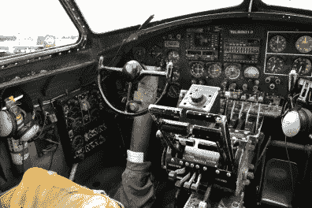](https://hackaday.com/2019/09/24/a-virtual-tour-of-the-b-17/b17_cockpit1/)  [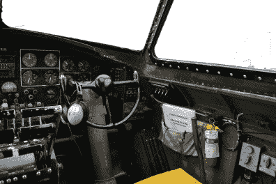](https://hackaday.com/2019/09/24/a-virtual-tour-of-the-b-17/b17_cockpit2/) 

## 炸弹舱

虽然 B-17 偶尔用于要人运输和侦察，但它首先被设计成轰炸机。换句话说，每一个设计决策都是为了最大限度地增加它能够携带多少磅的爆炸物到达目标。鉴于此，与现代飞机相比，炸弹舱如此之小，实际能够携带的有效载荷如此之少，令人难以置信。

例如，一架满载的 B-17G 可以向目标投掷 8000 磅的炸弹，但这是在推它。相比之下，美国空军目前使用的波音 B-52H 同温层堡垒的有效载荷能力超过 70，000 磅；这比它的二战前身满载重量还要重。简单地说，柏林上空布满数千架 B-17 的原因是每架可能只携带十几枚 500 磅左右的炸弹。

 [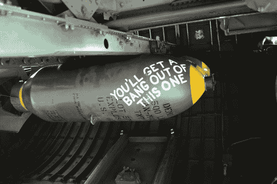](https://hackaday.com/2019/09/24/a-virtual-tour-of-the-b-17/b17_bay1/)   

## 无线电室

 在经历了炸弹舱狭窄走道的危险旅程后，你来到了无线电室。这无疑是飞机上最宽敞和舒适的区域之一:有足够的净空高度来站直，还有像窗户、椅子，甚至是一扇木门，无线电操作员可以关闭它来保持安静。

在 B-17 的早期版本中，这里会安装另一挺 0.50 口径的机枪，但在 G 版本下线时被拆除了，因为它被证明是一个无效的发射位置。至少在理论上，这使得操作无线电设备的人能够完全专注于与编队的其他成员进行通信，即使在战斗最激烈的时候也能让机组人员了解情况。在战争接近尾声时，这个房间将会安装更先进的硬件，[比如箔条分配器来迷惑敌人的雷达](https://hackaday.com/2018/07/24/milspec-teardown-c-1282-chaff-controller/)。

 [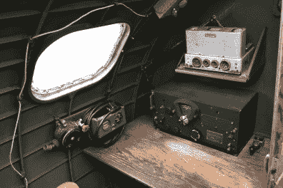](https://hackaday.com/2019/09/24/a-virtual-tour-of-the-b-17/b17_radio1/)  [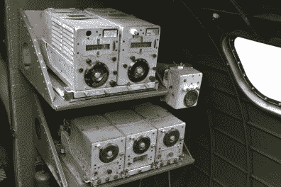](https://hackaday.com/2019/09/24/a-virtual-tour-of-the-b-17/b17_radio2/) 

## 枪的位置

 在无线电室后面，B-17G 实际上是一个空心管。这里几乎没有机械或电子设备，但尽管如此，它仍然是飞机上最重要的舱室之一。那是因为这是四个唯一的责任是保护轰炸机免受敌人攻击的人驻扎的地方。

两个腰部炮位可以防御来自侧面的攻击，后炮手可以让战斗机远离笨重的轰炸机尾部。但也许没有比位于 B-17 地下的斯佩里球炮塔更臭名昭著的炮位了。操作这个炮位的人，通常是机组中最小的人，不得不把自己缩成一个胎儿的姿势，以适应里面的空间。

一旦他就位，舱门将在他身后关闭，他将与飞机的其他部分隔离。炮塔是轻型装甲，是敌方飞行员最喜欢的目标。如果炮塔发生故障，不能旋转回到正确的位置，让他重新进入 B-17，他唯一的生存机会将是打开一个小舱口，让自己掉出来。不幸的是，炮塔内的空间非常狭小，大多数人都无法穿降落伞。

 [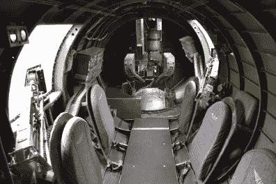](https://hackaday.com/2019/09/24/a-virtual-tour-of-the-b-17/b17_belly1/) Note: seats have been added for passengers [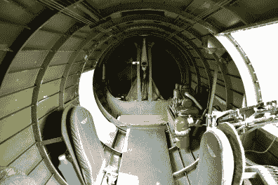](https://hackaday.com/2019/09/24/a-virtual-tour-of-the-b-17/b17_belly2/) Tail gunner position obscured from view

## 活生生的历史

大多数人可能认为 B-17 是一架相当大的飞机，翼展仅比空客 A320 小几米，它肯定不小。但是当我爬上通向飞机前舱的小梯子时，我有了和我女儿在操场上让我和她一起滑滑梯时一样的感觉:这个装置显然不是为我制造的。

[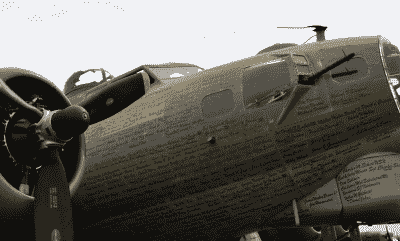](https://hackaday.com/wp-content/uploads/2019/09/b17_names.jpg)

The names of donors are listed on the side of the plane.

当然，这是真的。这些飞机被设计成由身体状况最佳的训练有素的年轻人驾驶。虽然我还足够年轻，我肯定会赢得 1940 年去欧洲的全包度假套餐，但我的“训练”养生法包括 YouTube 和麦当劳。

在九点零九分的船上，有几次我看着前方的小缺口或低垂的天花板，怀疑自己是否真的能通过。它使人难以相信，当它在飞行中和在敌人的炮火下，人类能够在这个飞行器内部导航。但他们做到了，世界永远欠他们一份情。

我们都曾通过电影、电视节目、书籍和电子游戏来体验第二次世界大战的飞机。但是没有什么比得上在去无线电室的路上穿过炸弹架，或者在飞行甲板下爬行。这些第一手的经验就是为什么自由之翼之旅是如此不可思议的一个项目，如果它曾经来到你的身边，我强烈建议你去机场，亲自看看这些历史性飞机的机组人员的生活是什么样的。