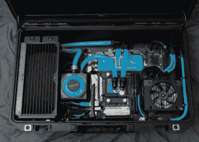

# 您可以随身携带的水冷游戏电脑

> 原文：<https://hackaday.com/2020/01/17/a-water-cooled-gaming-pc-you-can-take-with-you/>

你是否曾被困在酒店房间里，希望随身携带支持虚拟现实的游戏电脑？当然[thegarbz]有，这是这个绝对华丽的[移动设备的灵感，被亲切地称为“核足球”](https://imgur.com/a/R0D0Aac)，它给那些认为自己是 PC 高手的人带来了控制台级别的便携性。

 好了，没事了。我们承认，游戏笔记本电脑的存在意味着你不需要*实际上*带着这样一个精巧的装置到处跑，只是为了在旅途中玩 Steam 游戏。但是如果你要做的话，难道你不应该做得有风格吗？更实际地说，[thegarbz]表示，这个项目的成本低于类似规格的游戏笔记本电脑的成本。

核足球采用了锐龙 5 2600 处理器，NVIDIA 2070 超级显卡和 16 GB 的 DDR4 内存。水冷设备来自 Alphacool，包括一个连接到计算机的定制控制器，允许[thegarbz]通过桌面上的小工具监控温度和风扇速度。

虽然移动性差得远，但这台机器确实让我们想起了水冷的“大 O”，即[将所有当代游戏机和游戏 PC 打包成一台出色的机器](https://hackaday.com/2019/07/25/pc-and-console-gaming-united-courtesy-of-origin/)。