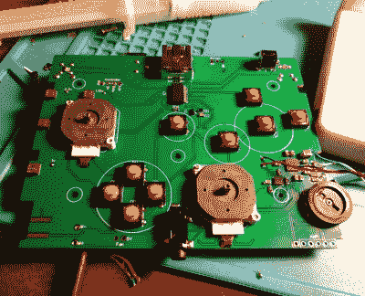

# 一台玩 GameCube 的 Wii，伪装成 Game Boy SP

> 原文：<https://hackaday.com/2019/06/09/a-wii-playing-the-gamecube-disguised-as-a-game-boy-sp/>

这可能很难相信，但多亏了任天堂狂热爱好者[比尔·帕克斯顿]的专业工作，你在 Wii 开始之前看到的 Game Boy Advance SP 和 GameCube lovechild。这意味着它不仅可以玩商业 GameCube 和 Wii 游戏，还可以访问适用于这些系统的大量自制游戏和模拟器。

 为了创造这个奇迹，[比尔]首先必须熟练地从 Wii 的主板上切掉无关的组件。然后，他将“修整过的”PCB 与一块新电路板配对，这块新电路板上有控制器以及一些其他辅助组件，如音频放大器和 USB 端口。正如休息后的视频所展示的，他甚至设法在里面塞进了一块电池。

最后，他设计了一个 3D 打印外壳，将 GameCube 风格的控件(配有打印按钮)融入经典的蛤壳式 Game Boy SP 形状。由于设计的复杂性，[Bill]决定在 Shapeways 进行专业打印，而不是试图在家用打印机上打印，他说这有助于销售专业外观。他确实花了一些时间反复试验，才找到了自己满意的绘画技巧，但我们认为最终的结果肯定是值得努力的。

发现这不是[比尔]第一次上演这样的噱头，可能不会令人感到惊讶。几年前，他创造了一个非常相似的“game cube SP”，但是从表面上看，这个修改的尝试在所有可能的方面改进了原始版本。

 [https://www.youtube.com/embed/MCXwcUc1mAo?version=3&rel=1&showsearch=0&showinfo=1&iv_load_policy=1&fs=1&hl=en-US&autohide=2&wmode=transparent](https://www.youtube.com/embed/MCXwcUc1mAo?version=3&rel=1&showsearch=0&showinfo=1&iv_load_policy=1&fs=1&hl=en-US&autohide=2&wmode=transparent)

