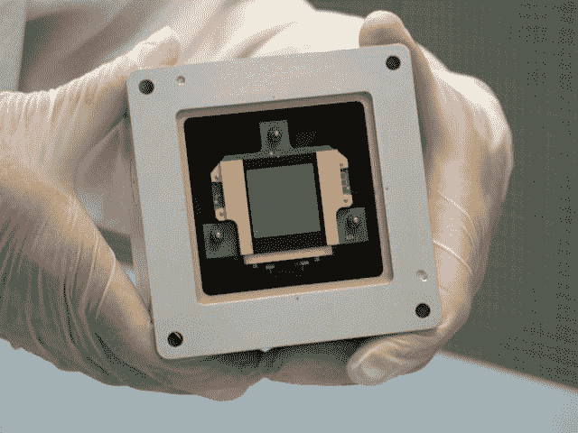
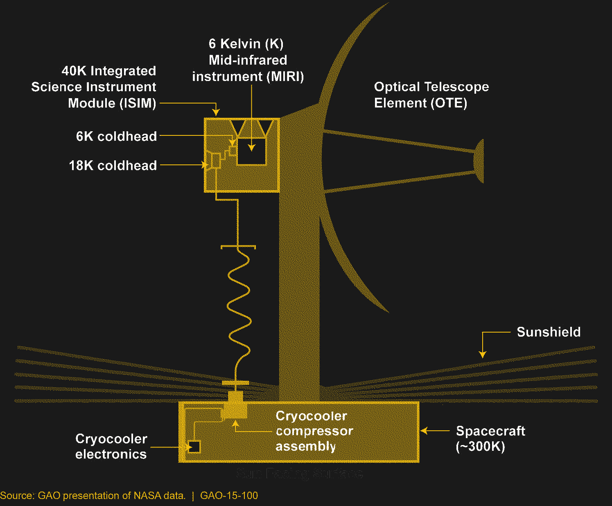
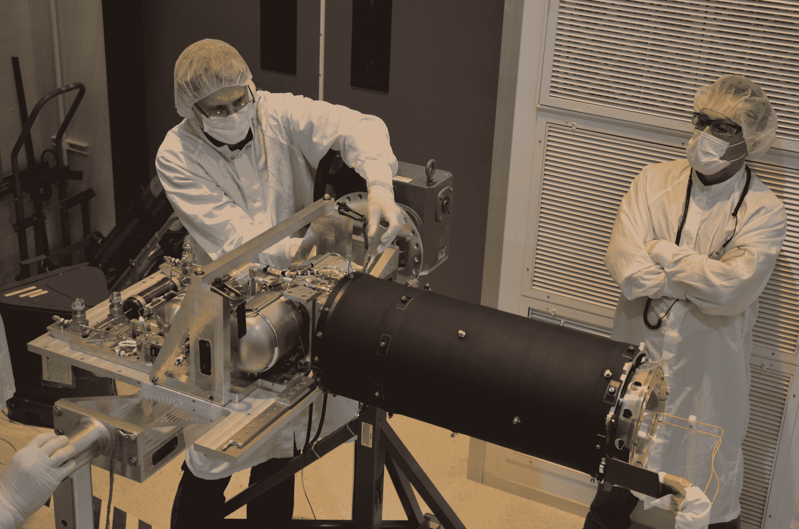

# 尽可能冷:韦伯望远镜的低温冷却器

> 原文：<https://hackaday.com/2022/05/05/about-as-cold-as-it-gets-the-webb-telescopes-cryocooler/>

如果让你说出太阳系中最冷的地方，你很可能会认为它是离太阳系所有能量的最终来源——太阳——尽可能远的地方。显而易见，你离热的东西越远，热量散发得越多。所以冥王星，不管是不是行星，都可能是创纪录低温的一个很好的猜测。

但是，尽管冥王星变得如此寒冷——低至 40 开尔文——但有一个地方比它冷得多，而且矛盾的是，它离我们的家更近。事实上，它只有大约 100 万英里远，而现在，詹姆斯·韦伯太空望远镜上的一个主要仪器的焦平面上的硅块只有 6 开尔文，使冥王星的表面看起来完全温暖。

考虑到仅仅几米之外，温度高达 324 K (123 F，51 C ),韦伯的寒冷程度就更加令人惊讶了。韦伯冷却系统的方法和原因充满了有趣的工程珍闻，值得深入研究，因为世界上最新的太空望远镜正在为观测做准备。

## 不够冷

关于太空中的低温冷却器，第一个最明显的问题可能是:究竟为什么韦伯需要一个低温冷却器？太空，尤其是围绕拉格朗日点 L2 的韦伯晕圈轨道周围的区域，还不够冷吗？一句话，不行——韦伯的红外天文仪器是为太空设计的，太空还远远不够冷。但是红外天文学有什么特别之处，为什么需要这么低的温度呢？

从最早的设计开始，詹姆斯·韦伯太空望远镜就一直被认为是红外望远镜。这是因为韦伯打算研究的物体是宇宙中最古老的物体，哈勃定律告诉我们，一个物体距离地球越远，它远离地球的速度越快，由于多普勒效应，来自它们的光将发生显著的红移。这意味着韦伯将指向的几乎所有东西发出的光都位于光谱的红外部分。Webb 的四个成像和光谱仪器包可以覆盖从 0.6 微米波长左右的可见光谱部分的边缘到 28 μm 左右的中红外波长。作为参考，微波的起始波长约为 100 微米波长，因此 Webb 设计研究的光的频率并不高于电磁波谱的无线电部分。

红外天文学的问题是，用于接收光线的传感器很容易被周围的热量淹没，这些热量在红外区域辐射。此外，红外望远镜中使用的光电传感器容易受到暗电流的影响，暗电流是传感器中的电流，即使没有任何光线照射到传感器上。暗电流主要是由传感器材料中电子的热刺激引起的，因此尽可能保持传感器低温有助于降低噪声。

## 有寒冷，然后是 MIRI 寒冷

如前所述，韦伯有四个主要工具。其中三种——近红外相机(NEARCam)、近红外摄谱仪(NEARSpec)、精细制导传感器和近红外成像仪和无缝摄谱仪(FGS-尼里斯)——都在光谱的近红外部分工作，正如它们的名字所暗示的那样。近红外略低于光谱的可见光部分，约为 0.6 至 5.0 μm。这些波长的传感器使用汞、镉和碲的合金(Hg:Cd:Te)，需要冷却到 70 开尔文左右才能使用。

MIRI’s sensor, a 1024×1024-pixel, arsenic-doped silicon sensor mounted in its focal plane module. The cryocooler will drive this sensor down to 6 K. Source: NASA/JPL

对于地面近红外望远镜，冷却汞:镉:碲传感器通常是用液氮。然而，在韦伯上，另一个选择是可行的，这要归功于巨大的五层遮阳棚，它保护天文台免受太阳的炙热光线，以及地球反射的光线，这要归功于望远镜的 halo 轨道始终可见。Webb 的镀铝 Kapton 遮阳篷的各层间隔开，使得入射的 IR 在相邻层之间反弹，并最终辐射到或多或少垂直于遮阳篷的空间中，而不是穿过各层到达其黑暗面上的敏感光学器件。遮阳板在热侧接收大约 200 kW 的能量，而仅允许 23 mW 的能量通过冷侧。这使得位于那里的仪器保持在 40 K 的低温，这对于三台近红外仪器来说足够冷了。

但是尽管气温比绝对零度高 40 开尔文，对韦伯第四台主要仪器中的传感器来说还是太热了。中红外成像仪，或 MIRI，旨在从 5 到 28 微米拍摄图像并进行光谱观测，这需要一个与近红外同类产品完全不同的传感器。MIRI 的传感器不是 Hg:Cd:Te，而是基于掺砷硅(Si:As)，这种硅需要冷却到非常接近绝对零度——低于 7 开尔文。

## 听起来很冷

在最初的韦伯设计中，MIRI 所需的超低温将由一个装有低温物质的杜瓦瓶提供:固态氢。存储式低温系统的选择是基于当时能够达到 6 K 的空间额定主动低温冷却系统的不成熟。然而，韦伯现在臭名昭著的延迟让低温冷却器技术得以发展，鉴于主动低温冷却器提供的重量减轻，更不用说使用 MIRI 更长时间的潜力——一旦固态氢全部蒸发，该仪器将毫无用处——决定更换低温杜瓦瓶。

当然，这并非没有工程上的挑战。其中最主要的是达到目标温度的能力，同时保持在功率和重量限制范围内，并且不会给敏感的光学系统增加不适当的机械振动。考虑到韦伯的巨大尺寸和天文台的物理布局，这两个规格都特别具有挑战性，这使得有必要将低温冷却器组件分布在航天器的三个不同区域，每个区域都有不同的热状态要处理。

Schematic of the cryocooler layout on Webb. Region 3 has the compressors and control electronics, Region 2 covers the refrigerant lines up to the instrument package, And Regio 1 is the cold end at the focal plane. Source. GAO via NASA

最热的区域，称为区域 3，位于航天器的总线。它位于遮阳罩的热侧，这意味着它可以预期看到高达 300 K 左右的温度。安装在该区域的组件主要由低温冷却器压缩机组件(CCA)及其相关的控制电子设备组成。CCA 是整个系统的“预冷器”，使用三级脉管设计来实现大约 18 K 的温度。脉管制冷机除了用于产生压力波的活塞之外没有移动部件，这使它们非常适合像这样的低振动应用。

脉管制冷过程依靠热声学来传递热量。在热声学中，驻波是在密封管道内的工作气体(韦伯低温制冷机中的氦气)中形成的。一个多孔塞，称为再生器或换热器，位于管内，靠近驻波的一个节点。随着工作气体的压缩和膨胀，蓄热室中会产生温度梯度。脉管的热端通过散热器将热量辐射到太空中，而冷端用于从闭环热交换器中带走热量，该热交换器也充有氦气。下面的视频很好地展示了热声冷却的原理。

 [https://www.youtube.com/embed/kkBBkQ8jFRY?version=3&rel=1&showsearch=0&showinfo=1&iv_load_policy=1&fs=1&hl=en-US&autohide=2&wmode=transparent](https://www.youtube.com/embed/kkBBkQ8jFRY?version=3&rel=1&showsearch=0&showinfo=1&iv_load_policy=1&fs=1&hl=en-US&autohide=2&wmode=transparent)

冷却后的氦，现在大约在 18 K，进入 2 区，这是在支撑韦伯主镜的塔内。这个区域的温度在 100 K 到 300 K 之间，超冷氦必须通过大约两米的管道才能到达望远镜焦点处的仪器，因此大量的工程设计确保不会有不必要的热传递。

在通过 2 区的行程结束时，制冷剂到达 1 区的心脏——MIRI 本身的焦平面。由于之前概述的被动冷却步骤，该区域已经处于大约 40 K，但是为了将制冷剂降低到其最终的 6 K 温度，它需要通过所谓的焦耳-汤姆逊阀。JT 阀利用焦耳-汤姆逊效应来进一步冷却氦工作流体。

Webb’s cryocooler after undergoing tests. The silver cylinders to the left house the dual-piston, horizontally opposed compressor, while the black tower holds the pulse tube and regenerator. Not shown is the Joule-Thompson valve assembly. Source: NASA/JPL

焦耳-汤姆逊说，当气体的压力降低时，它的温度也降低了。我们以前都见过这种情况，比如在除尘空气罐的外面形成霜，或者空气炮向空中发射炮弹时形成的水滴云。在 MIRI 内部的韦伯冷头组件(CHA)中，一个特殊的阀门允许超冷氦的压力突然下降，使其下降到大约 6 K，并冷却安装有 MIRI 传感器的铜块。在一个闭环系统中，氦通过管道返回 JT 阀，并沿着管道回到 CCA。

到目前为止，韦伯的低温冷却系统达到了预期目标，让 MIRI 很满意。[在撰写本文](https://jwst.nasa.gov/content/webbLaunch/whereIsWebb.html?units=metric)时，MIRI 焦平面的温度已经稳定地保持在 7 K 设定点以下超过 14 天，而其他近红外仪器保持在远低于其 40 K 目标的温度。希望我们能很快看到这些仪器的结果。

为了记录在案，太阳系中最冷的自然点实际上可能是月球南极的“双重阴影环形山”，只有 25 K。可怜的冥王星——从来没有受到过尊重。