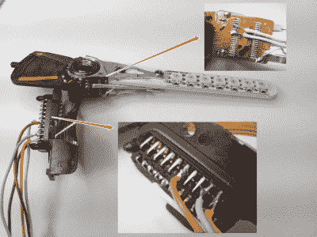

# 滥用硬盘成为 POV 时钟

> 原文：<https://hackaday.com/2020/08/14/abused-hard-drive-becomes-pov-clock/>

我们都知道旧硬盘没什么用。一旦你把盘片变得不可读，或许收获了那些强有力的磁铁，就没有多少兴趣了。当然，除非你[把整个事情变成一个视觉暂留时钟](https://www.instructables.com/id/PendoLux/)。

 至少【利奥】在创作《PendoLux》的时候是这么做的。时钟本身非常简单；像任何 POV 项目一样，它只需要一种方法来足够快速地来回移动闪烁的 led 阵列，以便它们可以欺骗眼睛看到实心图像。[Leo]将旧硬盘的读取头装置投入使用，首先将盘片和电机从其中取出。

磁头臂的音圈和磁铁保持不变，而一个携带七个 RGB LEDs 的 3D 打印臂取代了旧的磁头。[Leo]增加了一个小弹簧，使手臂回到中立位置，并使用 Arduino 驱动线圈和闪烁的 led。获得合适的时机是一个反复试验的问题；他还需要避开标准的 LED 库，因为他大量使用中断，而是使用直接寻址。

视点时钟最近可能已经过时了——这个[硬盘视点时钟](https://hackaday.com/2011/07/10/slick-16-segment-pov-hard-drive-clock/)和[光盘版本](https://hackaday.com/2013/01/30/hdd-pov-clock-takes-the-best-from-those-that-came-before-it/)是几年前发布的。但是[Leo]的时钟看起来相当不错，即使是在进行中的作品，所以也许这种风格会卷土重来。

 [https://www.youtube.com/embed/gI3e2UY084Y?version=3&rel=1&showsearch=0&showinfo=1&iv_load_policy=1&fs=1&hl=en-US&autohide=2&wmode=transparent](https://www.youtube.com/embed/gI3e2UY084Y?version=3&rel=1&showsearch=0&showinfo=1&iv_load_policy=1&fs=1&hl=en-US&autohide=2&wmode=transparent)

[通过 T0 黑客攻击。io]t1