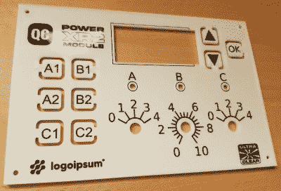

# 使用碳粉转印将全色图像添加到您的 3D 打印中

> 原文：<https://hackaday.com/2022/09/27/add-full-color-images-to-your-3d-prints-with-toner-transfer/>

墨粉转移是一种常用的技术，用于将文本和图像应用到 PCB 等平面上，但任何考虑过在 3D 打印上使用相同方法的人都会意识到熨斗的热量会是一个问题。[Coverton]有一个解决方案，通过直接在透明纸上进行 3D 打印，彻底改变了这个概念。

The fine detail is great for intuitive front-panel designs

这种方法非常简单，对于试图在印刷品上获得专业外观的全色图像的爱好者来说，这可能是一个游戏规则的改变者。

首先，用激光打印机将镜像图像打印到一张透明胶片上。然后，一旦 3D 打印机打下了物体的第一层，你就可以在它上面对齐透明物，并用胶带粘住，这样它就不会四处移动。已经沉积的塑料被移除，一点水被放在床的中央。使用纸巾，透明度变得平滑，直到气泡被推到边缘。

另外几片胶带压住所有角上的透明胶片，并根据透明胶片的厚度调整高度。从那里，打印可以继续正常进行。完成后，图像应该与塑料融合。如果很难形象化，休息后查看视频，获得一步一步的指导。

当然，也有一些警告。目前，将转印和打印对齐看起来有点复杂，使用的透明材料(显然)必须符合激光打印机的使用要求，并且只能在平面上使用。但是另一方面，会有一些读者已经拥有了他们需要的一切，现在就在家里尝试一下——我们很想看到结果！

我们在过去已经报道过一些其他的将颜色和图像放到 3D 打印上的方法，例如[这种水文技术](https://hackaday.com/2015/05/13/printing-photorealistic-images-on-3d-objects/)或者通过使用[喷墨打印头](https://hackaday.com/2021/12/04/full-color-3d-printing-with-the-help-of-an-inkjet-head/)，但是【Coverton】的想法看起来比这两种都简单得多。如果你对热敏性较低的材料的墨粉转移感兴趣，那么看看几年前的[指南](https://hackaday.com/2016/09/12/take-your-pcbs-from-good-to-great-toner-transfer/)，或者看看其他黑客读者对[木材](https://hackaday.com/2016/11/18/need-an-enclosure-try-scrap-wood-with-toner-transfer-labels/)或[黄铜](https://hackaday.com/2019/06/19/etching-large-brass-sheets-is-harder-than-you-think/)做了什么。

> 这里有一个碳粉转移过程的快速视频。来自[3d 打印](https://www.reddit.com/r/3Dprinting/)