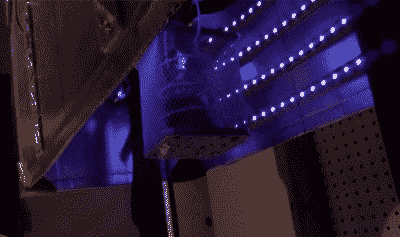

# 附件让 FDM 3D 打印机清洗和固化树脂零件

> 原文：<https://hackaday.com/2021/09/17/add-on-lets-fdm-3d-printer-wash-and-cure-resin-parts/>

在过去的几年里，我们看到树脂 3D 打印机的价格大幅下降，这非常令人兴奋，因为这意味着更多的人终于可以接触到这项令人印象深刻的技术。但是新来者可能没有意识到，打印机本身的成本只是你初始投资的一部分。树脂打印的零件在投入使用前需要清洗和固化，除非你想全部手工完成，否则这意味着需要购买第二台机器来进行打印后处理。

还不确定他是否想把钱花在一台专用机器上，[Chris Chimienti]决定采取一种不寻常的方法，对他的一台基于细丝的 3D 打印机进行修改，以处理清洗和固化任务。他聪明的外壳滑过 Anet ET5X 打印机相当大的 Z 轴，包括一排紫外发光二极管和风扇，以循环空气，加快干燥过程。

Looking up into the curing chamber.

固化部分很容易理解，但是它是如何清洗的呢？您只需将装有 70%异丙醇(IPA)的容器放在打印机的底座上，然后将待清洗的零件放入挂在打印机挤压机上的篮子中。定制的 Python 软件用于生成 g 代码，命令打印机将零件浸入酒精中，并来回擦拭，以获得良好的冲洗效果。

指定的时间过去后，打印机将零件放入外壳中，打开 led 灯，开始下一阶段的流程。[整个系统通过 OctoPrint 插件](https://hackaday.com/2018/09/15/adding-3d-printer-power-and-light-control-to-octoprint/)实现自动化，虽然打印机相对较低的运动速度意味着“清洗”周期可能不会像我们希望的那样充满活力，但这绝对是一个非常巧妙的解决方案。

[Chris]在他的 YouTube 频道上的最新视频[中提供了该项目的全面概述，*拥抱赛车*](https://www.youtube.com/watch?v=_hPHWUpPv9s) 。他在文中解释说，这一概念当然可以适用于 Anet ET5X 以外的打印机，但它相当大的体积使其成为转换的理想候选。当然，也可以使用泡沫板外壳本身作为固化室，尽管你仍然需要提前在 IPA 中清洗零件。

这可能是我们在 Hackaday 看到的最不寻常的清洗和固化系统之一，但我们很欣赏[Chris]将整个事情建立在这样一个想法上，即你可能有一台 FDM 打印机放在附近，否则当你处理树脂时就不会使用它。如果对你来说不是这样的话，[组装一个更传统的紫外线固化室](https://hackaday.com/2020/09/05/building-a-uv-curing-station-for-resin-prints/)是一个足够简单的项目。

 [https://www.youtube.com/embed/_hPHWUpPv9s?version=3&rel=1&showsearch=0&showinfo=1&iv_load_policy=1&fs=1&hl=en-US&autohide=2&wmode=transparent](https://www.youtube.com/embed/_hPHWUpPv9s?version=3&rel=1&showsearch=0&showinfo=1&iv_load_policy=1&fs=1&hl=en-US&autohide=2&wmode=transparent)

