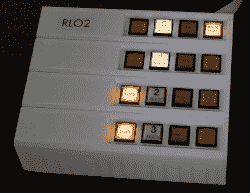

# 将 Linux 添加到 PDP-11

> 原文：<https://hackaday.com/2018/11/15/adding-linux-to-a-pdp-11/>

DEC 的 PDP 和 Vaxxen 的 UNIBUS 架构是天才之举。如果你想在你的小型机上有更多的内存，只要再加一张卡就行了。需要开车吗？将其插入背板。当然，有了这些奇怪的卡，这些旧的 UNIBUS PDPs 很难继续运行。UniBone 是这个问题的解决方案。它把 Linux 放在一个 UNIBUS 桥上，允许这个卡作为一个内存模拟器，一个测试控制台，一个磁盘模拟器，或者任何你能想到的其他硬件。

这一构建的关键是 BeagleBone，这是每个人第二喜欢的单板计算机，它有一个功能，另一个没有:PRUs，或可编程实时单元，允许你非常非常快速地闪烁许多引脚。我们已经看到 BeagleBone 在终端中被用作 [Linux，在](https://hackaday.com/2012/03/07/vintage-vt100-terminal-computing-with-a-beaglebone/)[旧 PDP-10 前面板](https://hackaday.com/2014/10/28/restoring-a-pdp-10-console-panel/)中被用作计算机的其余部分，在[中被用作 PDP-11/03](https://hackaday.com/2017/04/26/a-modern-day-pdp-11-front-end/) 的前端。

 在这个版本中，Beaglebone 的 PRU 负责与 UNIBUS 背板接口，将所有内容发送到作为应用程序运行的设备仿真器。UniBone 可以配置为内存或其他无聊的 T4，但其中一个可以模拟四个 RL02 驱动器，给 PDP-11 带来惊人的 40 兆存储空间。这种实施的真正杀手级应用程序为这些仿真驱动器提供了一整套发光按钮，用于加载、就绪、故障和写保护，就像真正的 RL02 驱动器的正面一样。这个面板是在 Beaglebone 上的 I2C 总线上控制的，它是一件艺术品。当然，模仿驱动器意味着你不能把它用作世界上最大的拇指驱动器，但这是拯救这些旧电脑的小小代价。