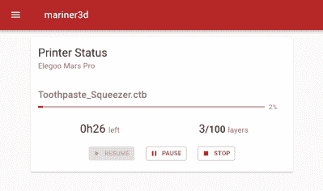

# 向 Elegoo Mars Pro 添加远程控制

> 原文：<https://hackaday.com/2020/10/30/adding-remote-control-to-the-elegoo-mars-pro/>

最近的价格下跌使得入门级的掩蔽立体平版印刷(MSLA)树脂 3D 打印机价格在 200 美元左右，使它们成为制造商和黑客非常有吸引力的工具。但正如你所料，要把价格降到这么低，通常需要走一些捷径。制造商让他们的机器如此便宜的方法之一是简化电子设备，将功能集削减到绝对最小。

因此，[Luiz Ribeiro]发现他的新 Elegoo Mars Pro 没有提供 WiFi 连接或远程控制接口并不奇怪。你应该把一个 u 盘插入打印机，从菜单系统中选择你想要打印的对象。但这并不意味着他不能破解自己的能力。

Monitoring a print with Mariner.

如果这是一台传统的 3D 打印机，他可能已经安装了 OctoPrint，不再使用它了。但是树脂打印机是一种非常不同的动物。最终，[Luiz]不得不开发自己的远程控制软件，解决打印机电子设备的独特限制。他的软件运行在 Raspberry Pi Zero 上，使用 Linux 的“USB 小工具”系统，当插入 Elegoo Mars Pro 的 USB 端口时，它看起来像一个闪存驱动器。

这允许通过网络向打印机发送目标文件，但是这个难题缺少了一部分。[Luiz]仍然需要手动转到打印机，从菜单中选择他想要加载的文件。直到他意识到控制板上有一个暴露的串行端口，允许他向打印机传递命令。在串行连接和仿 USB 大容量存储设备之间，他的 *mariner* 软件可以完全控制 Mars Pro，并能够远程触发和监控打印作业。

它可能无法提供将 OctoPrint 添加到 FDM 3D 打印机的灵活性，但这无疑是一个开始。