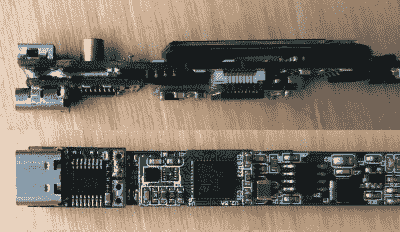

# 向 TS100 添加 USB-C

> 原文：<https://hackaday.com/2019/11/01/adding-usb-c-to-the-ts100/>

TS100 是新一代小型温控烙铁的热门产品，至少对我们中的一些人来说，这种烙铁已经开始取代老式的笨重焊台。不幸的是，这种特殊型号的一个缺点是需要将其插入一个相当笨拙的笔记本电脑式电源，这无疑妨碍了它的便携性。但是[丹尼斯·施耐德]想出了一个非常巧妙的解决方案，在他的 ts 100 上增加了一个 USB-PD 模块。

 这里的想法很简单:只需要把原来的 DC 桶形连接器拆下来，在它的位置上安装一个 USB-PD 触发模块就可以了。实际上，这不仅仅需要一点点的摆弄、切割、说服和创造性的焊接(讽刺的是，用一个焊接站)，但最终结果看起来确实很专业。

它有助于[Dennis]使用的 USB-PD 模块*几乎与 TS100 PCB 的宽度完全相同，这意味着修改后的熨斗可以放回原来的箱子。虽然正如我们不久前所见，[如果您选择的触发模块不完全符合原始电路板的尺寸，3D 打印替换外壳的社区会越来越多](https://hackaday.com/2019/10/28/3d-printing-new-cases-for-the-ts100-soldering-iron/)。或者，如果你根本不想修改熨斗，[你总是可以只做一个外部适配器](https://hackaday.com/2019/09/22/the-miniware-ts100-as-a-usb-c-soldering-iron/)。*

那些对这些熨斗有一些经验的人可能会问，当我们已经有了 TS80 时，修改 TS100 以采用 USB-C 有什么意义。事实证明，虽然 TS80 使用 USB-C 连接器，但它实际上并不使用 USB-PD，所以它没有利用增强的功率传输能力。我们知道，这有点令人困惑。