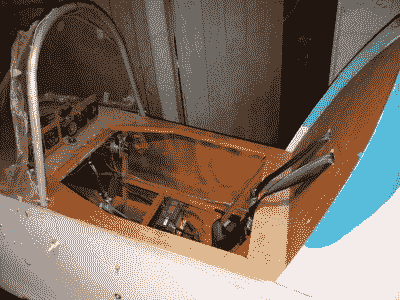

# 采用孤立的超轻

> 原文：<https://hackaday.com/2018/11/29/adopting-an-orphaned-ultralight/>

拥有和驾驶自己的小型飞机提供了无与伦比的自由和自主。不需要处理地面交通的“直线”旅行立即缩小了你的世界，并使各种旅行和冒险成为可能。不幸的是，拥有飞机的负面影响(存储和维护成本，你可能会死于火灾的知识，等等)，让我们大多数人坚定地站在陆地上。

 [而不是【ITman496】。他拥有超轻型飞机的梦想最近实现了](https://itman496.com/2018/11/09/ultralight-adventures-ii-the-acquiring/)，他决定与世界分享他的经验。在挣脱地球的束缚之前，他还有很长的路要走，但是没有比开始更好的地方了。在最近的一篇博客文章中，他记录了把他的新玩具带回家的过程，并详细介绍了他计划做的一些工作，以使它适于飞行。

这架有问题的飞机是一架迷你马克斯飞机，[ITman496]认为它不仅比他的年龄大，而且从未飞行过。它是由一位退休的飞机机械师建造的，不幸的是，在装配快结束时，他的心脏出现了问题。他明智地决定，他应该找到一种更安全的方式来度过他的空闲时间，而不是在一架实验飞机上进行单人飞行，所以他将这架飞机出售。

在经历了相当大的冒险将飞机运回家后，[ITman496]发现它保存得如此之好，以至于发动机可以马上启动。但这并不意味着它已经准备好起飞了。为了自己的安全，他打算拆掉整架飞机，以确保一切完好无损，组装正确；所以至少如果他在空中出了什么事，他只能怪自己。

一旦飞机的结构是合理的，他将继续进行一些急需的发动机改造，包括从驾驶舱内调整空气燃料混合物的方法，冷却系统的改进，以及安装一个排气系统，这实际上是为了他的二冲程发动机。当*完成*后，【ITman496】将进入真正有趣的事情:创造他自己的“玻璃驾驶舱”。

对于那些不花时间玩飞行模拟器的黑客读者来说，“玻璃驾驶舱”是一个通用术语，指的是在车辆中使用数字显示器而不是模拟仪表。[ITman496]已经买了两个日光可读的 10.1 英寸 IPS 显示器，他计划用树莓 Pi 在 HDMI 上驾驶。没有关于他的软件设置和传感器阵列会是什么样子的消息，但是随着项目的进展，我们渴望听到更多的消息。

如果你不够幸运，在 Craigslist 上找不到一架几乎完整的飞机，你可以用泡沫塑料做一架自己的飞机。