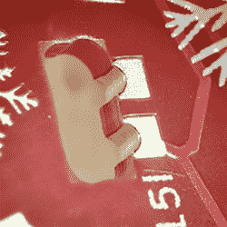

# 扁平封装印刷电路板的进展

> 原文：<https://hackaday.com/2018/11/28/advances-in-flat-pack-pcbs/>

现在，我们有艺术印刷电路板，我们有#badgelife，我们有反向安装的发光二极管，通过玻璃纤维基板发光。所有这些对于作为功能性艺术品的 PCB 来说都很棒。然而，艺术家需要不断突破界限，下一步显然是一种看起来根本没有任何组件的 PCB。我们还没到那一步，但[Stephan]提交了一个项目，这是我们迄今为止看到的最接近的项目。这是一个 PCB，所有组件[都包含在电路板本身](https://github.com/designer2k2/2d-xmas-tree)中。一个 2D 印刷电路板，如果你愿意的话。

就#badgelife 项目而言,[Stephen]的项目有些简单。这是一个圣诞装饰品，由两个硬币电池供电，通过 Charlieplexing 容纳一个 ATTiny25 和闪烁的 24 个 led。PCB 是在 KiCAD 中制作的，并得到了 Inkscape 和 Gimp 的一些帮助。到目前为止，一切顺利。

Castellated edges, containing a part

诀窍是安装这个项目中的所有组件，使它们不会伸出电路板表面。这是通过在每个零件应该去的地方铣一个矩形孔，并在孔的一侧添加齿形垫来完成的。然后，将这些器件一次一个地焊接在这些城堡形焊盘上，这样，完成组装的电路板的厚度就是 PCB 的厚度。

这个项目中使用的部件是标准的 jellybean 部件，但是有一些方法可以改进这个项目的实现。led[是标准的 0805s](https://www.digikey.com/product-detail/en/broadcom-limited/HSMC-C170/516-1428-1-ND/637752) ，但是侧面发光的 led 确实存在。如果你想进一步发展这个想法，有可能创造一个 PCB 的夹层，中间层满是元件孔。然后，这些 PCB 层可以焊接或用环氧树脂粘合在一起，制成一个 PCB，这个 PCB*实际上做了一些事情*，但看起来不像做了。这种技术是在非常高端的 PCB 中实现的，但是它非常昂贵。

尽管如此，这仍然是一个很好的例子，说明了使用标准 PCB 工艺和从随机工厂订购的电路板可以做些什么。这也是一个伟大的圣诞装饰品，并推动了 PCB 艺术的界限。