# 超频历险记:树莓 Pi 4 哪个味道最快？

> 原文：<https://hackaday.com/2020/11/11/adventures-in-overclocking-which-raspberry-pi-4-flavor-is-fastest/>

目前市场上有三种不同版本的 Raspberry Pi 4:普通的 Pi 4 Model B、[Compute Module 4](https://hackaday.com/2020/10/19/new-raspberry-pi-4-compute-module-so-long-so-dimm-hello-pcie/)和刚刚发布的 [Raspberry Pi 400 电脑键盘](https://hackaday.com/2020/11/02/new-raspberry-pi-400-is-a-computer-in-a-keyboard-for-70/)。他们都在重复同一个曲调，但他们之间有足够的差异，你可能会更丰富的选择。

Pi 4B 最容易集成到项目中，如果你正在设计自己的 PCB，CM4 最容易发挥系统的所有功能，Pi 400 似乎是针对消费市场的，但它有一个黑暗的秘密:它是一个超频怪物，能够在 2.15 GHz 下无限期运行。

回想起来，到处都有暗示。在 Model B 上运行的片上系统是 Broadcom 2711ZPKFSB06B0T，而 CM4 和 Pi 400 上的 SOC 是 2711ZPKFSB06C0T。如果你眯着眼睛看，你能看出从“B”到“C”的修改。在 CM4 数据表中，有一句话是关于它的运行效率比 Model B 更高。当我查看 Pi 400 内部时，有一个巨大的铝制散热器连接到 SOC，大概是为了防止它在紧凑的键盘外壳中过热。但是还有一个线索:Pi 400 的默认主频是 1.8 GHz，而不是其他两款的 1.5 GHz，这两款没有散热片。

CM4 加一点铝能跟上 Pi 400 吗？较新的兄弟姐妹会将 Pi 4 Model B 甩在身后吗？是时候玩一点超频了！

## 覆盆子超速档

超频一个树莓 Pi 基本上是无痛的。在大多数情况下，[就像编辑你的`/boot/config.txt`文件](https://www.raspberrypi.org/documentation/configuration/config-txt/overclocking.md)并输入想要的最大速度和 CPU 核心电压一样简单。如果它不启动，你选择一个较低的 CPU 速度，直到你得到一些工作。但这并不意味着你将获得全面的性能提升——主 CPU 与运行 [ThreadX RTOS](https://en.wikipedia.org/wiki/ThreadX) 的 GPU 并行运行，或者在它们下面运行，并在主 CPU 变热时节流。

这种热节流意味着你可以在低于 2.15 GHz 的上限下，以尽可能快的速度运行 Raspberry Pi 来散发它产生的多余热量。对于市场上销售的 1.5 GHz 或 1.8 GHz 的系统来说，这还不算太差。但这也是圆周率的致命弱点；当我们自己的乔纳森·本内特在没有散热器的情况下，尝试将 Pi 4B 作为台式机使用一周时，他发现它偶尔会变慢。在这里的所有三个测试模型中，节流发生在 82.5°c 左右。

我们的测试套件包括在`--matrix 0`模式下运行 [stress-ng](https://wiki.ubuntu.com/Kernel/Reference/stress-ng) 以完全加载 CPU，然后记录来自 Linux 系统的时间和温度，并用`vcgencmd measure_clock arm`测量 CPU 速度。简单！

## 骨原基线

[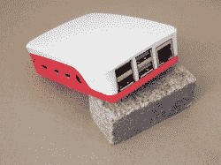](https://hackaday.com/wp-content/uploads/2020/11/DSCF2023.jpg) 对于一个将要看到任何负载的全新的 Raspberry Pi 4B，你能做的最糟糕的事情就是买一个不通风的外壳，就像官方的 Raspberry Pi 外壳一样，并把它放在那里，即使是在 1.5 GHz 的股票上。正如你所看到的，在下面用红色绘制的，它在满负荷的 10 分钟后就开始节流，过了一会儿，平均速度下降到大约 1.1 GHz。

打开机箱享受凉爽的微风会让你受益匪浅:有证据表明，在全速运行大约 25 分钟后，在标称的 1.5 GHz 频率下，只有最微小的一点节流，这还不算太糟糕。这就是为什么 1.5 GHz 是 Pi 4B 的宣传速度:如果不加限制，它就处于令人满意的边缘。

将它与同样 1.5 GHz 的黄色计算模块进行比较，您会发现它产生的热量更少，这是数据手册中提到的节能效果。毫无疑问，没有散热器，计算模块会变热。但在户外，它停留在 75℃左右，可能比节流阈值低 7℃。

[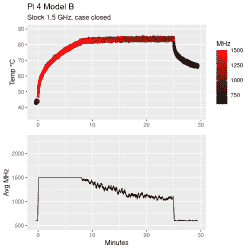](https://hackaday.com/pi_4_model_b_stock_1-5_ghz_case_closed/)[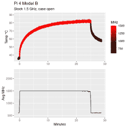](https://hackaday.com/pi_4_model_b_stock_1-5_ghz_case_open/)[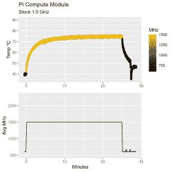](https://hackaday.com/pi_compute_module_stock_1-5_ghz/)[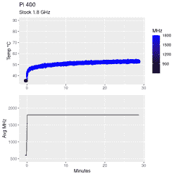](https://hackaday.com/pi_400_stock_1-8_ghz/)

作为对比，看看蓝色的 Pi 400。那个巨大的铝制散热器发挥了它应有的作用，甚至更多。在 1.8 GHz 的主频下，已经比其他任何一个模块快了 20%，这并不费事——保持在 60°c 以下。夏天，你可以在我的阁楼上永远开足马力运行 Pi 400。

## 驾驶 Pi 400 赛车

因此，如果 Pi 400 在正常速度下运行良好，那么如果我们提高速度会发生什么呢？为此，我编辑了`/boot/config.txt`文件，设置了`arm_freq=2000`和`over_voltage=6`，然后重启。为什么是六个？因为这是最高的过压水平，而不会将芯片推出其设计范围并使保修无效——你可以更高，但可能不会有什么收益，而且你可能会烧毁东西。

(奇怪的是:Pi 400 默认带有`over_voltage=0x11170`，它提供 0.95 V，而不是默认的 0.86 V，但低于你在`over_voltage=6`获得的 1.03 V。我不理解新的格式，所以我没有摆弄它。有人吗？)

在 2.0 GHz 时，Pi 400 上升到 60°C 以上，即使在 50 分钟后也显示出继续预热的迹象，但它离节流还很远。所以我试了 2.2 GHz，在这个速度下 CPU 完全拒绝启动。回到 2.15 GHz，它运行得很好，所以我把它放了三个小时。它停留在舒适的 62.5 摄氏度，这是温暖的，但在规格范围内。我的猜测是，这大约是 Pi 400 的性能极限，但请注意，这完全是股票，它连续几个小时 100%地锤打所有四个核心。

[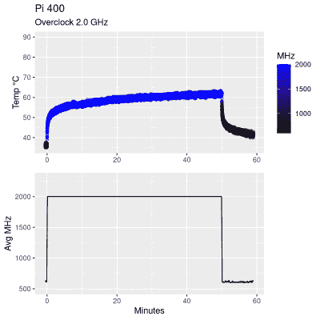](https://hackaday.com/pi_400_overclock_2-0_ghz/)[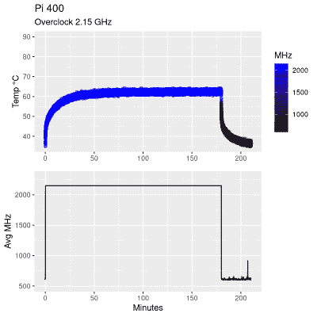](https://hackaday.com/pi_400_overclock_2-15_ghz/)

鉴于所有的 Pi 4 系列都使用动态 CPU 速度，并在空闲时降低到 600 MHz 以节省电力，我绝对没有理由不超频。它会在你需要的时候更快，但不会在你不需要的时候消耗更多的能量。

但是计算模块和 Pi 400 具有相同的、更高效的 SOC。你能从稍微散热的 CM4 上得到同样的结果吗？我买了一些便宜的散热器来了解一下。

## 廉价的散热器并没有真正的帮助

[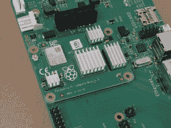](https://hackaday.com/wp-content/uploads/2020/11/DSCF2028.jpg) 首先，我认为给 CM4 增加小散热器至少可以让它进入 Pi 400 的 1.8 GHz 范围。答案是一个明确的“有点”。之前它处于 1.5 GHz 的节流边缘，这个小铝奇迹让它运行在 1.8 GHz，处于节流边缘。当然，这是一个进步，但对于足球运动员来说，这不是一个好的生活。

[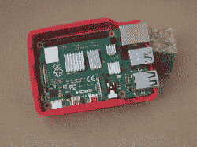](https://hackaday.com/wp-content/uploads/2020/11/DSCF2025.jpg) 为了科学，我在 Pi 4B 上放了另一套便宜的散热器，并以 1.8 GHz 运行。这是对 SOC 的两个版本(“B”和“C”)进行的最接近苹果对苹果的测试，两个主板都有自由空气流通，相同散热器的散热片垂直定向。但是超频对 Pi 4B 可不厚道。仅仅五分钟后，它就达到了节流温度。更糟糕的是，它的速度太慢了，平均运行速度只有 1.5 GHz，尽管消耗了更多的功率并加热了我的办公室，但速度还是不快。

罪魁祸首是提高核心电压，以促进超频，也许有可能找到一个更低的电压设置，将更有效地运行，但在这一点上，我的结论是，廉价的散热器充其量是一个边际效益。

[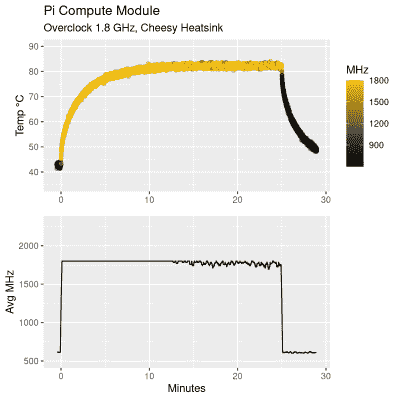](https://hackaday.com/pi_compute_module_overclock_1-8_ghz_cheesy_heatsink/)[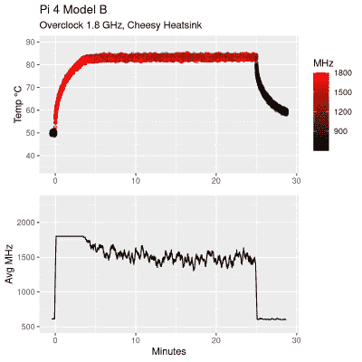](https://hackaday.com/pi_4_model_b_overclock_1-8_ghz_cheesy_heatsink/)

## 带上铝！

为了不被打败，我在我的垃圾箱里寻找一个既适合 CM4 又适合 Pi 4B 的散热器。我从散热槽中选择了一管老化的糊状物和两条游戏级超频拉链，依次将铝贴在 CM4 和 Pi 4B 上。他们现在会怎么跑？

首先，我在 1.8 GHz 下运行了带有较大散热器的 CM4，以提供一些与廉价散热器进行比较的基础。一大块铝会产生多么大的不同啊！它停留在舒适的 68 摄氏度左右。即使将它提升到 2.15 GHz 并放置几个小时，它也只比 70°C 低一点点，这是节流阈值的安全范围，只比 Pi 400 中的巨大散热器高几度。成功了！

[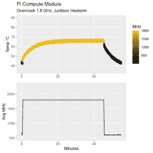](https://hackaday.com/pi_compute_module_overclock_1-8_ghz_junkbox_heatsink/)[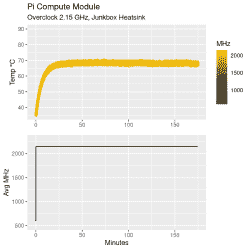](https://hackaday.com/pi_compute_module_overclock_2-15_ghz_junkbox_heatsink/)[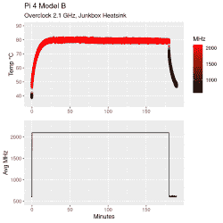](https://hackaday.com/pi_4_model_b_overclock_2-1_ghz_junkbox_heatsink/)

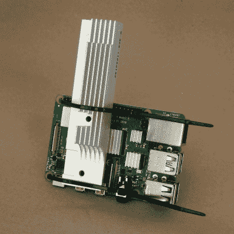

当我试图用 Pi 4B 复制这一成功时，我在运行中期遇到了前两次自发关机，由于内置的热量管理，我并不希望看到这种情况。(闪回拍 Celerons 的时代！)看起来 2.15 GHz 对于 4B 和垃圾盒散热器来说有点太快了。我把它降低到 2.1 GHz，它在粗糙的边缘上运行了几个小时，散热片垂直放置。但它真的很危险:在第一次 2.1 GHz 运行期间，几个小时后我将主板平放在桌子上，这意味着散热器不再垂直，它上升了几度，完全崩溃。这不是生活的方式。

## 摘要

整个实验一直在玩弄两种效应。首先，CM4 和 Pi 400 有一个稍微更节能的芯片组，允许它们运行得更冷或更快——随你选择。这种影响是非常真实的，CM4 在 1.5 GHz 下运行时温度降低了约 10°C，这为热节流提供了很好的余量。或者，如果您愿意生活在边缘，对于相同的温度和冷却解决方案，您可以在 1.8 GHz 下运行 CM4，而 Pi 4B 在 1.5 GHz 下运行，并且没有散热器。

但除了效率增益之外，如果你安装足够好的散热器，Pi 4 家族的任何成员都可以毫无问题地运行到 2 GHz 范围。多大才算够大？这将取决于您的环境、您对节流和/或缩短 SOC 寿命的容忍度，以及您有多希望将散热器放入狭小的空间。根据我对垃圾箱散热器的测试，你应该能够找出一种被动冷却解决方案，它适用于除了最紧配合以外的任何情况。

 可以肯定的是，覆盆子的工程师们已经用 Pi 400 完成了一个不错的设计。一块足够大的铝给了它们足够的热开销来全速运行内部的四个 CPU，而不用流一点汗，此外，它还运行更节能的芯片组。我仍然对 Pi 400 散热器如此有效感到惊讶，它只不过是一个塑料盒中的一大块铝板，但它比足够的多*。我将在 2.15 GHz 下运行我的 Pi 400，因为——为什么不呢？*

这些有意义吗？最后，你说的是一个小的，只有中等功能的单板计算机，而不是一个液冷的巨型数字处理装置。它的内存有限，GPU 中等。超频增益在 10%到 30%的范围内，所以它们也是适中的。所涉及的配置工作，编辑配置文件，确实是最少的，但您将花费适量的时间和金钱来寻找合适的散热器。

对于一般的工作负载，你可能不需要超频，而对于硬核工作负载，Raspberry Pi 可能不是正确的选择。但如果你需要的是一个中型减速带，你可以得到它。在我们看来，你也一样。

我们认为这很酷，覆盆子剧组得到了更好的硅版本，并将其应用到他们的两个最新产品中。如果 Broadcom“C”系列 SOC 是“B”的替代产品，我们不介意在未来的 Pi 4Bs 中看到更新的版本。为什么不呢？它的能效似乎提高了 10%,虽然这可能算不上惊天动地，但绝对不容小觑。与此同时，只需在 4B 上多放一点铝表面，就万事俱备了。