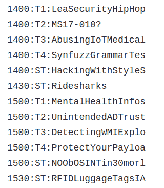

# 通过 SSID 公布您的会议日程

> 原文：<https://hackaday.com/2019/10/22/advertise-your-conference-schedule-via-ssid/>

无论是运行在 Linux 机器上的 Python 脚本还是 ESP8266，~~滥用~~使用 WiFi SSIDs 来传递信息已经不是什么新把戏了。但是对于 DerbyCon 2019，[vgrsec]希望做一些有点独特的东西。我们敢说，甚至有用。这个[树莓 Pi 创造了假的 WiFi 网络，告诉每个人将要进行什么样的会谈，而不是广播 SSID 的淫秽内容或模因。](https://www.vgrsec.com/post20191006.html)

 这里的概念相当简单:`/boot`中有一个文本文件，包含日程表中所有讲座和研讨会的缩写名称，每行一个，每行以特定事件的预定时间开始。[vgrsec]编写的脚本打开这个文本文件，搜索以当前时间开始的行，并生成适当的 SSIDs。随着在德比康赛道上运行的赛道数量增加，这意味着一次可能会产生多达五个 SSIDs。

从理论上讲，这足以完成这次特殊的黑客攻击，但是有一个问题。Raspberry Pi 上缺少 RTC 意味着它不能很好地保持时间，而 WiFi 适配器将忙于输出 SSIDs 的事实意味着它能够连接到互联网并通过 NTP 下拉当前时间的机会不是很好。

由于没有可靠的计时方式，这个系统毫无价值，[vgrsec]在其中添加了一个 Adafruit PiRTC 模块。一旦时间同步，系统就可以通过 USB 电池组不受束缚地运行。我们可能会把它放在一个围栏里，这样它看起来不那么可疑，但话说回来，在 DerbyCon 上肯定会看到比这更不寻常的设备。

当然，如果你不介意一次就把整个时间表扔掉，让用户自己筛选堆积如山的假 SSIDs，[这甚至更容易完成](https://hackaday.com/2018/02/09/esp8266-broadcasts-memorial-wifi-spam/)。