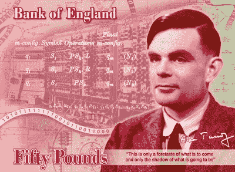

# 艾伦·图灵成为 50 英镑的代言人

> 原文：<https://hackaday.com/2019/07/15/alan-turing-to-be-the-face-of-fifty-quid/>

英格兰银行宣布，50 英镑钞票的新头像将是艾伦·图灵。这一消息是在一轮[科学家填补空缺](https://hackaday.com/2018/11/03/whos-going-on-your-fifty/)的公开提名之后发布的，图灵与斯蒂芬·霍金和艾达、洛夫莱斯伯爵夫人等竞争激烈。

 即使你是英国人，你也不会经常看到 50 元的钞票，只有在你买了二手车的情况下，你才会经常接触到这种钞票，但这一举动的重要性超越了这张钞票是否会出现在酒吧里一品脱发泡的淡啤酒上。这不是一个轻易授予的荣誉，尤其是在图灵的案例中，尽管他在战时破译了密码，并开创了计算机科学学科，但在 20 世纪 50 年代，当他被发现是同性恋时，他仍被羞辱并被迫自杀。

### 钞票上的硬件会和图灵本人一样出名吗？

这家银行还没有让雕刻师开始工作，但是他们已经制作了这个模型，除了图灵本人之外，还有一张由图灵机示例叠加在早期计算机机架图片上的桌子。我们不认为这是 [EDSAC](https://en.wikipedia.org/wiki/EDSAC) 或 [Manchester Baby](https://en.wikipedia.org/wiki/Manchester_Baby) ，这不是 [Bombe](https://hackaday.com/2018/02/17/help-keep-the-bombe-at-bletchley/) 也绝对不应该是[巨像](https://hackaday.com/2016/08/23/colossus-face-to-face-with-the-first-electronic-computer/)因为他与此事没有什么关系，但我们确信在我们的读者中会有人能够提供一个肯定的身份证明。我们希望无论最终的设计是什么，它都能公正地对待图灵的遗产。

 [https://www.youtube.com/embed/jyQ40biOCec?version=3&rel=1&showsearch=0&showinfo=1&iv_load_policy=1&fs=1&hl=en-US&autohide=2&wmode=transparent](https://www.youtube.com/embed/jyQ40biOCec?version=3&rel=1&showsearch=0&showinfo=1&iv_load_policy=1&fs=1&hl=en-US&autohide=2&wmode=transparent)

