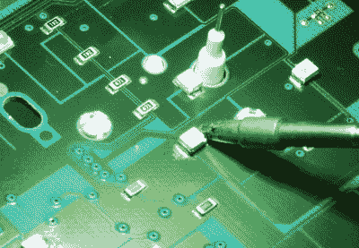

# 阿尔法罗密欧仪表组获得一组新的发光二极管

> 原文：<https://hackaday.com/2020/11/26/alfa-romeo-gauge-cluster-gets-a-fresh-set-of-leds/>

在老式汽车上，如果你注意到你的一个仪表后面的灯熄灭了，你知道是时候把手伸回去，更换已经熄灭的小白炽灯泡了。但是，如果你在一辆已经向 LED 仪表盘照明飞跃的现代汽车上看到同样的问题，你该怎么办呢？这就是[Tysonpower]最近不得不发现的事情，当时他的阿尔法·罗密欧·朱莱塔·QV 的燃油指示器变暗了。

 在休息之后的视频中，【Tysonpower】详细介绍了如何从 Giuletta 的仪表板上拆卸仪表组，我们认为这对拥有相同车辆的任何人来说都是一个有用的小教程。一旦他把它放在工作台上，他就把它拆到光秃秃的 PCB 上，并开始(字面上)四处摸索。

他最终注意到，如果他推动燃油指示器附近的电路板，他可以让相应的 3528 SMD LED 亮起，但触摸焊点似乎不能解决问题。假设 LED 肯定是内部有缺陷，他简单地更换了它，一切又恢复了正常。

不完全是。新部件产生的光与安装在板上的其他十几个白色 led 的颜色或亮度不匹配，所以[Tysonpower]决定直接将它们全部更换。虽然这显然需要更多的时间和精力，但他表示，最终结果是，夜间驾驶时，仪表组看起来明显更亮、更清晰。对于一下午的工作和几块钱的发光二极管来说还不错。

大多数时候，当我们看到有人在仪表板后面乱搞时，那是因为他们打算用更强大的东西取代原来的仪器。但是像这样的项目，[只是对现有的硬件](https://hackaday.com/2018/08/11/updating-a-1999-saab-with-an-arduino/)做了一点改进，证明了库存部件并不总是*令人失望。*

 [https://www.youtube.com/embed/Gn_txGQ0IJ0?version=3&rel=1&showsearch=0&showinfo=1&iv_load_policy=1&fs=1&hl=en-US&autohide=2&wmode=transparent](https://www.youtube.com/embed/Gn_txGQ0IJ0?version=3&rel=1&showsearch=0&showinfo=1&iv_load_policy=1&fs=1&hl=en-US&autohide=2&wmode=transparent)

