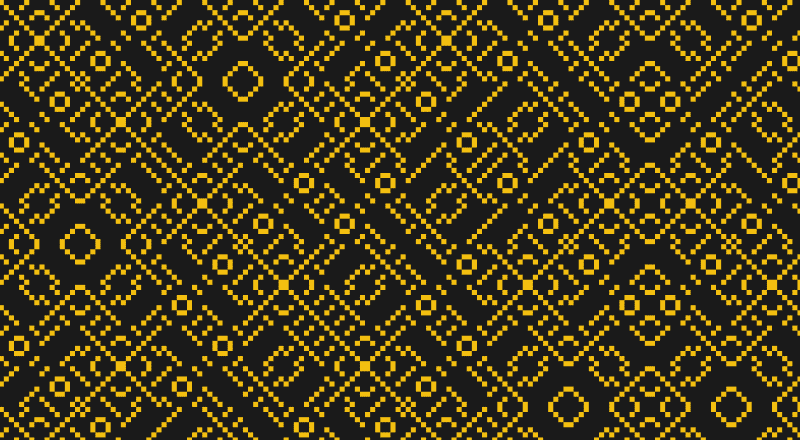

# 用惊人简单的数学绘制的外星艺术

> 原文：<https://hackaday.com/2021/04/13/alien-art-drawn-with-surprisingly-simple-math/>

程序员【AEM kei】[在推特上发布了公式](https://twitter.com/aemkei/status/1378106731386040322) `(x ^ y) % 9` [以及更多“外星艺术”](https://jsfiddle.net/mdshaub/9tm3eard/37/)的代码。但是像`(x ^ y) % 9`这样简单的公式怎么会导致复杂的设计呢？按位异或(`^`)和模(`%`)的组合产生了一个重复的模式，它仍然足够复杂，足以满足视觉，如果这听起来不像一个解释，也没关系。当使用存储器和移位寄存器时，位运算很有用，但如果您想要驱动 LED 的行或矩阵，或者解释多个开关的组合，或者在这种情况下，在新的[翻转点显示器](https://hackaday.com/2021/02/24/30-fps-flip-dot-display-uses-cool-capacitor-trick/)或[低分辨率 LED 矩阵](https://hackaday.com/2020/05/18/jumbo-led-matrix-brings-classic-sprites-to-life/)上显示有趣的测试模式，位运算也值得学习。你喜欢吗？是的，所以我们开始吧。

XOR Truth Table

|  | 0b00 | 0b01 | 0b10 | 0b11 |
| 0b00 | 0b00 | 0b01 | 0b10 | 0b11 |
| 0b01 | 0b01 | 0b00 | 0b11 | 0b10 |
| 0b10 | 0b10 | 0b11 | 0b00 | 0b01 |
| 0b11 | 0b11 | 0b10 | 0b01 | 0b00 |

按位异或比较两个输入的每个二进制数字。当两位数字中只有一位是 1 时，XOR 返回 1，否则，它返回该位置的 0。假设坐标是 3，2。转换成二进制，我们有 0b11 和 0b10。从这个真值表中，我们可以看到最高有效位都是 1，返回 0，而只有一个最低有效位是 1，所以比较返回 1。

转到%上，这是模运算符，与百分比无关。该运算符将两个数相除，如果有余数，则返回余数。取`9 % 5`。当 9 除以 5 时，5 进一次，余数为 4，所以`9 % 5 = 4`。现在，我们从顶部开始的原始公式将为每第九个数字绘制一个黑盒，除了按位 XOR 将扳手扔进该计数，改变可被 9 整除的数字出现的频率，并提供这些可怕模式所需的复杂性。

你能用简单的公式创造出哪些最有趣的设计？