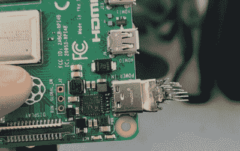
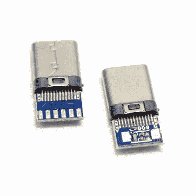
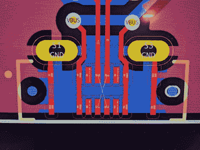
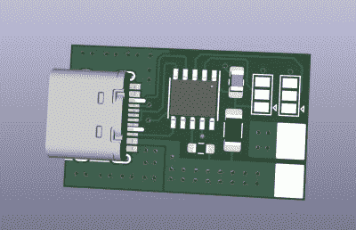
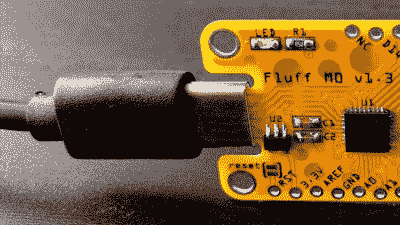
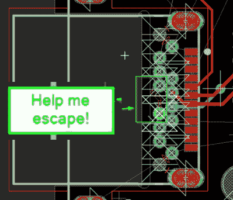
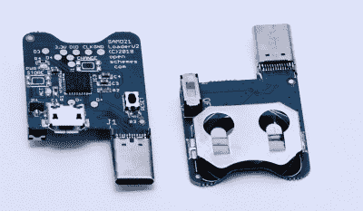

# 关于 USB-C 的一切:连接器机制

> 原文：<https://hackaday.com/2022/12/20/all-about-usb-c-connector-mechanics/>

在两种情况下，黑客必须考虑 USB-C 连接器的机制。第一种是当 USB-C 连接器物理损坏时，第二种是当我们需要在自己的板上安装连接器时。让我们把它们都过一遍。

## 清洁连接器

如果你的手机或笔记本电脑的插座出现故障怎么办？首先，这可能是由于灰尘或碎片。你可以买棉签来清洁 USB-C 连接器；也许添加一些异丙醇或其他适合清洁的液体，你可以达到“足够好”的状态。你也可以使用热空气或锋利的烙铁头以及一些焊剂来回流连接器上的引脚——当遇到机械故障时，这往往可以补救它们，即使是很短的时间。

连接器怎么会出故障呢？嗯，其中一个引脚可能会在塑料内折断，或者变得太脏而无法接触。考虑一个带有 USB-C 充电和数据插座的设备，带有 USB 2.0，但没有高速线对——可悲的是，这就是说，市面上的大多数手机。试着用 USB-A 转 USB-C 线把它插到 USB-A 充电器上。它充电吗，即使很慢？那么，您的 VBUS 引脚是正常的。

使用 C 型电缆将其插入 C 型充电器，现在就涉及到 CC 引脚了。它在两个方向都充电吗？那么你的两个 CC 引脚都没问题。它只在一个方向充电吗？其中一个 CC 引脚必须被破坏。然后，您可以检查 USB 2.0 引脚，用于数据传输和传统充电。使用 USB-A 到 USB-C 电缆将手机插入电脑。它作为设备枚举吗？它是否列举了两个方向？如果没有，你可能要清洁 D-和 D+引脚，甚至两组。

## 有时可以被替换

如果你能拆开你的设备，得到一个 USB-C 插头插座，并通过插座测量连续性，这也会有所帮助。如果你的连接器坏得太厉害，没有连续性，不管你怎么回流一个特定的引脚？嗯，这可能是个坏消息，除非你有一个相当受欢迎的设备。

如果真的有一千种不同的 USB-C 连接器类型，我不会感到惊讶——世界上的每部手机和笔记本电脑似乎都使用稍微不同的、机械不兼容的连接器。如果你的昂贵设备中的 USB-C 连接器出现故障，你可能不得不寻找一个非常非常特殊的替换部件。考虑到它们总是通孔和 SMD 器件的组合，它们的脱焊和更换也很麻烦。有时，SMD 焊盘牢牢地位于连接器下方，无法触及；对于边缘安装连接器，有时它们位于电路板的两侧。通常，在针的旁边或上面有塑料。所有这些都使得使用热空气或烙铁来移除连接器很麻烦。

从好的方面来看，并不是所有的制造商都像那样半故意地怀有敌意。新的 Macbooks 在一个单独的、容易拆卸和更换的部件上有 USB-C 插座。许多手机也在手机底部的一个单独的小 PCB 上有 USB-C 端口。在这两种情况下，你都可以在全球速卖通上购买一块单独的电路板，然后进行更换。现在，拆卸现代手机是一个兔子洞，但我想我们应该感谢至少有一些考虑。

Probably not fixable with a cotton swab. On the upside, continuity measurements are easy to do.

就像 MicroUSB 一样，USB-C 连接器也有小插销。它们是不可见的，因为它们在插头内部，在侧面。也就是说，他们经常出现。当然，就像 MicroUSB 一样，这些插销也会磨损。谢天谢地，你需要做的就是买一根不同的电缆。如果这是你最喜欢的电缆，或者你想自己制作电缆呢？

你也可以购买带有小型分线印刷电路板的 USB-C 插头，这样你就可以在上面焊接电线。有了这样的插头，你就可以建造定制的电缆或创造新的电缆；我个人从 LCSC 购买它们，因为如果你知道在哪里可以找到的话，它们的种类多得惊人。有些插头上有上拉电阻，非常适合构建 USB-A 至 USB-C 电缆，但对于 USB-C 至 USB-C 应用，您最好确保移除该电阻。有插头暴露两个 CC 垫，额外方便的情况下，你想建立自己的 USB-C 扩展或什么的。此外，如果你想从 PSU 中获得 5 安培的电流，并需要建立一个定制的电缆，还有其他事情，也有带电子标记程序的插头。

到目前为止，我们已经坚定地进入了制造我们自己的东西的领域。让我们来讨论如何正确地做这件事——现在，我们还是把自己限制在机械方面。

## 通用连接器规则

首先，让我们强调一下 USB-C 插座的优点。它们中的绝大多数都有通孔安装引脚，这是对 MicroUSB 和 MiniUSB 传统的一个可喜的转变，在 micro USB 和 mini USB 中，你可以买到的最便宜的连接器只是表面贴装的，很容易将连接器从电路板上撕下来。很难找到一个完全表面贴装的 USB-C 插座，这确实使东西在机械上更加坚固。

对于黑客来说，这确实会使 PCB 和组件变得更加昂贵——你需要你的工厂能够制作 PCB 插槽，因为大多数 USB-C 连接器都使用插槽，当订购带组件的 PCB 时，你需要两个或四个额外的通孔引脚，需要手动焊接——这需要额外的费用。也就是说，毫无疑问，价格会随着时间的推移而下降。

USB-C 连接器、插座和插头都有额定电流。所有的插座都应该额定为 5 A，但我见过一些中国的额定为 3a；查看数据手册。当然，如果您在板上放置 5 A 连接器，请记住，只有当您的板能够请求时，它才会通过 5 A，这反过来需要有源 USB-PD 通信，通常的双 5.1K 下拉配置不足以满足要求。从好的方面来说，如果你不打算有一个 5 A 的连接器，你不需要检查电流额定值。

Downside: it’s unroutable unless you use really small vias. Upside: it looks like it will eat you. ([from RealTimeKodi](https://twitter.com/RealTimeKodi/status/1597546133085360131))

之所以有这么多种插座，是因为你可能有无数种方式来安装 USB-C 插座——水平安装在电路板的顶部，或垂直安装，或垂直但面向侧面安装，或与电路板成直线安装，有几十种可能的高度，有或没有防水，并且制造质量不同。如果你需要高速线对的连接器，也有无数种方法可以暴露高速线对。有些使用 SMD 焊盘，有些使用通孔引脚来实现高速，这还只是皮毛。

也不是所有的连接器都适合你——这确实有助于减少多样性。首先，你会看到没有 CC 引脚的连接器暴露在外，只有 USB-A 到 USB-C 电缆才能正常工作。人们可以期待在售价 3 美元的“婴儿第一个焊接工具包”中找到这样的连接器。然而，你真的不应该使用它们。还有很多连接器希望将引脚的 SMD 焊盘完全隐藏在自己的封装下。如果你的锡膏印刷技术达不到标准，你真的真的不想调试这种连接器的焊接问题。

## 速度慢，规则简单

USB-C PD configurable trigger board with the tried and true 16-pin connector, based on the CH224K chip

让我们把自己限制在 USB 2.0 和 CC，当然，还有 VBUS 和 GND。第一篇文章中强调，爱好者选择了 16 引脚 SMD 连接器。你会在 devboards、廉价的 USB-C 产品和许多黑客创造中看到它——它很特别，因为它是 USB-C 规范中定义的[，也是](https://twitter.com/GregDavill/status/1265776452852539393)。KiCad 将其封装列为`USB_C_Receptacle_HRO_TYPE-C-31-M-12`，并带有一个名为`USB_C_Receptacle_USB2.0`的匹配符号，但 HRO 肯定不是第一个生产这种连接器的国家，而且有大量引脚和封装兼容的连接器专门针对这种连接器。此外，正如我提到的，你会得到 SBU 引脚，你可能想把它们用于 UART 之类的东西，或者，[从](https://twitter.com/sad_electronics/status/1508190002316038144)封装中删除 SBU 焊盘，这样你就可以在焊接期间少桥接两个引脚，如图所示。

当你找到一个好看的替代连接器时，一定要检查其数据手册中的引脚编号是否与你正在使用的 PCB 尺寸一致。曾经有过这样的情况，数据手册中的引脚编号[与常用编号](https://twitter.com/gregdavill/status/1265773774487470082)不同，或者[数据手册令人困惑](https://twitter.com/arturo182/status/1460656050814828547)并导致黑客出错，[在发现制造问题后导致数小时的调试](https://twitter.com/timonsku/status/1460642158646550534)。查阅数据手册时，请检查是否有安装这种连接器的推荐 PCB 厚度。尽管这种连接器安装在电路板的顶部，但 PCB 的厚度可能会决定外壳引脚正确焊接的难易程度。也就是说，这更多的是一个建议，而不是一个要求。

绒毛 M0 板作者【德希普】

当然，你不应该害怕搜索和使用任何你可能想要的连接器。例如，如果你不想要 USB 2.0，可能想要更容易的焊接体验，[有非常好的连接器](https://twitter.com/DurandA23/status/1508197172042416130)，它们只露出 GND、VBUS 和 CC 引脚。一般来说，如果你想要一个完全符合你的使用情况的连接器，你总是可以找到一个，你可以把 16 针连接器作为最安全的后备。哦，如果你用的是 0.8 毫米的 PCB，而且你想做非常非常便宜的东西，你可以[把插座直接建在你的 PCB 上。这可能只是一个小小的玩笑，最终可能会让你失望，但最终会足够好。](https://hackaday.io/project/174215-usb-c-pcb-socket)

## 高速度，高要求

如果您想使用连接器访问高速通道，该怎么办？遗憾的是，我没有具体的高速连接器可以推荐给你，但我可以给你一些指南，告诉你如何找到一个。

For when you’d like to be utterly unable to inspect your soldering ([from Cyber City Circuits](https://twitter.com/MakeAugusta/status/1597414166079623168))

如果您希望为自己的设计选择支持高速的插座，我建议您要么找到一个现有的、经过验证的开源设计，它看起来很容易焊接，要么找到几个看起来合适的连接器，订购样品，设计一个具有所有连接器测试尺寸的电路板，然后尝试组装几个，看看效果如何。

如果您在网上找到了一个看起来很适合您找到的连接器的封装，请仔细检查尺寸，然后再次检查，即使封装名称与连接器零件号完全相同。两个月前，我决定让[成为一个突破，在 USB-C 插座上展示所有高速通道，](https://github.com/CRImier/MyKiCad/tree/master/Breakouts/usbc_hs_female_breakout)让信号至少看起来像差分对。它并不完全适合实际的日常 USB3 或 DisplayPort 使用，因为我订购了一个双层板，因此阻抗不奇怪，但它仍然比通常的 90 度弯曲“高速”走线的[突破](https://www.adafruit.com/product/4396)要好。

我在 KiCad 中发现了一个看起来很容易焊接的足迹——封装下一行的通孔引脚，封装外一行的表贴但可通过烙铁接触的焊盘。我在 LCSC 上找到了一些连接器，看起来和脚印吻合。当需要将连接器焊接到分线点上时，结果是前端的屏蔽引脚偏离了封装位置几毫米。事实还证明，在增加电镀后，用于通孔引脚的 PCB 孔稍微有点太紧了——下一版本肯定会有稍微更大的孔。

## 边缘和塞子

你可能会找到一个不错的带通孔高速内排引脚的边缘安装连接器。在进行 PCB 布局时，你可能会[意识到不可能将两个最里面的信号拉出](https://electronics.stackexchange.com/questions/497204/how-can-i-route-2-inner-pins-on-this-usb-c-component)——一个 CC 和一个 SBU。一种变通方法是，如果足迹是 USB-C 插头，则直接省略这两个引脚:您不使用 SBU，也不需要 VCONN 的第二个引脚，简单地说，这是一个未使用的 CC 引脚，重新用作电子标记器的电源引脚。

或者你可以解决这个问题。第一种方法是使用多层板，通过内层引出引脚，内层没有通孔引脚的圆环。第二种方法是使用足够小的走线，它们仍然可以绕过连接器，靠近 PCB 边缘。或者第三种方法，你可以偷偷减小顶层(不可焊)违规引脚周围的两个通孔焊盘的宽度，直到它们之间有一条走线。

The mid-mount plugs on [a Nintendo Switch payload injector board](https://hackaday.io/project/160187-samd-v2-fusee-payload-injector)

我提到的大部分内容同样适用于插座和插头。当然，还有一些特定于插件的问题。例如，有中间安装插头——露出全套引脚的插头，每个 USB-C 引脚侧位于 PCB 的不同侧，非常适合焊接。另一方面，我不知道这种插头是如何在工厂组装的——在我拆卸的产品中，它们似乎是回流的，而不是手动焊接的，但由于连接器顶部的两侧都有 SMD 焊盘，我不知道如何给这样的电路板打模板，尤其是在大规模制造环境中。有什么想法吗？

另一个特殊的考虑是，你只允许一个插头连接一组 USB 2.0 数据引脚，也就是说，一对 USB 2.0 引脚必须保持断开。一些可焊接插头甚至缺少第二对 USB 2.0 引脚。我不太清楚为什么你不能这样做，特别是考虑到几乎每一个 USB-C 插座 PCB 设计都与这些引脚平行，而且它仍然是一个平行连接。

这就是你可能想知道的关于 USB-C 连接器机制的一切。当然，如果我错过了什么，请在评论中谈论它！