# DEF CON 26 (vol 3)的所有徽章

> 原文：<https://hackaday.com/2018/08/29/all-the-badges-of-def-con-26-vol-3/>

在 DEF CON 26 上，我尽最大努力去看每一个徽章，和每一个徽章制作者交谈。有一件事是肯定的，那就是今年看完所有的比赛是绝对不可能的，但是我已经很接近了。查看本系列第 1 卷和第 2 卷的[中展示的伟大徽章。游戏正在进行中，如果你要去参加一个黑客会议，这是建立你自己的硬件徽章的最好时机——无论你建立 5 个还是 500 个！](https://hackaday.com/2018/08/14/all-the-badges-of-def-con-26-vol-1/)

好吧，让我们看看徽章！

## 撒旦徽章黑客

 [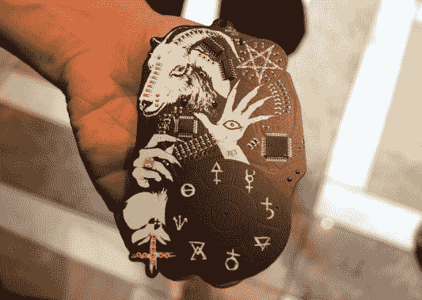](https://hackaday.com/?attachment_id=320593)  [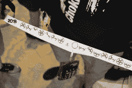](https://hackaday.com/?attachment_id=320594)  [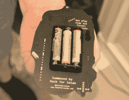](https://hackaday.com/?attachment_id=320595) 

撒旦徽章是#Badgelife 中最大的“全套”产品之一。徽章的设计，里面的谜题，围绕着它的社会宣传，以及随之而来的装备使得这是一项了不起的事业。

这种徽章一共生产了 300 枚，装在 VHS 盒式磁带中交付。最引人注目的特点之一是，所有的组件都被放置以增强整体设计，这是一个美丽的哑光黑色阻焊膜，白色丝网和镀金。例如，有一个光敏电阻，在手上看起来像一个圆环。在线条和弧线上有发光二极管和电阻来创造闪亮，但看看 Baphomet 鼻子的喇叭和鼻梁，你会发现真正有趣的位置选择。

徽章配有 Atmel 触摸控制器，可读取字形填充圆圈上的电容触摸输入。PIC18F4520 驱动徽章，在 595 个移位寄存器的帮助下管理 led。徽章的重点是一个被描述为“网络加密和速记”的谜题。他们甚至有自己的字符集，显示在挂绳上。解开谜题激活新的和越来越令人印象深刻的可视化。如果你收集到足够多的徽章(我猜五角星的搭配是 5 个)并表演一场降神会，你显然可以召唤撒旦。

## 隐藏徽章先生

 [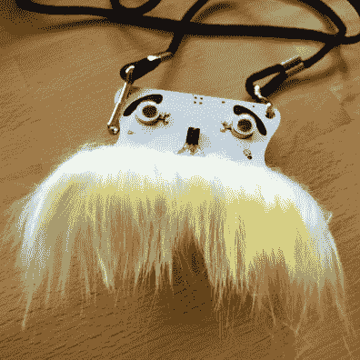](https://hackaday.com/2018/08/29/all-the-badges-of-def-con-26-vol-3/mustache-badge-front/)  [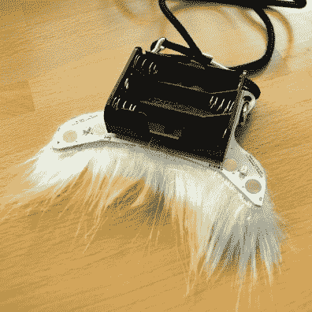](https://hackaday.com/2018/08/29/all-the-badges-of-def-con-26-vol-3/mustache-badge-rear/) 

看看这个漂亮的家伙！我认为这是我在今年的 DEF CON 上看到的最令人愉快的徽章。

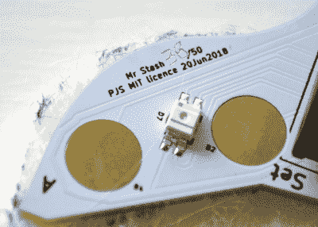

设计出来的生活就是让我会心一笑。看看可爱的红外接收器的鼻子！这些徽章相互识别，当它们识别时，眼睛下面的振动马达就会振动！

小胡子本身下面也有 led。它们安装在电路板的背面，透过基板发光。电容式触摸按钮允许用户输入。但是看看这些编号的有趣方式。在定制徽章的世界里，一枚刻有手工序列号的徽章(在我的例子中是 50 枚中的 38 枚)是一种个人风格。令人难以置信的是，Stash 先生徽章是由 [@wireengineer](https://twitter.com/wireengineer) 制作的，他当然也是制作 DC26 官方徽章的人之一。

## DEF CON 拍摄徽章

 [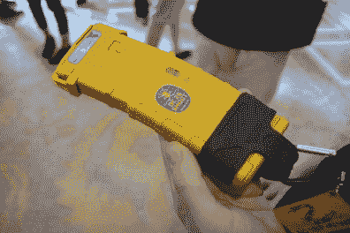](https://hackaday.com/?attachment_id=320390)  [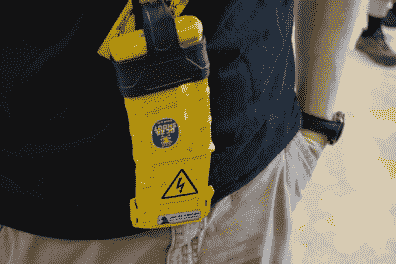](https://hackaday.com/?attachment_id=320391) 

有一个会前聚会叫做 DEF CON Shoot，枪支爱好者在拉斯维加斯附近的射击场聚会。我第一次注意到这个活动的徽章是在去年，当时一款功能正常的桌面佳能叫做#boombadge 。今年是另一个真正创造性的徽章:一个定制的香味和染色 PMAG。

PMAG 是一个聚合物杂志，沙色的版本开始几乎是白色的。水煮后可以浸泡在 Rit 染料中，再煮一次，浸泡在香蕉香味中。从那里，一个定制的贴纸看起来就像你在香蕉上找到的一样，完成了这个外观——这是一个香蕉夹！嗯，我猜是香蕉杂志。黄色 LED 和硬币电池完成了外观。他们生产了 145 个这样的徽章。

## Goon Box 徽章

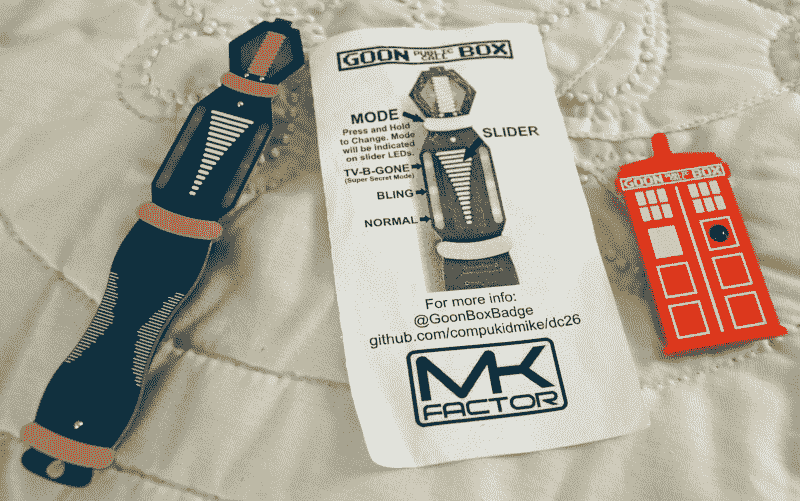

[Goon Box 徽章](https://twitter.com/goonboxbadge)是一个声波螺丝刀，除了珠光宝气之外，还包括一个 TV-B-Gone。但我认为徽章上的徽章才是最棒的。它由背面的硬币电池驱动，并使用红外探测器来监听任何红外流量，当发现载波信号时，红色 LED 就会亮起。这是一个超级简单的红外通知程序，在一个有很多徽章都在发送红外信息的骗局中变得非常有趣！

## DC801 徽章

 [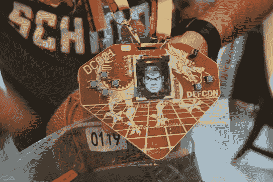](https://hackaday.com/?attachment_id=320596)  [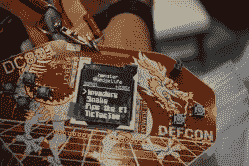](https://hackaday.com/?attachment_id=320597)  [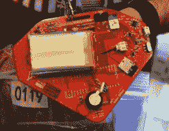](https://hackaday.com/?attachment_id=320598) 

向[@仓鼠](https://twitter.com/hamster)和 [DC801](https://twitter.com/dc801) 徽章工作人员致敬，他们着手制作 400 个这些漂亮的徽章，并设法实现了 100%的产量！他们设计这个徽章是为了资助 DC801 派对和他们在盐湖城的黑客空间。这些徽章中有 350 个是售前徽章，另外 50 个是在大会上发布的。

在里面你会发现一款 *Wargames* 风格的井字游戏。徽章使用 Rigado BMD-300 模块，该模块结合了 Nordic NRF 52832(BLE 无线电和 ARM Cortex M4F)以及电源管理、天线和 FCC 认证。这些模块非常受 DC25 徽章的欢迎。你还会发现一个 microSD 卡插槽，还有一个 FTDI 芯片(未填充)的足迹，供任何想通过 USB 进行黑客攻击的人使用。不过，这个徽章还有一个串行引导程序，所以任何人只要有 USB 转串行电缆就可以在会议结束后进行固件更新。[在 repo](https://github.com/DC801/DC26PartyBadge) 上了解更多关于徽章的信息。

## 第 4 阶段地面穿越电离层徽章

   [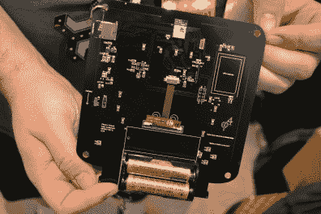](https://hackaday.com/?attachment_id=320602) 

如果你是业余无线电爱好者，这个[跨电离层徽章](https://twitter.com/abraxas3d/status/1031542795901661185)应该会让你热血沸腾。这也使用了前面提到的 BMD-300，它提供了 ARM 控制器和 BLE 支持。一开始我以为是 5 GHz 和 10 GHz 的收音机，但事实并非如此。这个徽章就是这样一个无线电的外围设备——[第 4 阶段地](https://phase4ground.github.io/),这是一个基于 FPGA 的开源设计。你可以在项目页面上了解[更多关于徽章本身的信息。](http://openresearch.institute/badge/)

## 光明会徽章

 [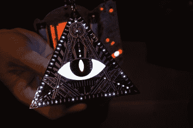](https://hackaday.com/?attachment_id=320666)  [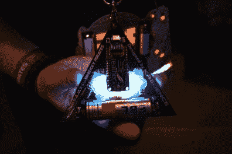](https://hackaday.com/?attachment_id=320667) 

简单，但做得非常好！这是光明会的徽章，由 [@_kredence](https://twitter.com/_kredence) 手工制作，他在[制作了 23 个徽章](https://twitter.com/_Kredence/status/1028303626865790976)，每个徽章都花了大约 2.5-3 个小时。

PCB 的正面使用光滑的黑色丝网和白色阻焊膜，我不相信裸铜会在设计中发挥作用。有 97 个发光二极管排列成三角形，将点连接到中心的眼睛。由于 3D 打印扩散器填充了眼睛的两个切口(巩膜和瞳孔是切口，虹膜本身是 PCB)，所以这只眼睛看起来很壮观。徽章边缘背面的 led 灯照亮这个漫射器以获得最终效果。

徽章使用 Adafruit Feather 328P 来驱动动画。这被部分选择是因为羽毛板已经为给徽章提供能量的 18650 细胞提供了脂肪处理。LED 本身由 ISSI 的 IS31FL3741 LED 驱动芯片驱动，该芯片是今年非常受欢迎的带徽章的零件系列。

## 衷心徽章

[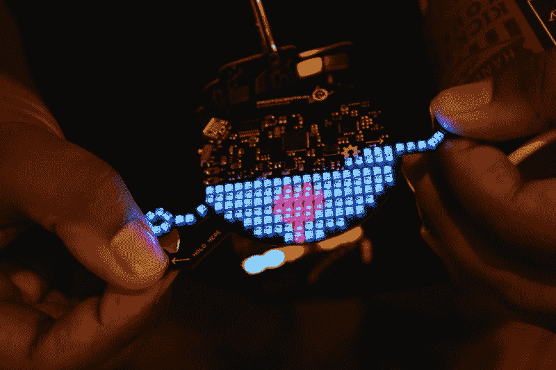](https://hackaday.com/wp-content/uploads/2018/08/32-heartypatch-badge.jpg)

我在 DEF CON 的早餐会上遇到了 [Ashwin K. Whitchurch](https://twitter.com/ashwinkw) ，并很高兴地看到他在前往 CON 的前几天制作了一个定制徽章。这是基于他用于[heart patch](https://hackaday.io/project/21046-heartypatch-a-single-lead-ecg-hr-patch-with-esp32)的相同电路，这是一种可穿戴单导联 ECG，你可能记得在 2017 年 Hackaday 奖中见过。

制作了两个 HeartyBadges，每个都有 144 个 led。两个圆形附件上暴露的铜可以夹在拇指和食指之间，以检测和显示您的心跳！

## 电子纸徽章是对未来伟大事物的暗示

[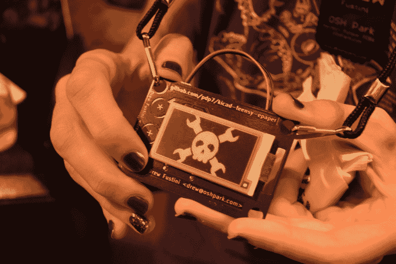](https://hackaday.com/wp-content/uploads/2018/08/36-epaper-hackaday-shoutout.jpg)

Hackaday 的朋友 Drew Fustini 带着他自己设计的胸牌参加了我们在 DEF CON meetup 的早餐会。[电子纸徽章](https://hackaday.com/wp-content/uploads/2018/08/35-flux-capacitor-number-2.jpg?w=250)使用一个微小的 LC 来驱动一个 2.15 英寸的电子纸显示器。左边的一排电容触摸按钮允许改变图像，他只是碰巧在这张照片的选择画廊里有 Jolly Wrencher。

这个徽章让我对今年 9 月 27 日在麻省理工学院举行的[开放硬件峰会](https://2018.oshwa.org/)感到非常兴奋。今年的徽章是[由 Hackaday.io](https://hackaday.io/project/112222-2018-open-hardware-summit-badge) 上的一群人合作完成的！这基本上是德鲁的类固醇徽章，他告诉我，与团队合作的经历非常积极。似乎每当团队遇到一个难题或一堆需要完成的工作时，团队中的某个人就会抓住它，带着它跑。这是认证开放硬件和团队开发的一个很好的例子。

## WiscoBadge

这个徽章是威斯康辛州的地图。这是一叠压克力框架，顶部有一个印刷电路板。我喜欢在这个设计中使用裸露的 FR4，因为它为点缀在地图上的 led 提供了一个非常好的扩散器。虽然我没有机会与 [@D1g1t4l_T3mpl4r](https://twitter.com/d1g1t4l_t3mpl4r/status/1027375534735409153) 谈论这个设计，但我被告知左上角的红外接收器可以让徽章相互检测。当这种情况发生时，地图的不同部分在可视化中被解锁。

**更新:**艾迪发来一个链接，上面有更多关于[设计和建造 WiscoBadge](https://www.reddit.com/r/Tymkrs/comments/98z30g/wisconsin_badge_2018/) 的信息。

## 加密和隐私村徽章

[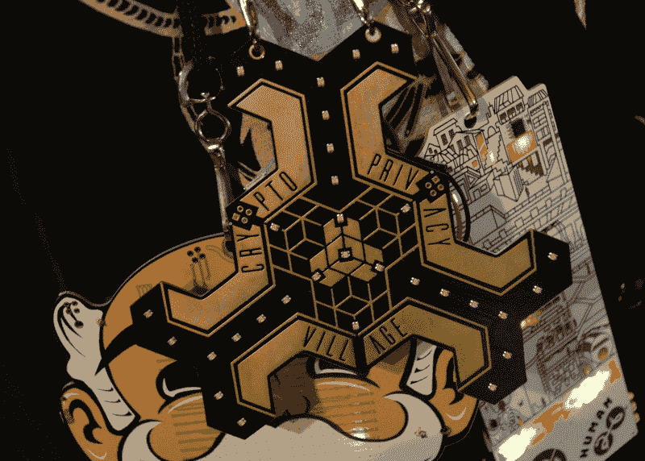](https://hackaday.com/wp-content/uploads/2018/08/29-crypto-and-privacy-front.jpg)

我对阻焊膜、丝绸、丝网和裸铜所能达到的效果感到惊讶。但是看看今年[加密和隐私村徽章](https://github.com/cryptovillage/badge2018)的脸。它没有丝网印刷，但看起来仍然令人惊叹！镀金铜的使用，以及字母和轮廓的焊接掩模的明智放置，使其看起来像是机械加工的金属，而不是 PCB。在正面只使用一种封装(RGB LEDs)的极简主义进一步增强了这种效果。铜垫是电容式触摸，我相信徽章上的灯形成了迷宫的大厅(如果你有更多信息，请在评论中支持我)。同样令人敬畏的是，这是一个镶嵌；放在一起的徽章[形成一个没有缝隙的立体形状](https://twitter.com/CryptoVillage/status/1026355283155546114)。

 [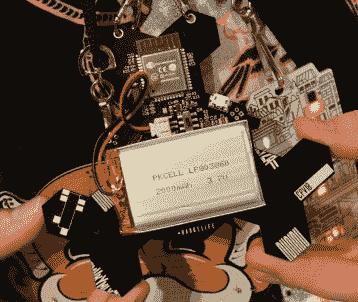](https://hackaday.com/?attachment_id=320664)  [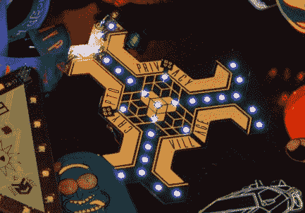](https://hackaday.com/?attachment_id=321434) 

该徽章围绕 ESP32 构建，但也包括一个 EFM8 微控制器。与去年的产品一样，它从 LiPo 电池中获取能量，并可以通过 micro-USB 端口充电。当然，硬件本身也存在挑战，这与[黄金虫难题](https://goldbug.cryptovillage.org/)有关联。在某一点上，徽章层有一个很好的可视化，但我现在只能在这条推特上[找到它。](https://twitter.com/CryptoVillage/status/1025559961462431745)

## 克罗穆伦

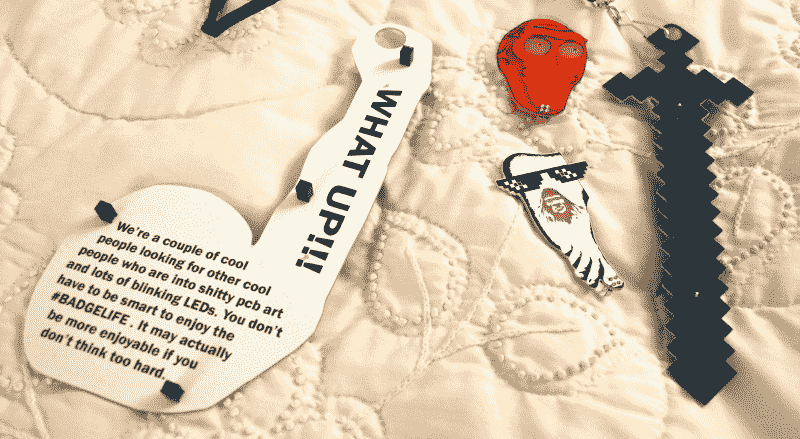

当你有太多的附加品，想全部穿上的时候，你会怎么做？你制作徽章的唯一目的就是持有它们并赋予它们力量。这就是 [@CromulonBadge](https://twitter.com/cromulonb) 的意义所在。这里我们有《我的世界》剑，它有三个附件。还有*费城*的徽章，这是……嗯，只要看看那个系列(基于地球上最糟糕的人)，你最终会看到涵盖这个徽章的那一集。

## 我们下次会完成的

我原本希望这是最后一部巨作，但是徽章实在太多了。我有最后一篇文章(至少有你在这篇文章中看到的那么多徽章)来结束我们的 DC26 徽章报道。密切关注黑客日！