# AlphaSmart Neo 拆卸:这是不受干扰的写作方式

> 原文：<https://hackaday.com/2020/11/05/alphasmart-neo-teardown-this-is-the-way-to-write-without-distractions/>

历史总会有介于两者之间的技术——当下一件重大而持久的事情解决了其中的问题时，这些技术会把我们推过去。这些类型的设备通常做一件事，而且做得很好。还记得 zip 驱动器吗？是的，你知道。我的还在。

AlphaSmart NEO 的太平日子介于人们被笨重的打字机和文字处理器束缚的时代和移动计算的黎明之间。早期的笔记本电脑不能被信任不会突然死亡，但 NEO 将在三个 AAs 上运行 700 小时。

[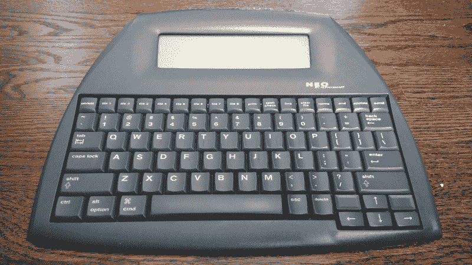](https://hackaday.com/wp-content/uploads/2020/09/neo-beauty-shot.jpg)

NEO 代表着随时随地将想法记录下来的自由，不需要桌子、纸张、墨水、丝带、电源线和其他将人们束缚在室内平面上的装饰品。这正是它吸引我的地方。灵感真的可以在任何时间任何地点发生，所以为什么不做好准备呢？这个东西在大约一秒半的时间里从关闭变成闪烁的光标。甚至还有一个两个按钮的“开”选项，这样当它在你的包里时，你就不会耗尽电池或意外删除文件。

These might be the world’s greatest scissor switches.

[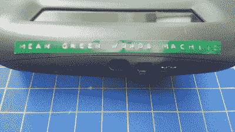](https://hackaday.com/2020/11/05/alphasmart-neo-teardown-this-is-the-way-to-write-without-distractions/neo-interface/)

L-R: DC power, IR, USB-B, and USB-A for connecting to a printer.

几年前，当我想尝试 NaNoWriMo 时，我买了这个有趣的小文字处理器——这是全国小说写作月，你可以为一本小说、非小说书籍或任何类型的短篇小说集写 50，000 字。平均每天 1667 个单词，持续 30 天。有时候很容易，有时候不容易。但是那个月我输入的每一个非日常单词都在这个，我的绿色单词机器上。

 [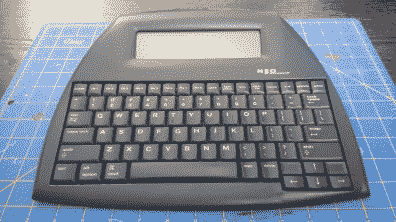](https://hackaday.com/2020/11/05/alphasmart-neo-teardown-this-is-the-way-to-write-without-distractions/neo-scale/) Only 12 inches wide! [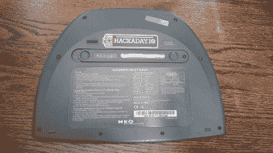](https://hackaday.com/2020/11/05/alphasmart-neo-teardown-this-is-the-way-to-write-without-distractions/neo-back/) Takes three AAs. Has much better battery life on regular alkaline than rechargeables. [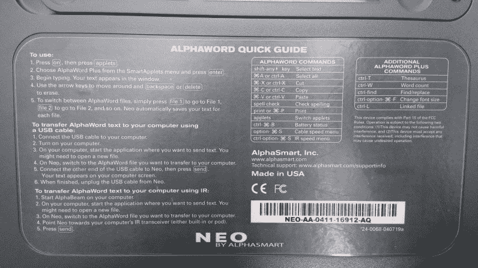](https://hackaday.com/2020/11/05/alphasmart-neo-teardown-this-is-the-way-to-write-without-distractions/neo-quick-guide/) Word count is just a few keypresses away.

## 每当灵感袭来

AlphaSmart NEO 文字处理器最初是在 21 世纪初出售给作家的，他们正在为笔记本电脑电池和早期互联网的分心而撕扯头发。它们还被推销给学校，并作为打字训练器给孩子们使用了大约十年，这就是为什么二手市场上有这么多这样的东西。我要说的是，NEO 确实达到了实用的最佳点，但并不那么多才多艺和有用，以至于让人分心。

[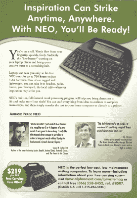](https://hackaday.com/wp-content/uploads/2020/09/neo-ad-cropped.png)

As much as I like my NEO, I would never have paid $219 for it.

这些仍然可以有大约 40 美元的电子湾运送。这与 2008 年这个广告出现在所有写作杂志封底时 219 美元的价格相差甚远。

虽然我认为 NEO 主要是一个文字处理器，但这不是它唯一的功能。书写功能是少数所谓的小程序之一。还有一个可以记录运行历史的计算器，一个打字训练器和一个让老师从电脑上传测试的小测验程序。还有一个通过红外将文件发回给老师的 beamer 程序。

## 二合一的好东西

我的 NEO 在 NaNoWriMo 期间绝对达到了它的目的，这是因为很多事情。重量为 1.5 磅(709 克)，如果 1667 个单词需要很长时间才能出来，它还不足以压在你的腿上。全键盘非常完美——不需要敲击按键，这意味着更好的流畅和更多的单词。老实说，键盘动作棒极了。那下面只有剪式开关，但它们很棒。来，听听:

<https://hackaday.com/wp-content/uploads/2020/11/neo-typing-sounds-loudnorm.mp3?_=1>

[https://hackaday.com/wp-content/uploads/2020/11/neo-typing-sounds-loudnorm.mp3](https://hackaday.com/wp-content/uploads/2020/11/neo-typing-sounds-loudnorm.mp3)

NEO 一次最多可以显示六行文本，所以这些文字会随着你的移动而消失，但你仍然可以看到足够远的地方，这样你就不会迷路。背面的快速指南中列出了不同的两键和三键组合，您可以轻松检查字数或剩余电池电量。每天当我写完东西后，我会将文字连续地输入电脑，一次一个字符，以此来备份我的作品。这不是发送文件的唯一方式。它们也可以用 AlphaSmart 管理软件一起发送，或者用于课堂教学，也可以通过红外线单独发送到一个特殊的接收器。

[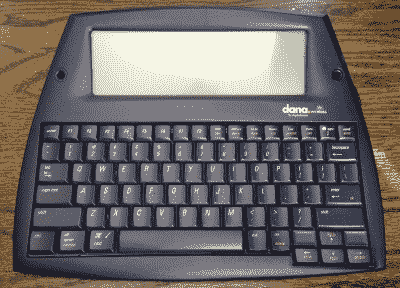](https://hackaday.com/wp-content/uploads/2020/09/alphasmart-dana.jpg)

The Dana seems like it would be the better option, but it’s overpowered in my opinion.

因为整个 RSI 的事情，我再也不能一次使用它太长时间了，但我过去常常在车上随身携带它，因为它太坚固了。如果你在 2019 年的 Supercon，你可能会看到我把它和我的笔记本电脑配合使用。这是我最喜欢的功能之一，它可以用作即插即用键盘。

在 NEO2 之后，AlphaSmart 推出了 Dana，这是一个更大的 Palm 驱动版本的 NEO，也可以运行 PalmOS 应用程序。屏幕比它之前的任何东西都大，有一个消耗电池的背光，和一个可以和手写笔一起使用的触摸屏。

Dana 也支持双 SD 卡，但它们必须是 SD 1.0 技术，1Mb 或更小，并且是 FAT12 格式的。我很想更经常地使用我的 Dana，但我太害怕电池耗尽，不管背光是否打开。还有，SD 卡的情况我也不放心。还不如通过 USB 发送文件。

## Mod Mode

[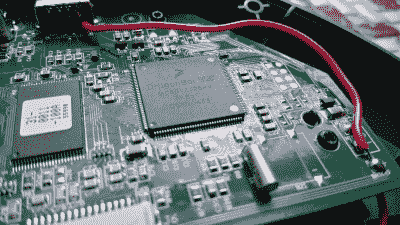](https://hackaday.com/wp-content/uploads/2020/09/neo-power-wire.jpg)NEO 让我困扰的几件事之一就是缺少背光。我试图给它加一个背光面板，但是没有足够的空间。我仍然可能尝试边缘照明，但现在，我只是做了一个简单的黑客供电外部灯。

我所做的只是将一根电线从电池盒连接到母 USB——一个用来连接打印机的端口。我从一元店买了一个便宜的 USB 阅读灯，有一个弯曲的灯颈，还加了一个电阻让它变暗。当我需要更多光线时，我只需插上电源。

我从 reddit 上的[【newsINcinci】得到这个想法，他们通过做端口供电 mod，然后插入带有 USB 桥的蓝牙适配器，将他们的 NEO 做成蓝牙键盘](https://www.reddit.com/r/AlphaSmart/comments/cquvfr/my_nearly_perfect_neo_bluetooth/)。

## 拆卸时间

[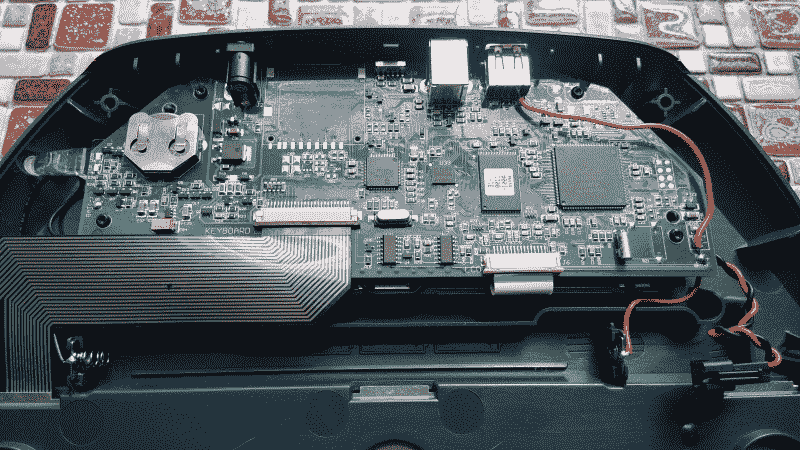](https://hackaday.com/wp-content/uploads/2020/09/neo-inside.jpg)

Under the hood.

NEO 在 matrix 的幕后并没有太多的事情要做。大脑是一个 33MHz 的 DragonballVZ，这是一个由摩托罗拉飞思卡尔公司制造的基于 68000 的处理器。VZ 将每一次击键都保存到 RAM 中，这在操作中并不明显，但在板上保持一个新的硬币单元非常重要。

[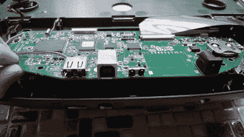](https://hackaday.com/wp-content/uploads/2020/09/neo-ports.jpg)

Inputs and outputs.

[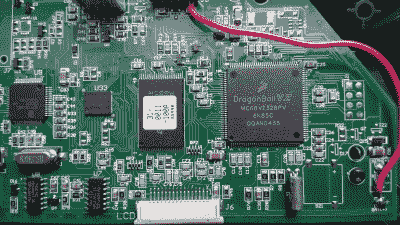](https://hackaday.com/wp-content/uploads/2020/09/neo-processor.jpg)

Dragonball VZ!

我仍然希望有一天能添加边缘照明，但我必须首先切割显示器周围的金属边框才能到达边缘。

NEO 是一个很棒的无干扰书写工具和全能外接键盘。我认为基于 68k 的处理器应该使黑客攻击变得成熟，但这不是我的专长。如果可以的话，我会添加 microSD 支持，但我真的不介意通过 USB 获取文件。安装内置蓝牙发射器可能会很有趣。

[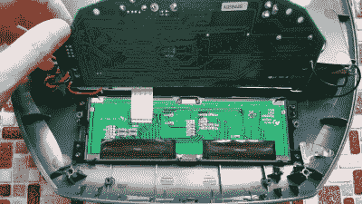](https://hackaday.com/wp-content/uploads/2020/09/neo-screen-PCB.jpg)

The LCD’s PCB.

[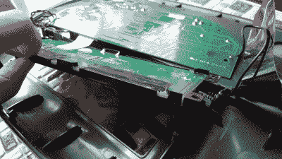](https://hackaday.com/wp-content/uploads/2020/09/neo-screen-bezel.jpg)

The bezel I would have to cut to edge light the display.

我有点希望这些仍然在学校使用，而不是完全成熟的笔记本电脑。20 世纪 90 年代初，我学会了在 IBM 电动打字机上打字，我常常希望我能在家里练习打字。我想这并不是一个真正的问题，但分心自由打字硬件越来越难搞定。