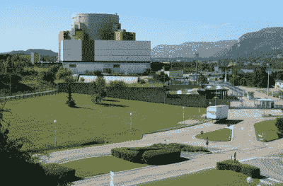
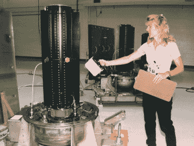
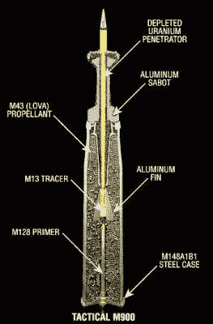
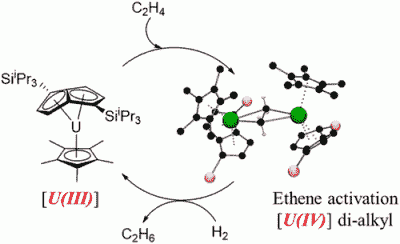

# 核废料的替代用途

> 原文：<https://hackaday.com/2020/01/29/alternative-uses-for-nuclear-waste/>

如果你想在不释放大量二氧化碳和其他有害污染物的情况下产生大量电力，核能是很好的选择。然而，这项技术的主要问题一直是浪费。核电站运行产生的许多副产品都具有放射性，而且数千年来一直如此。以安全和经济的方式储存这些废物仍然是一个问题。

处理这种废物流的替代方法仍然是一个活跃的研究领域。那么有哪些方法可以转移或再利用这些废物呢？

## 快速繁殖者想要结束燃料循环

The Superphénix reactor in France is one of a handful of operational fast-neutron reactor designs.

典型的轻水核反应堆(LWR)的主要废物形式之一是裂变反应产生的乏燃料。这些同位素大约由 3%的废同位素、1%的钚同位素和 96%的铀同位素组成。这种废物富含超铀元素，其半衰期长达数千年。这些给储存带来了最大的问题，因为它们必须被安全地保存在一个安全的地方，时间长度远远超过任何一个人类社会的寿命。

这个问题的拟议解决方案是使用快中子反应堆，这种反应堆将不可裂变的铀-238“繁殖”成钚-239 和钚-240，然后可以用作新燃料。先进的设计也有能力处理出其他[锕系元素](https://en.wikipedia.org/wiki/Actinide)，也在裂变过程中使用它们作为燃料。这些反应堆的好处是能够使用铀燃料中几乎所有的能量含量，与传统方法相比，燃料用量减少了 60 至 100 倍。

不幸的是，快中子增殖技术在很大程度上受到了经济的阻碍。20 世纪 70 年代发现了更丰富的铀资源，这意味着简单地挖掘更多的燃料比再加工废物更便宜。此外，对快速增殖反应堆制造武器级核材料能力的担忧也阻碍了发展。虽然这项技术很有前景，但这一领域的重大发展可能还需要几十年的时间。

## 将废物加工成核电池

A radioisotope thermoelectric generator from the Cassini mission is inspected by a NASA technician.

对于前往更深处的宇宙飞船来说，太阳能并不总是能满足它。越过火星，没有太多来自太阳的光使太阳能电池板成为可行的供电选择。在这些情况下，航天器经常使用[放射性同位素热电发生器(RTGs)](https://en.wikipedia.org/wiki/Radioisotope_thermoelectric_generator) ，用热电偶将放射性物质包装在一个盒子里。衰变材料的热量通过热电偶阵列产生电力，用于运行航天器。另一个好处是所提供的热量有助于将飞行器上的系统保持在合适的工作温度。

历史上，俄罗斯和美国都曾使用过这种技术，但欧洲航天局渴望得到这种技术。该计划包括从英国核燃料再加工产生的钚废料中提取镅-241。虽然就清理废物而言，这不太可能是一个大项目，但它可以作为 RTG 材料的一个有用来源。随着美国库存的减少，这一点尤其重要，因为以前使用的钚-238 只能从用于生产核武器的反应堆中获得，这些反应堆已被关闭。[生产更多](https://hackaday.com/2019/02/08/the-deep-space-energy-crisis-could-soon-be-over/)的竞赛正在进行，但同时，这也为英国的项目打开了大门。

这一领域的另一个想法是贝塔伏打电池。这是通过使用一种半导体材料捕获放射性物质β衰变释放的电子来实现的。布里斯托尔大学正致力于开发“钻石电池”，[它使用来自英国核设施](https://www.seeker.com/nuclear-waste-and-diamonds-make-batteries-that-last-5000-years-2120412155.html)中使用的废弃石墨慢化剂块的放射性碳-14。这些块的外层被刮掉，那里有大部分碳 14，这被用来制造人造钻石，当它们衰变时会释放电子。然后它们被包裹在非放射性碳-12 的外壳中，以防止辐射逃逸到大气中。β衰变释放的电子能量很低，所以只需要较小的屏蔽。[据估计，这种电池可以提供 100 瓦的电量，使用几千年](https://www.electronicsweekly.com/news/research-news/diamond-nuclear-battery-generate-100%CE%BCw-5000-years-2016-12/)。

## 贫铀的用途

A cutaway drawing of a typical depleted uranium anti-tank munition.

核能工业的另一个主要副产品是贫铀。这是在浓缩过程后剩余的铀，浓缩过程是制备反应堆用燃料所必需的。它主要由不可裂变的铀-238 组成，仍然具有一定的放射性，尽管由于大部分铀-235 在浓缩过程中被移除，放射性有所降低。

贫化铀有几个特性，使其对军事应用极具吸引力。它的高密度意味着它是反坦克弹药的好弹头。贫化铀弹药具有极好的穿透能力，能够穿透重型坦克装甲。这也得益于它们的自锐性。当贫化铀弹头击中目标时，它会以某种方式碎裂，使其保持锋利，而撞击的热量有助于点燃由此产生的贫化铀粒子云。这使得这种子弹在这些任务中非常有效，经常取代其他高密度材料，如钨。

## 贫化铀的化学加工

Recently, uranium has proven its ability to be used as a novel catalyst for ethylene to ethane production.

除了武器之外，贫铀还有其他用途。最近，贫铀有了一个新的应用，即在化学加工领域。苏塞克斯大学的一组研究人员利用这种材料制造了一种催化剂，有助于将乙烯转化为乙烷。虽然在这两种化学物质之间进行转换并不是什么新鲜事，但对于贫铀来说，这是一种新的应用。

储存浓缩过程中产生的大量贫化铀是世界各国政府面临的一个持续问题。能够在工业过程中使用这种材料可能是一种可行的替代方法，而不是简单地将其储存在处理场或通过坦克和战机将其运往国外。然而，需要注意确保轻度放射性物质不会造成额外的工作场所危害或健康问题。

## 路障依然存在

不幸的是，在核废料的再利用和再处理方面存在问题。许多这些过程为核材料被盗窃或转移开辟了可能性。这构成了核武器扩散的风险。

例如，制造一枚可行的核武器所需的钚的数量是以几十磅来计量的。随着后处理在工业规模上进行，大量这种材料有可能丢失而不被发现。这是一个令人担忧的问题，取决于同位素和过程的确切细节。例如，目前来自轻水反应堆的核废料并不是一个问题，因为它被认为放射性太高，不容易被窃取。但像燃料后处理这样的技术有可能从乏燃料中产生武器级材料，许多政府试图尽可能地阻止这种可能性。

此外，一些人认为，回收或再利用核废料的努力夺走了本应用于寻找该材料专用存储解决方案的资源。许多国家都在拖延建立永久性废料堆放场，[包括美国](https://www.usatoday.com/story/news/politics/2018/06/03/yucca-mountain-congress-works-revive-dormant-nuclear-waste-dump/664153002/)。由于目前反应堆的乏燃料在数千年内仍然不安全，因此为这种现有废料找到一种安全的长期储存方案应该是一个优先事项。

## 为什么今天的事可以拖到明天？

从根本上说，核废料的高放射性和危险性给寻求处理这种材料的政府和工业带来了许多挑战。目前的现状很大程度上是让它积累起来，而几十年之久的关于如何处理日益增加的核废料的斗争仍在继续。理想情况下，新技术将为以清洁和安全的方式处理这一问题开辟道路，但与此同时，需要做出艰难的政治决定。