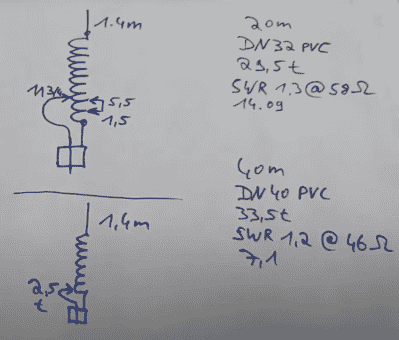

# 用于 10 米操作的 20 厘米铝箔天线

> 原文：<https://hackaday.com/2022/07/02/aluminum-foil-20-cm-antenna-for-10-m-operation/>

DL1DN 的[David]是一名业余无线电爱好者，对低功耗(QRP)便携式操作情有独钟。最近他出去了，发现 10 米繁殖是完全开放的。他没有因为忘记带天线而气馁，而是用 20 厘米长的铝箔拼凑了一个临时天线(见休息时的视频演示)。[David]并非完全没有准备，因为他确实有便携式 20 米天线的负载线圈，但缺少伸缩鞭。他计算出 10 米操作的鞭长应该在 20 厘米左右，并把一张箔纸折成大致的长度。他通过滚动顶端缩短“鞭子”来调整它的长度，直到他得到一个 SWR 最小值。

【大卫】的 QRP 便携式鞭状天线

【大卫】在另一个视频中描述了这种风格的便携式天线[，使用更常规的伸缩鞭状天线作为辐射元件。负载线圈由普通 PVC 管和绝缘线制成。虽然这些不一定是最有效的天线，但当便携性是一个主要问题时，它们可以做到这一点。对于一个不同的方法，这里有一个](https://www.youtube.com/watch?v=PeVZFD07-xY) [QRP Hackaday.io 便携式天线项目使用磁环天线](https://hackaday.io/project/162089-magnetic-loop-antennas-for-qrp-amateur-radio)。但是对于 QRP 的终极，看看[这个我们在 2013 年写的发射器](https://hackaday.com/2013/11/26/amateur-radio-transmits-1000-miles-on-voice-power)它只使用声音功率来操作。

你曾用什么不寻常的东西做临时天线？请在下面的评论中告诉我们。感谢[mister35mm]将此提交给我们的举报热线。

 [https://www.youtube.com/embed/TDV9eA6S6q8?version=3&rel=1&showsearch=0&showinfo=1&iv_load_policy=1&fs=1&hl=en-US&autohide=2&wmode=transparent](https://www.youtube.com/embed/TDV9eA6S6q8?version=3&rel=1&showsearch=0&showinfo=1&iv_load_policy=1&fs=1&hl=en-US&autohide=2&wmode=transparent)

