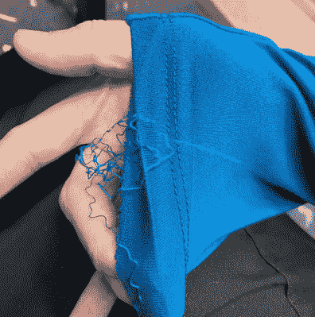
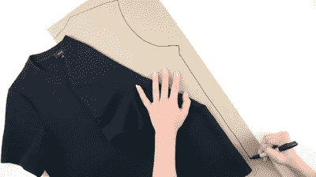

# 亚马逊的定制 t 恤可能会让你不舒服

> 原文：<https://hackaday.com/2021/01/06/amazons-custom-t-shirt-may-rub-you-the-wrong-way/>

为了追求完美的黑色 t 恤，你会走多远？你会让亚马逊建立一个你身体的虚拟替身吗？他们已经对你了如指掌，那么客户和公司之间的一两次身体扫描算什么呢？

事情是这样的——亚马逊正试图推出一个名为*的定制服装品牌，名为*Made for You，他们从[定制纯色 t 恤](https://www.amazon.com/dp/B08HPZ3RHR)开始。事情是这样的:你给他们 25 美元，并附上你的身高、体重和肤色等信息。然后你上传两张你身体的照片到他们的应用程序，这些照片会变成你身体的 3D 模型。一旦你的头像建立匹配，你设计你的衬衫，以适应模型。理论上，你可以很好地了解它的适合程度。

您可以从两种不同的面料和八种颜色中进行选择，并且可以定制领口、衬衫长度和袖子长度。如果你愿意，你可以把你的名字写在标签上。然后，你的完美 t 恤在美国由进口面料制成——要么是轻质要么是中等重量的皮马棉。我们不确定是机器人还是人在制造它们，但我们的钱在人身上。毕竟，亚马逊是创造机械土耳其人的公司，以形成一个可以通过互联网按需工作的人才库。这是沿着那些线，但裁缝按照你的规格缝制。最大的问题是你得到了什么，技术如何使这些比现成的更好，你会放弃你的隐私作为回报吗？

### 千篇一律

说这些是定制 t 恤有点言过其实。哦，你不必担心 t 恤会紧绷皮肤，露出你的备胎——如果你想要宽松的，那也是选择之一。但是目前的选择有限。

Any color you like as long as it’s one of these eight. Image via [Amazon](https://www.amazon.com/MadeForYou-Made-to-measure-customizable-T-shirts/dp/B08HPZ3RHR)

有三种长度可供选择，但只有两种领口。他们甚至不提供 3/4 袖，只有短款和长款。这是亚马逊给我们真正选择的机会，我们说这些选择是不冷不热的。与定制的匡威菜单相比，这算不了什么，如果你需要的话，它甚至允许你穿两种不同尺寸的鞋子。

t 恤真的只是个开始。亚马逊希望将这项服务扩展到其他服装产品，并对建议持开放态度，尽管他们预计在不久的将来会推出连衣裙、裤子和运动服。除了已经可以在网站页脚找到的鞋类和服装网站，如 Zappos，以及所有亚马逊必需品品牌的服装，他们未来的服装帝国还将屹立不倒。

This person’s sleeve unraveled in under an hour. Image via [Amazon](https://www.amazon.com/dp/B08HPZ3RHR#customerReviews)

### 它们可能只是普通的 t 恤，但现在我很好奇

评论褒贬不一——一些人喜欢他们的鞋子，而另一些人则对不合身的衣服和穿了一个小时后开始散开的下摆感到沮丧。这是趣闻，在购买现成的衣服时有不好的裤脚也不是没有听说过。时间会证明这种按需定制的服装模式是否真的存在质量保证问题。

问题是，试穿服装不是一个微不足道的过程——这里有什么可靠地捕捉你的体形的秘密酱料吗？不像其他一些公司拍摄你的视频并创建你身体的点云，亚马逊根据你输入的两张照片和数据制作他们的 you-vatar。

个人觉得很矛盾。我想试试，因为我知道[皮马棉](https://en.wikipedia.org/wiki/Gossypium_barbadense)手感真的很好，但是我想我不希望亚马逊有我这么详细的体量和地形图。我喜欢我的衬衫大，所以也许我可以捏造我的体重，扔掉我的头像，但是按照我想要的方式来做这件衬衫。

### 亚马逊能让准剪裁成为主流吗？

时尚是周期性的，显然我们穿衣服的方式也是如此。这并不完全是剪裁，但是剪裁衣服的想法和衣服本身一样古老。是费用让它无法大规模流行。接下来的问题是，如果有绝对的选择，人们会买什么，多久买一次？如果衣服做得太好，从长远来看，他们可能卖不出去。除了定制裁剪问题之外，还有很多变量需要考虑。

It’s easy to make patterns from your favorite clothes. Image via [With Wendy](https://www.youtube.com/watch?v=KeJjB-bdzuI)

少数公司正在尝试类似的模式，但这是亚马逊。如果有人能做到，那就是他们，对吗？我们不禁认为，一个更好的模式可能会围绕复制人们最喜爱的 t 恤，但这是你自己可以做的事情。如果亚马逊真的想的话，他们可以在商场里放一个人体扫描亭(3D 打印社区已经在黑客空间和活动中这样做了很多年了)。你的点云被上传到你的亚马逊账户，然后你在家购物。

### 更少浪费，更令人毛骨悚然

收购裁缝业的一个明显好处是减少浪费，这是一个众所周知的浪费行业，它过度生产服装，加剧了我们的微塑料和垃圾填埋问题。通过说服消费者把更合身的衣服穿得更久来抑制生产和减少浪费听起来不错！

但是，人们仍然想知道，一家公司还能通过一系列身体扫描做些什么？这是互联网，所以你必须假设在某个时候会有数据泄露(尽管亚马逊告诉 Engadget，他们在旋转身体替身后会删除照片)——当人们的身体扫描被盗时会发生什么？我们不是在谈论像机场级反向散射雷达扫描仪产生的那种侵入性图像，但想想仍然令人毛骨悚然。

那么，亲爱的读者，这是一个很酷的创新，还是他们走得太远了？如果我们同时获得技术和隐私权利，你会购买定制 t 恤吗？请在评论中告诉我们。