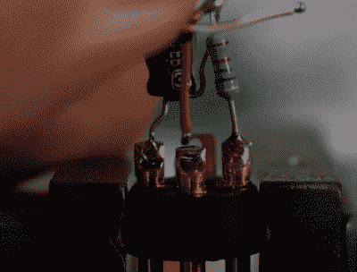

# Ambi-Alice 掉进了 Ambisonic 麦克风的兔子洞

> 原文：<https://hackaday.com/2021/08/27/ambi-alice-goes-down-the-rabbit-hole-of-ambisonic-microphones/>

从理论上讲，环绕声麦克风可以让你完美地编码你周围的声景，并从任何方向的焦点再现它。为此，你至少需要四个麦克风炭精盒和一些数学知识。环绕声麦克风已经存在了 50 年，但是[【DJ Jules】想让这些工具更容易使用，并把它们推向开源阵营](https://www.instructables.com/Ambi-Alice-a-First-Order-Ambisonic-Microphone/)。

 正如你将在下面的视频中看到的，在此之前还有几次迭代。当[DJJules]发现 TSB25905 胶囊后，一切都变得更好了。这些是驻极体电容话筒，配有 1 英寸振膜和内置 EMI/RFI 抑制电容。另一个很大的帮助是决定对所有东西进行颜色编码，从 XLR 电缆靴到电缆套管，再到保护 XLR 插头内每个 P48 电阻电容对的绝缘胶带。

[DJ Jules]“buddy[Tom]设计并印刷了一个单件，以完美的四面体阵列容纳四个胶囊，以及一个优雅的两件式篮子，保护麦克风并为其中一个毛茸茸的挡风玻璃提供底座。麦克风和篮筐由四个硅胶塞隔开，这四个硅胶塞专为四轴飞行器设计，提供隔离和减震功能。

如果你想自己做一个，[DJJules]有一个普通麦克风支架和一个 GoPro 支架的 STL。休息后看看构建视频和 Instructables 上的声音演示。

不需要丰富的声景？[做一个 USB 麦克风来代替](https://hackaday.com/2021/06/02/diy-usb-microphone-seems-overkill-is-surprisingly-in-depth/)，或者如果那太冷太现代，[削出一个木制的丝带麦克风](https://hackaday.com/2021/03/18/wooden-you-love-to-build-a-ribbon-microphone/)。

 [https://www.youtube.com/embed/1ipEZyuf8Zw?version=3&rel=1&showsearch=0&showinfo=1&iv_load_policy=1&fs=1&hl=en-US&autohide=2&wmode=transparent](https://www.youtube.com/embed/1ipEZyuf8Zw?version=3&rel=1&showsearch=0&showinfo=1&iv_load_policy=1&fs=1&hl=en-US&autohide=2&wmode=transparent)

