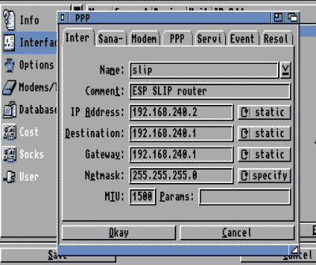

# 雾中的阿米加用 ESP8266 上网

> 原文：<https://hackaday.com/2019/07/03/amiga-in-the-mist-gets-online-with-an-esp8266/>

虽然在他们的日子里，他拿不出足够的钱来买一辆，但[布鲁诺·安图内斯]一直对阿米加很着迷。当个人电脑足够快时，他使用像 UAE 这样的模拟器来体验这种体验，但这绝不是一回事。直到他发现了 MiST anyway，它使用 FPGA 来实现几个复古的计算机，如 Apple II，Atari，当然还有他心爱的 Amiga。

[布鲁诺]唯一的缺点是 MiST 没有网络接口。为了接入互联网，他不得不在设备内部安装一个 ESP8266 】,并花一些宝贵的时间调整各种软件设置，以使所有东西都能相互交流。最终结果是一个在 Amiga 1200 上托管的 BBS，它运行在 FPGA 上，通过 ESP8266 连接到 WiFi。活着是多么美好的时光。

 将 ESP8266 添加到 MiST 实际上非常简单，因为电路板上有一个未填充的串行端口接头。虽然[Bruno]警告说，这个标题已经从该设备的 1.4 版本中删除，所以如果你在市场上购买 FPGA 复古箱，并可能希望在某个时候将其上线，这可能是一个需要记住的细节。ESP 正在运行实现串行线路 IP (SLIP)的固件；它允许您通过串行端口使用 TCP/IP，尽管非常慢。

硬件植入非常顺利，但不幸的是[布鲁诺]发现 ESP8266 无法通过薄雾的厚金属外壳进行通信。他让他的女朋友为薄雾做了一个新的纸质外壳，ESP 可以说话，由于内部的 led，它甚至还有发光的额外好处。我们可能会得到一个包括外部天线的 ESP 模块，但每个模块都有自己的天线。

解决了硬件问题后，剩下的大量文章详细描述了他是如何让 Amiga 操作系统通过 SLIP 连接与互联网对话的。他检查了从使用 NTP 设置系统时间到安装 Telnet 守护程序的所有内容。正如你所料，这需要安装一些额外的软件包，但是[Bruno]很友好地提供了你需要的所有东西的链接。

我们以前见过 ESP8266 用于将其他复古计算机接入现代互联网，但它通常是通过使用外部设备来实现的。这种内部修改非常干净，对于任何拥有喷雾器和烙铁的人来说似乎都是显而易见的。

 [https://www.youtube.com/embed/7mHzEnqV7gk?version=3&rel=1&showsearch=0&showinfo=1&iv_load_policy=1&fs=1&hl=en-US&autohide=2&wmode=transparent](https://www.youtube.com/embed/7mHzEnqV7gk?version=3&rel=1&showsearch=0&showinfo=1&iv_load_policy=1&fs=1&hl=en-US&autohide=2&wmode=transparent)

