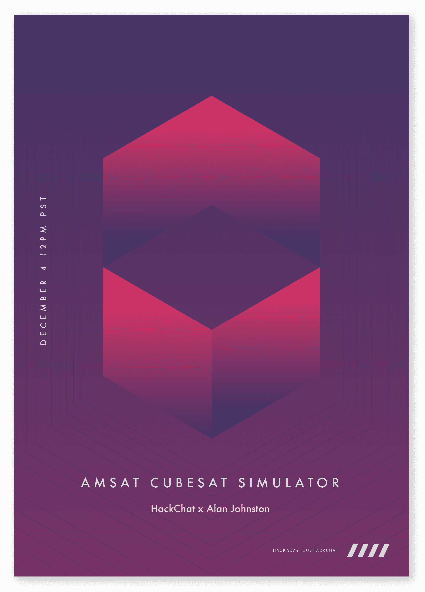

# AMSAT CubeSat 模拟器黑客聊天

> 原文：<https://hackaday.com/2019/12/02/amsat-cubesat-simulator-hack-chat/>

加入我们太平洋时间 12 月 4 日星期三中午的 [AMSAT CubeSat 模拟器黑客聊天](https://hackaday.io/event/168230-amsat-cubesat-simulator-hack-chat)与[阿兰·约翰斯通](https://hackaday.io/hacker/482829-alanbjohnston)！

尽管世界各国政府口口声声说“太空属于人民”，但在太空时代的头 50 年里，他们在让自己进入太空方面做得相当不错。当然，私营企业可以将投资者的钱花在冗长的审批过程上，并支付太空之旅的费用，但除了少数例外，如果你想要自己的卫星，你需要有一个民族国家的资源。

这一切在大约 20 年前开始改变，那时立方体卫星概念诞生了。作为一种让工程专业学生参与卫星行业的方式，10 厘米立方体形状因素已经成为学生、业余无线电运营商、非政府组织甚至私人公民设计和发射卫星的标准，从中继业余无线电信息到监测环境状态。

但是在这一切发生之前，立方体卫星的建造者需要知道他们的小块硬件将会完成它的工作。这就是维拉诺瓦大学电子和计算机工程教授阿兰·约翰斯通的切入点。作为业余无线电卫星公司 AMSAT T1 的成员，他建造了一个 T2 立方体卫星模拟器 T3。该模拟器造价约 300 美元，主要使用现成的 3D 打印部件，让卫星建造者在将设计投入最终前沿之前解决设计中的问题。

约翰斯顿博士将会在黑客聊天室停下来讨论他的立方体卫星模拟器和所有纳米卫星的事情。一起来了解如何确保卫星符合标准，了解他参与 AMSAT 和 CubeSat 测试的动机，以及人们发现该平台的其他用途。提示:想想高空气球。

 我们的黑客聊天是 [Hackaday.io 黑客聊天群发消息](https://hackaday.io/messages/room/2369)中的社区直播活动。本周，我们将于太平洋时间 12 月 4 日星期三中午 12:00 坐下来讨论。如果时区让你烦恼，我们有[一个方便的时区转换器](https://www.timeanddate.com/countdown/generic?iso=20191204T12&p0=224&msg=AMSAT+CubeSat+Simulator+Hack+Chat&font=cursive)。

点击右边的那个发言气泡，你会被直接带到 Hackaday.io 上的黑客聊天群，不用等到周三；随时加入，你可以看到社区在谈论什么。

