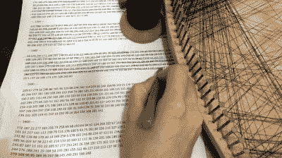

# 艺术的算法:线肖像

> 原文：<https://hackaday.com/2021/03/18/an-algorithm-for-art-thread-portraits/>

我们都经历过——通过互联网的魔力，你看到别人令人惊叹的项目，你只需要复制它。对[Jenny Ma]来说，这个项目是计算机生成的线条画，因为计算机会计算出复制给定图像的最佳指甲顺序，而你自己会把线条画出来。

 那么，它是如何工作的呢？虽然已经有一些算法，但是[【珍妮】想用 Python](https://www.youtube.com/watch?v=UsbBSttaJos) 做出自己的算法。本质上，它将图像裁剪成一个圆形，然后在圆周上均匀分布软件钉子。该算法从一个随机的指甲开始，然后通过从该指甲到每隔一个指甲画一条线来确定下一个最佳的指甲，并根据这条线下面的图像的暗度选择最暗的一个。它一次重复一个和弦，从原始图像中减去，直到每个像素都被替换为线或缺少线，然后它吐出一个有序的指甲号码列表。

一旦软件准备就绪，[Jenny]制作了一块直径为 80 厘米(31.5 英寸)的木帆布，并开始布置钉孔位置。没有足够的空间容纳 300 个钉子，所以[Jenny]没有重新开始，而是改变算法，使用 298 个钉子并重新运行。

[Jenny]在讨论软件创作艺术的硬件表现中的许多变量方面做得很好。最明显的当然是使用的钉子越多，分辨率越高，但她确定 300 是最佳点——超过这个值，分辨率不会真正提高。我们不得不怀疑 360 个钉子是否会让事情变得更简单。休息之后，请观看构建视频。

想彻底砍掉大部分体力劳动？[给自己造一台弦艺机](https://hackaday.com/2020/12/11/cnc-router-frame-repurposed-for-colorful-string-art-bot/)。

 [https://www.youtube.com/embed/UsbBSttaJos?version=3&rel=1&showsearch=0&showinfo=1&iv_load_policy=1&fs=1&hl=en-US&autohide=2&wmode=transparent](https://www.youtube.com/embed/UsbBSttaJos?version=3&rel=1&showsearch=0&showinfo=1&iv_load_policy=1&fs=1&hl=en-US&autohide=2&wmode=transparent)

