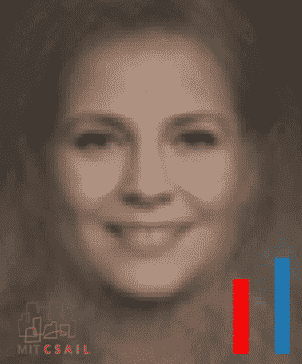

# 一种去偏人工智能系统算法

> 原文：<https://hackaday.com/2019/10/21/an-algorithm-for-de-biasing-ai-systems/>

关于人工智能系统的一个基本事实是，用有偏见的数据训练系统会产生有偏见的结果。当系统被用于预测犯罪或为罪犯选择刑罚时，这可能特别危险，因为它们可能依赖于无关的特征如种族或性别来做出决定。

来自麻省理工学院(MIT) CSAIL 的一组研究人员正在研究一种解决方案，通过重新采样使数据更加平衡来“消除偏见”。博士生[亚历山大·阿米尼]和[艾娃·索莱马尼]发表的论文描述了一种算法，它可以学习特定的任务——如面部识别——以及训练数据的结构，这使它能够识别并最小化任何隐藏的偏见。

测试表明，与其他广泛引用的面部检测模型相比，该算法将“分类偏差”最小化了 60%以上，同时保持了相同的检测精度。当该团队评估来自算法正义联盟(从麻省理工学院媒体实验室分离出来的一个小组)的面部图像数据集时，这个数字保持不变。

该团队表示，他们的算法尤其适用于不易被人类检查的大型数据集，并有可能纠正安全、执法和面部检测以外的其他领域中使用的算法。