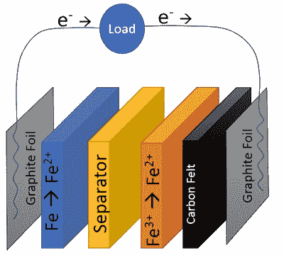

# 全铁电池不轻，但很便宜

> 原文：<https://hackaday.com/2019/08/03/an-all-iron-battery-isnt-light-but-its-cheap/>

可充电电池是一项已经存在了一个多世纪的技术，目前正在进行大量研究，以提高移动和替代能源项目的能量密度。但是常用的化学物质都有其自身的危险，可能是化学污染、火灾风险，甚至是有限资源造成的成本。爱达荷大学一个团队的硬件论文试图解决其中一些问题，这是一种开源的可充电电池，其电极化学特性是两侧都含有铁。这是一种更便宜的建筑，没有铅酸电池的有毒重金属，也没有锂电池的费用和火灾危险。

A diagram of the all-iron cell.

该电池的化学性质被离子交换膜分成两部分，氯化铁(II)是阳极侧的电解质，铁在阳极侧被氧化成铁 2+离子，氯化铁(III)在阴极侧被还原成氢氧化铁。结果是一个只有大约 0.6V 低电位的电池，但所声称的材料成本仅为每 ~~kWh~~ Wh 储存能量 0.10 美元。这些电池永远不会在存储容量或重量上竞争，但这种成本使它们对固定安装具有吸引力。

看到来自 HardwareX 的开源项目令人鼓舞，我们注意到它在 2016 年发布[。](https://hackaday.com/2016/08/02/hardwarex-is-a-scientific-journal-for-open-hardware/)

谢谢[朱利安]的提示。