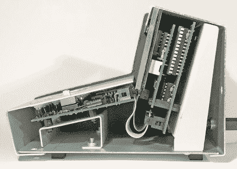

# 一个 ALU 作为一个桌面计算器已经过时了

> 原文：<https://hackaday.com/2021/06/07/an-alu-as-a-desktop-calculator/>

对微型计算机历史感兴趣的人会知道，电子计算器的发展道路和集成 CPU 的起源之间有很强的交叉。英特尔的 4000 以计算器而闻名，在 20 世纪 70 年代的一段时间里，这些数学助手被视为时代的奇迹。[【Simon Boak】的计算器](https://unimplementedtrap.com/sb181-74ls181-logic-operator)是对那个时代的一种奇怪的回归，因为它不是我们所知道的十进制计算器，而是一种十六进制设备，它简单地使用著名的 74181 ALU 芯片的功能进行计算。

ALU，或全称算术逻辑单元，是具有两个输入和一个输出的 CPU 的组件，可以对两个输入执行一系列二进制函数中的任何一个，并在输出上返回结果。这个计算器有两个 8 位原始加法幂，一个十六进制键盘用于设置输入，一组 7 段显示器用于显示结果。它被装在一个令人心痛的复古折叠金属板控制台外壳中，带有木制端件，这在 1975 年左右会让任何工程师的办公桌增光添彩。我们可能不需要，但我们*真的*想要一个！

如果 74181 对你来说是一个谜，那么不要担心，因为芯片大师[Ken Shirriff] [已经对它的操作](https://hackaday.com/2017/03/27/explaining-the-operation-of-the-74181-alu/)做了一些方便的解释工作。

谢谢[Ted Yapo]的提示。