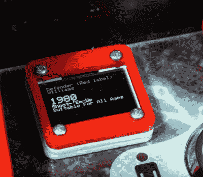

# 有备用展示品的拱廊橱柜

> 原文：<https://hackaday.com/2020/01/31/an-arcade-cabinet-with-displays-to-spare/>

我们都有一个很好的街机柜的形象，所以你可能不需要提醒，传统上它们是单屏幕的事情。但这种想法可以追溯到它们围绕着又大又笨重的 CRT 显示器建造的时候。现在我们有了现代的 LCD、LED 和有机发光二极管面板，谁说你必须遵循旧的规则？

这正是导致[【阿尔·克林】建造这种独特的多显示器街机机柜](https://www.instructables.com/id/Arcade1Up-Mod-With-LED-Marquee-and-Sub-Displays/)的那种开箱即用的想法。游戏本身仍然在一个屏幕上进行，但几个更小的子显示器点缀在橱柜周围，以指示各种辅助信息。它们有必要吗？几乎没有。但我们不能否认这是一个聪明的想法，如果我们开始在其他 DIY 橱柜中看到类似的东西，我们也不会感到惊讶。

 建造始于 Arcade1Up 的一款商用橱柜，这款橱柜非常受欢迎，一些大型零售商都有库存。除了显示器之外，所有电子设备都被拆除，并替换为 Dell OptiPlex 9020 计算机和高质量的操纵杆和按钮。[Al]然后在整个橱柜上安装了他的各种显示器，[包括一个我们之前展示过的华丽的 led 罩。](https://hackaday.com/2019/04/04/arcade-with-led-marquee-shows-off-your-game/)

那么这些小屏幕是做什么的呢？[Al]在休息后的视频中解释了它们，但总的想法是它们提供了关于你当前已经加载的游戏的上下文信息。双色有机发光二极管显示屏显示游戏的名称及其等级，而七段 LED 显示屏显示游戏发布的年份。显示屏位于控制装置和投币口附近，所以无论你是在玩游戏还是在房间里，你都可以看到所有的信息。

我们总是惊讶地看到建筑商如何找到方法让他们自己的拱廊橱柜脱颖而出。虽然这是一个想法，在这一点上我们已经看到了很多，[没有两个项目是完全相同的](https://hackaday.com/2018/01/14/bartop-arcade-cabinet-build-skips-the-kit/)。

 [https://www.youtube.com/embed/jYcuxc77F0g?version=3&rel=1&showsearch=0&showinfo=1&iv_load_policy=1&fs=1&hl=en-US&autohide=2&wmode=transparent](https://www.youtube.com/embed/jYcuxc77F0g?version=3&rel=1&showsearch=0&showinfo=1&iv_load_policy=1&fs=1&hl=en-US&autohide=2&wmode=transparent)

 [https://www.youtube.com/embed/MgXtOIzMJoY?version=3&rel=1&showsearch=0&showinfo=1&iv_load_policy=1&fs=1&hl=en-US&autohide=2&wmode=transparent](https://www.youtube.com/embed/MgXtOIzMJoY?version=3&rel=1&showsearch=0&showinfo=1&iv_load_policy=1&fs=1&hl=en-US&autohide=2&wmode=transparent)

