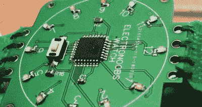

# 没有时钟的 Arduino 手表

> 原文：<https://hackaday.com/2018/08/24/an-arduino-watch-without-a-clock/>

当你戴着这块裸露的 PCB 手表出现在聚会上时，你可能会从那里的其他人那里收到两种可能的反应。他们要么会对那个在公共场合手腕上戴着闪烁电路板的书呆子窃笑，要么会对低得离谱的器件数量感到惊讶。我们给你一个猜测，看看在 Hackaday 参与的任何事件中，你可能会得到什么样的反应。

 由【电子银行】[设计制造，这款极其简单的手表由一个 ATmega328P 微控制器、十几个发光二极管及其相关的 200ω电阻和一个电池](https://www.electronoobs.com/eng_arduino_tut40.php)组成。前面还有一个按钮，不仅用于设置手表，还可以在你想查看时间时打开 led 灯。除了下降到一个 LED 和闪烁的时间，很难想象一个时钟比这更少的组件。

你可能想知道在没有 ATmega328P 芯片的外部时钟源的情况下，[电子人]是如何做到这一点的。该芯片实际上有一个可以使用的内部 8 MHz 振荡器，但你需要先闪存适当的引导加载程序。因此，PCB 背面有 SPI 和 UART 焊盘，用于外部引导加载程序和固件编程。

正如你所料，使用内部振荡器有一个缺点:它不是很好。ATmega328P 规格表声称工厂校准精度为 10%，而[electronio OBS]发现这相当于每天约 15 秒的时钟漂移。不完全好，但考虑到电池只能持续两天，在这种情况下没有太大的影响。

[与我们见过的其他“模拟”LED 手表](https://hackaday.com/2018/07/05/leds-make-an-analog-wristwatch/)相比，这款手表的简单性真的非常了不起。迄今为止，我们见过的最接近的[竞争对手是这款光滑的二元手表](https://hackaday.com/2018/07/24/a-bcd-wristwatch-youd-want-to-wear/)。

 [https://www.youtube.com/embed/nHZllsSoZp4?version=3&rel=1&showsearch=0&showinfo=1&iv_load_policy=1&fs=1&hl=en-US&autohide=2&wmode=transparent](https://www.youtube.com/embed/nHZllsSoZp4?version=3&rel=1&showsearch=0&showinfo=1&iv_load_policy=1&fs=1&hl=en-US&autohide=2&wmode=transparent)

