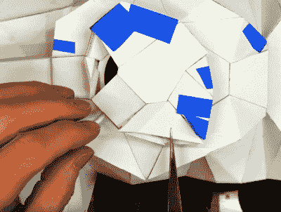

# 一辆由泡沫芯和大盒子玩具制成的装甲车

> 原文：<https://hackaday.com/2020/03/19/an-armored-vehicle-from-foam-core-and-big-box-toys/>

在过去的几个月里，[埃里克·斯特雷贝尔]一直在研究一种电动步兵战车的概念。我们不认为他已经被任何国家的军方雇佣来设计这款车，但是作为一名产品设计师，我们认为他做这种事情是为了让自己保持敏锐。无论如何，[作为旁观者很有趣。](https://www.youtube.com/playlist?list=PLc4A0YSriLcueqVarDx4hP2-PV1mC0Ufu)

在这一系列视频的最新部分中，[Eric]将他早期的概念艺术变成了一个功能原型；尽管规模有所缩小。尽管如此，从头开始建造任何一种交通工具都不是一件容易的事，观看这个过程非常有趣。

 这辆车的装甲板具有未来派的多面外观，这是一个非常耗时的建造过程，因为他必须将每一块泡沫芯切割并粘合到位。一些较小的碎片似乎有[通过激光切割机](https://hackaday.com/2019/11/16/making-models-with-lasers/)时留下的泄露秘密的焦痕，但在休息后的视频中，你可以看到较大的面板是用剃刀手工切割的。

该计划最初只是制作一个静态的车辆模型，但由于[Eric]在当地大型零售商那里发现了一对遥控卡车，这款泡沫战斗机最终得到了升级。在从两辆卡车中解放出电机和变速箱后，他 3D 打印了车轴延伸部分，以考虑到他的车辆更宽的轨道，并围绕它建造了他的“浴盆”。虽然遥控齿轮显然是在光谱的低端，但当车辆在院子里跳跃时，整体效果看起来很好。

《Hackaday》的读者无疑会非常了解[埃里克·斯特雷贝尔]和他的许多才华。[从通过摄影测量进行 3D 扫描](https://hackaday.com/2019/03/13/3d-scanning-via-diy-photogrammetry/)到[将电子设备嵌入柔性模制部件](https://hackaday.com/2019/07/19/making-flexible-overmolded-parts-with-urethane-resin/)，跟随这位多产的制造商，你一定会学到一些新东西。

 [https://www.youtube.com/embed/O-Nx5y3JWso?version=3&rel=1&showsearch=0&showinfo=1&iv_load_policy=1&fs=1&hl=en-US&autohide=2&wmode=transparent](https://www.youtube.com/embed/O-Nx5y3JWso?version=3&rel=1&showsearch=0&showinfo=1&iv_load_policy=1&fs=1&hl=en-US&autohide=2&wmode=transparent)

