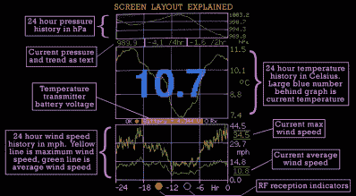
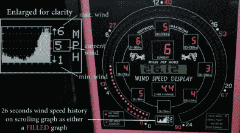

# 给风的电子情书

> 原文：<https://hackaday.com/2019/01/08/an-electronic-love-letter-to-the-wind/>

家用气象站是黑客和制造者将他们的技能付诸实践的好方法。毕竟，当他们可以建立自己的电台，将信息传到他们自己的街道时，谁会想听到整个城市的当前状况呢？这种设置不需要比连接到微控制器的温度传感器更复杂，但并不是所有人都像[Richard]那样对天气狂热。

说得委婉一点，他建造的用于监测他家上空风力的系统是不可思议的。我们可能不会都像理查德一样痴迷于风，但我们肯定会尊重这个综合系统的思想和设计。从他白手起家建立的风速计到他想出的在家中展示收集到的环境数据的各种方式，如果这种建立不能激发你一起黑进你自己的气象站，那就没有什么能了。

这个系统的核心是风速计本身，它利用了几个废弃的部件，比如复活节塑料彩蛋的下半部分作为风杯。杯子在 635ZZ 轴承内的一根短 M5 螺纹杆上旋转，最终旋转位于红色 LED 和 OPL550A 光学传感器之间的“光斩波器”。在一个特别好的触摸中，[Richard]甚至在移动部件周围安装了一些功率电阻，用作加热器，当温度下降时，它可以防止设备冻结。传感器每转产生 8 个数字脉冲，并通过 30 米(98 英尺)的电缆将数据输入基站。

从那里，基站使用 ESP8266 将风和温度数据上传到 ThingSpeak 和 Weather Underground，以便通过各自的网络界面和应用程序查看。该项目本来可以就此结束，但它本身仍然令人印象深刻，但该站还包括 433 MHz 和 NRF24L01 发射机，用于将数据发送到[Richard]设计的其他显示设备。

433 MHZ 显示器内置在灯笼的框架中，在 LED 读数器上显示当前时间和温度，在 2.2 英寸的 ILI9341 TFT 屏幕上显示历史风和温度图表，该屏幕[Richard]已旋转为纵向布局。顶部有一个红灯，每当收到信号时就会闪烁，表明系统正在工作，甚至还有一个触摸传感器，如果你不想看完整的图表，可以用它来关闭 TFT 屏幕。

    

另一个显示器，被理查德称为“相框”，利用令人眼花缭乱的单个 LED 阵列，少量的数字 LED 读数，甚至还有一个有机发光二极管屏幕。他们一起工作来显示当前的风速以及过去一天三个小时的平均风速。由于该显示器能够实时显示当前的风力状况，并且平均持续时间只有两分钟，因此它使用 NRF24L01 接收器以 3 Hz 的速率从基站获取数据。

过去我们见过 3D 打印的气象站，当然还有一些非常简单的事情[，只不过使用了一块 ESP8266 板和一些传感器](https://hackaday.com/2018/06/03/6-weather-station-goes-where-you-do/)。但是很少有人考虑过如何将收集到的数据呈现给用户。如果你真的想知道在你的地堡之外是什么样子，[理查德]有一些技巧给你看。

 [https://www.youtube.com/embed/IJ1JcADg-FI?version=3&rel=1&showsearch=0&showinfo=1&iv_load_policy=1&fs=1&hl=en-US&autohide=2&wmode=transparent](https://www.youtube.com/embed/IJ1JcADg-FI?version=3&rel=1&showsearch=0&showinfo=1&iv_load_policy=1&fs=1&hl=en-US&autohide=2&wmode=transparent)

