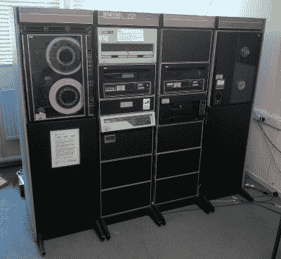

# 整个 PDP-11 在你的工作台上

> 原文：<https://hackaday.com/2019/08/24/an-entire-pdp-11-on-your-bench/>

A PDP-11 at [The National Museum Of Computing](http://www.tnmoc.org/), Bletchley, UK.

DEC PDP 系列的小型机在我们的计算史上占有特殊的地位，因为从 20 世纪 60 年代到 20 世纪 90 年代，它们作为商业计算的主力，为我们今天认为理所当然的许多计算技术奠定了基础。如果我们想到任何 PDP，我们很可能会想象冰箱大小的单元，带有闪光灯面板，这些面板本身已经成为标志性的东西。但这并不是 PDP 硬件的总和，因为在这一系列机器的最后，生产出了 PDP-11，它包含了以前在单个芯片大小的模块上需要的冰箱大小的单元。[Peter Schranz]有一个这样的模块，一个他在 20 世纪 90 年代抢救回来的 DCJ11，他在[开始用它制作 PDP-11](https://www.5volts.ch/pages/pdp11hack/) 的现代桌面版本。

PDP-11/hack 是一个 PDP-11，作为一组子卡安装在稍加修改的 Q-bus 背板上。DCJ11 及其内存位于其中一个上，仿真磁盘控制器位于另一个上，最后一个多功能板将时钟和串行功能结合在一起。PDP-11/hack 使用了更现代的 CPLDs 和微控制器来提供粘合逻辑并模拟现在已经过时的组件。给定一个串行终端，它将启动并运行 PDP 操作系统和软件，尽管它缺少一组闪光灯来显示其状态。

这个[并不是我们展示给你的第一个使用这个芯片](https://hackaday.com/2016/08/22/a-pdp-11-on-a-chip/)的 PDP-11。