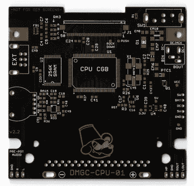

# 一个史诗般的追求，以建立最终的游戏男孩

> 原文：<https://hackaday.com/2023/01/04/an-epic-quest-to-build-the-ultimate-game-boy/>

如果你不是抱着任天堂最初的 DMG-01 游戏机长大的，可能很难看到 2023 年的吸引力。它具有砖块般的人体工程学，系统的无光 LCD 屏幕使用了有点令人作呕的绿色调色板，当与世嘉游戏设备或雅达利山猫等当代竞争对手相比时，它肯定会成为劣质平台。但尽管它有缺点，但这款机器还是有一些神奇之处，那些对这款标志性手持设备情有独钟的人总是渴望重温那些辉煌的日子。

现在，由于[桶鼠]的不可思议的工作，玩旧的“砖块”游戏不再像 1989 年那样是一种简朴的体验。这是因为[他已经为手持设备](https://mousebitelabs.com/2022/10/25/the-game-boy-dmg-color-dmgc/)开发了一套替代 PCB，不仅实现了后来 Game Boy Color 的所有功能，还加入了一些现代的细节。其结果是，这款掌上电脑在外观上看起来和原来的一样，但玩你最喜欢的游戏甚至比你记忆中的还要好。

 【桶鼠】为这个项目收集了一些极好的文档，设计文件在知识共享许可下发布，供任何想开发自己的副本的人使用。他甚至为那些不想花时间和麻烦去制造电路板的人出售电路板。但是要注意——这不是周末项目。

首先，你需要从一个牺牲性的 Game Boy 颜色中抢救出几个关键组件(如 CPU 和 SRAM)，并从 Game Boy 的原始 PCB 上拔下外部连接器。然后，你将需要拿起一个第三方液晶显示器和镜头在绝对最低限度，虽然你也可以去所有，并得到一个定制的新制造的情况下，按钮集，而你在它。

除了玩 Game Boy 彩色游戏的能力之外，新的内部组件还提供了对现有硬件的许多改进。例如，有一个集成的导航开关(安装在对比度转盘原来的位置)，可以让您浏览升级后的 IPS LCD 面板的设置菜单。音频硬件也进行了升级，以获得更好的声音，现代开关模式电源应该可以让你比以前多使用几个小时的 AA 电池。你还可以选择将面部按钮更换为 Game Boy Advance SP 中使用的更具触感的版本，如果你真的想炫耀那种售后半透明外壳，请为你的重生手持设备添加一些 RGB LED 照明。

如你所料，这个项目是一项长期的爱心工程。几个月来，[桶鼠]一直在不定期地更新 [Hackaday Discord 服务器](https://discord.com/invite/NkbHrAW7NG)，看到进展令人着迷。你可能还记得我们报道过这个概念的早期版本，在那里他真的[把一个游戏机彩色主板塞进了 DMG-01 的盒子里，](https://hackaday.com/2021/08/06/game-boy-color-makes-itself-at-home-in-a-dmg-01/)，但是这种新的方法允许更专业和可靠的安装——符合任天堂和横井君平的便携式产品的传奇可靠性。