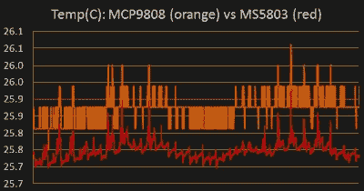

# 热敏电阻的史诗故事:更好的温度传感技巧

> 原文：<https://hackaday.com/2019/07/21/an-epic-tale-of-thermistors-tricks-for-much-better-temperature-sensing/>

多年来[爱德华]一直在建造专业级的水下传感节点，其价格对感兴趣的个人来说是可接受的，无需政府拨款。其中一个重要的组成部分是温度，他一直在寻求从任何部件获得最高精度的温度读数，以达到成本和复杂性之间的最佳平衡。首先是传统的温度传感器 IC，但在部署了大量节点后，[Edward]的精度达到了极限。他能使用 c 杆代码和电路来获得更好的结果吗？简而言之，答案是肯定的，但长的答案是 [，这是 2016 年开始的一系列帖子，详细介绍了【爱德华】实现目标的探索](https://thecavepearlproject.org/2016/06/09/better-thermistor-readings-with-an-arduino-series-resistors-aref/) 。

Orange is 12 bits, red is 24

第一步是热敏电阻，这是一个概念简单的器件:电阻随温度变化(说真的，[传感器还能简单到什么程度呢](https://hackaday.com/2018/04/16/two-cent-temperature-sensors/)？).你可以像测量任何其他电阻一样，通过点击分压器的中心来测量它们，但[Edward]已经放弃了这个想法，因为这种幼稚的方法加上他的 Arduino 10 位 ADC 产生的分辨率太低，不值得满足他的需求。但是，通过使用正确的模拟基准电压并调整分压器，他可以将分辨率提高 20 倍，在相关温度范围内可降至 0.05°C。这也是第一篇文章的[主题。](https://thecavepearlproject.org/2016/06/09/better-thermistor-readings-with-an-arduino-series-resistors-aref/)

接下来是什么？过采样。显然是受到 2015 年 Hackaday 上的一个项目的推动【Edward】踏上了[之旅，将它应用于他的热敏电阻问题](https://thecavepearlproject.org/2017/02/27/enhancing-arduinos-adc-resolution-by-dithering-oversampling/)。直接引用[Edward]的话，要获得“n 个额外的位分辨率，需要读取 ADC 的 4 的 n 次幂”。三位提供了大约一个数量级的更好的分辨率。这有效地让您解析小于单个样本的信号，但前提是您测量的信号中存在抖动。在没有扰动的情况下读取相同的模拟线没有任何好处。本文的其余部分将讨论人工扰动信号的过程，这一过程非常复杂，但 10 位 ADC 的结果大约为 16 位精度！

有什么好处？来自几个无源器件和一个廉价 Arduino 的高质量传感器读数。如果这是你的难题，在设计你的下一个传感项目时，看看这个优秀的系列吧！