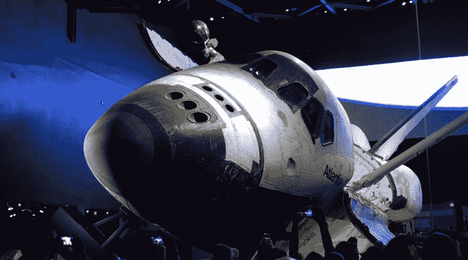
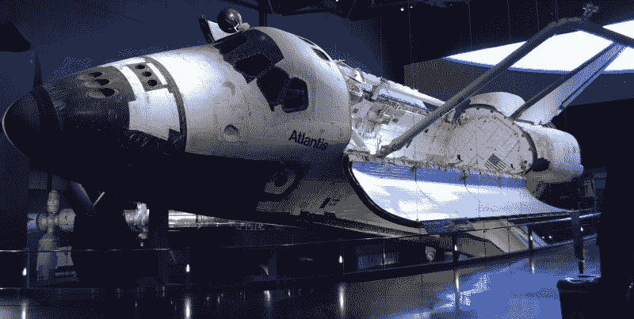
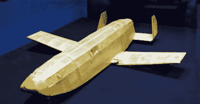
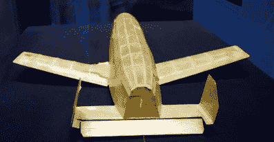
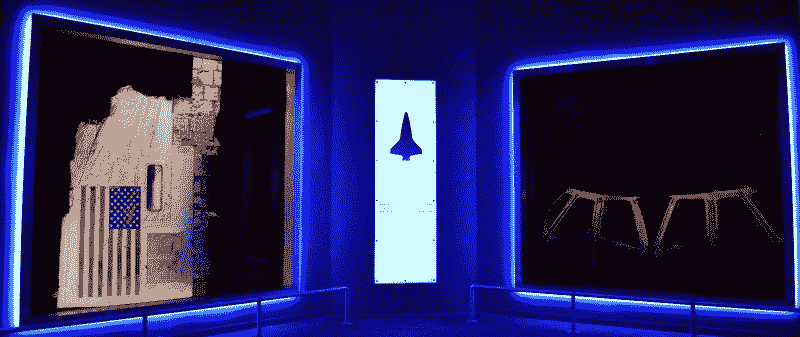
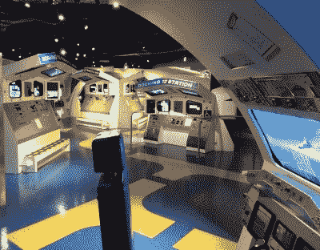

# 亚特兰蒂斯号航天飞机之夜

> 原文：<https://hackaday.com/2019/06/18/an-evening-with-space-shuttle-atlantis/>

当我接到电话问我是否愿意飞往肯尼迪航天中心报道一个事件时，我立即同意了。大约一个星期后，我记得打电话回去问我应该在做什么。这并不重要，如果全国钩针锦标赛在 KSC 举行，我会很乐意写几千字。自从航天飞机计划结束后，我已经多年没有去过那里了，我渴望看到为航天飞机舰队的第四名成员创造的展览。

所以你可以想象当我得知 Hackaday 想让我报道的康乃尔杯决赛将会在正常的公园时间后私下参观 T2 亚特兰蒂斯展览时的反应。之后，比赛的获胜者将在航天飞机本身的下*举行的晚宴上宣布。这对学生来说将是一个难忘的夜晚，这是对他们在比赛中出色表现的应有奖励。*

现在回想起来，康乃尔杯的组织者和甘乃迪太空中心的工作人员确实应该受到表扬。这是一个不可思议的夜晚，和我交谈过的每个人都为这种独特的经历感到谦卑。它有一种真实的、可触知的、你无法制造的能量。当然，那天晚上坐在*亚特兰蒂斯*下的人没有比学生们更兴奋的了。虽然我可能是第二名。

我承认看到这样一个不可思议的工程变成了一件博物馆藏品有点苦乐参半；看起来好像亚特兰蒂斯号随时都可能升空执行另一项任务。但是不可否认的是，这个展览在庆祝航天飞机项目的历史和成就方面做得非常出色。美国国家航空航天局正式认为幸存的航天飞机轨道器是在执行“灵感的使命”，所以它们不是被封存在沙漠中的某个机库里，而是被展出，公众可以近距离接触人类最伟大的成就之一。从我看到的反应来看，任务进行得相当顺利。

如果你有办法这么做，你绝对应该去卡纳维拉尔角一游，去看看亚特兰蒂斯和所有其他收藏在 KSC 的迷人的太空历史。绝对没有什么可以代替看实物，但是如果你不能去佛罗里达，希望这份由你卑微的抄写员提供的报告能让你领略一下展览的魅力。

## 充满感情的介绍

在你亲眼见到亚特兰蒂斯之前，你被引导进入一条长长的走廊，这条走廊盘旋着通向建筑的中心。墙上有航天飞机计划历史上的华丽图片和关于建造和飞行这些不可思议的航天器的励志名言，以安抚你，但它仍然是任何其他名称的线条。设计师们清楚地知道*亚特兰蒂斯*展览将会在 KSC 大受欢迎，所以他们尽一切努力确保长长的参观者队伍尽可能舒适。

当然，随着公园的关闭，我们不必担心拥挤的人群。我们能够快速穿过这个区域，直接进入剧院。在屏幕的两侧，墙上装饰着经典的纸浆艺术概念图像，这些图像与最终的航天飞机略有相似，暗示了我们即将看到的演示。一名 KSC 工作人员随后发言说，我们将观看一部 12 分钟的电影，讲述航天飞机激进设计的起源，以及将其变为现实的挑战。

这部电影本身做得相当好，尽管它确实有点做作的感觉，这似乎是历史重演的标志。他们甚至做了一项令人尊敬的工作，让扮演与项目相关的各种工程师的演员变老，因为他们经历了马克斯·法吉特(Max Faget)早期有翼轨道飞行器概念和 1981 年首次航天飞机飞行之间长达几十年的发展过程。

也就是说，这确实让我觉得亚特兰蒂斯的展示有点奇怪。影片中展示的设计和建造过程显然是为*号【哥伦比亚】号*而设计的，这是[号第一艘投入使用的航天飞机，它在 2003 年](https://hackaday.com/2018/02/01/the-hard-learned-lessons-of-the-columbia-disaster/)悲惨地丢失了。我可以理解展示航天飞机项目起源的愿望，但它的展示方式给我的印象是，大多数人会被引导去相信他们将要看到的是“原始的”航天飞机。

电影结束后，我们被带到另一个影院，这次小得多，有一个环绕式投影屏幕。在这里，你可以看到航天飞机在发射和着陆过程中的真实镜头，以及电脑生成的航天飞机在太空中的效果图。

在演示的最后时刻，*亚特兰蒂斯*出现在太空中，向观众前进。随着喇叭声，屏幕缩回到天花板上，显示出背后真正的航天飞机，悬挂在与视频结尾时相同的角度。这是一个令人印象深刻的效果，观众中可以听到不少真正的喘息声。

## 在巨人面前

我们都看过它们的照片和视频，但如果你从未亲眼见过，你可能不会意识到航天飞机实际上有多大。当屏幕升起时，观众意识到这架巨大的太空飞机的机头一直离我们只有几步远，这非常吓人。在某种潜意识层面上，甚至有点可怕。悬浮在一个超凡脱俗的角度，机械臂伸过你的头顶，你几乎不能相信这是真的。事实上，我无意中听到几个学生互相询问这是真的亚特兰蒂斯还是为展览设计的某种模型。

在这一层，有一条走道贯穿整个轨道器，让你尽可能近距离观看。当飞船的外壳离你只有 4 英尺远的时候，你可以欣赏到所有微小的表面细节，这些细节在照片上是看不到的。许多观察者惊讶地看到，飞船的皮肤不像飞机一样光滑，而是由厚而粗糙的隔热毯拼凑而成。我知道这种想法完全不适合这样一个神奇的机器，但近距离观察，我无法摆脱这种感觉，它看起来有点像一个毛绒玩具。

还有一个高架平台，让你有一个稍微高一点的有利位置。这给了一个很好的视角，可以看到空荡荡的货舱，也是一个认识到这辆车有多大的机会。所有出席的人都可以舒服地挤在这个有富余空间的洞穴空间里。

沿着这条走道点缀着增强现实终端，这些终端将飞船各种组件的标签叠加在背面安装的摄像头提供的实时视频上。您可以触摸不同的图标来获得关于该特定系统的简要描述和特写 3D 渲染。

这是一个有趣的设置，但我必须承认，增强现实方面似乎毫无意义。对于不同高度的观众来说，终端的移动不会超过垂直调整，所以看起来它们可以简单地将信息叠加在航天飞机那一部分的静止图像上。希望将来他们能够改进这个系统，让你可以真正地左右移动终端来获取飞船不同部分的信息。

## 卑微的出身

一旦你看够了亚特兰蒂斯本身，你就下到建筑的一楼，那里是大多数文物和展品的所在地。在这里，你可以看到各种各样的遗物，如在航天飞机计划的最后一次任务中飞行的两个米其林轮胎，以及用于在起飞前将氧气从外部油箱中排出的“无檐帽”通风罩。

它们都以自己的方式引人入胜，但对我来说，这里展出的最令人印象深刻的物品之一是一架小型 balsa 滑翔机。马克斯·法吉特在 1969 年 4 月建造了这个小模型，以展示他对航天器的想法，即像火箭一样垂直发射，像飞机一样水平着陆。

    

总的来说，几乎认不出它是悬挂在空中的航天飞机的原点。只有一点家族相似的迹象:微微上翘的机头，方方正正的机身，以及尾部巨大的“机身襟翼”操纵面。然而，这个小模型是航天器设计发生根本性转变的第一步。

## 纪念逝者

坐落在这样一个地方，你不能不看到它就离开建筑，亚特兰蒂斯展览有一个安静的区域，是献给在航天飞机项目中丧生的 14 名宇航员的。每个宇航员的个人物品都是由他们的家人捐赠的，这些物品陈列在照亮的盒子里，这些盒子排列在一条短走廊上，通向一个安静而光线昏暗的房间。在这里，游客们看到了一幅罕见而发人深省的景象:挑战者号*的*机身的一大部分，以及来自*哥伦比亚号*的驾驶舱窗框。

通过让游客在看到残骸之前浏览 14 名宇航员的生活快照，纪念馆清楚地表明，虽然失去挑战者号和 T2 号的物质成本对航天飞机项目和整个美国宇航局来说是巨大的:但人的因素永远不应被忘记。

## 灵感的使命

正如我在开始时所说的，对我经历的简单描述并不能代替亲自观看亚特兰蒂斯的展览。这些是对我来说最突出的元素，但只代表了所有要看和要做的事情的一小部分。从令人印象深刻的航天飞机发射模拟器到哈勃太空望远镜的全尺寸模型，这座建筑里有如此多的东西，没有两个参观者会有相同的经历。

Good luck getting on one of these during normal hours.

但是无论你在亚特兰蒂斯号航天飞机的永久家园规划什么样的路线，有一件事是非常清楚的:美国国家航空航天局做了令人难以置信的工作来纪念这个项目，并通过这个展览让所有年龄的游客都可以参观。虽然普遍的共识是，在没有明确继任者的情况下退役航天飞机是一个错误，但美国航天计划仍在感受其影响，看到一屋子的大学生如何爬过展览的每一英寸，让我意识到这真的是一把双刃剑。

公众在航天飞机运行期间从未有过这种程度的接触，现在他们退休了，他们将以一种以前不可能的方式激励未来的科学家和工程师。亚特兰蒂斯号也许再也不能飞行了，但显然她的使命还远未结束。