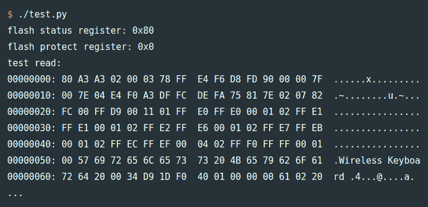

# 使用 GreatFET 进行固件转储的练习

> 原文：<https://hackaday.com/2021/06/04/an-exercise-in-firmware-dumping-with-the-greatfet/>

为了磨练自己的硬件黑客技能，詹姆斯·钱伯斯(James Chambers)最近开始对一种普通的廉价无线键盘进行逆向工程:罗技 K360。它使用的芯片组已经被安全研究人员很好地探索(和利用)，但这里的目标更多的是获得一些实际的实践经验，而不是开辟任何新的领域。

[我们确信这将是一个引人入胜的系列文章](https://jamchamb.net/2021/05/29/dumping-k360-firmware.html)中的第一篇文章是关于使用 GreatFET 清除电路板固件的。事实上，我们还没有看到太多展示这种[高性能开放硬件多工具](https://hackaday.com/2019/07/02/hands-on-greatfet-is-an-embedded-tool-that-does-it-all/)的项目，所以这篇文章很好地展示了如何编写必要的 Python 脚本，以便在实际场景中使用它。

Some promising bytes.

当然，即使有最好的工具，也总会有一些绊脚石。在识别出 K360 的小型 PCB 上明显是某种编程头之后，在[James]意识到他需要接入键盘的 nRF24LE1 微控制器上的更多引脚之前，他在读取固件方面进行了几次失败的尝试。一旦所有东西都连接好，他就为 GreatFET 写了一些代码，这些代码将在芯片的`PROG`和`RESET`引脚上执行适当的咒语，以启用其编程接口。

[James]继续解释如何从硬件中提取一些扩展芯片信息，并使用 Gihdra 验证固件转储的内容，但任何更高级的分析都必须等到本系列的下一篇文章。与此同时，如果你喜欢从这个“肩膀后面”的角度阅读硬件黑客，你应该[看看](https://hackaday.com/2020/04/08/a-hackers-guide-to-jtag/)[【错误波特】在过去一年左右的时间里发来的一些精彩作品](https://hackaday.com/2020/01/07/poking-around-inside-a-pair-of-classic-gaming-gifts/)。