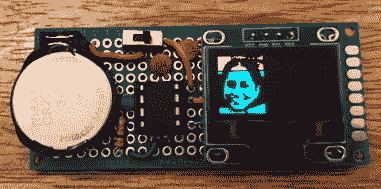

# 由 ATtiny85 驱动的有机发光二极管相框

> 原文：<https://hackaday.com/2021/07/19/an-oled-photo-frame-powered-by-the-attiny85/>

制作自己的数码相框，从 SD 卡中加载图像，并通过 ESP32 等现代微控制器在液晶显示器上显示这些图像，是一个下午的项目，如果你引入别人的代码，就更不用说了。但是，如果您没有最新、最好的硬件，该怎么办呢？

无论你将其视为实际应用还是从低端硬件中获取更多性能的有趣实验，[Assad Ebrahim]使用 ATtiny85 在有机发光二极管上显示数字照片的演示都非常值得一看。整个系统可以用几个常见的组件放在一块废弃的 perfboard 上，并可以在 CR2032 硬币电池上循环播放存储在芯片闪存中的五幅图像长达 20 小时。

 正如你所料，这个项目中最大的挑战是让所有的代码和数据都适合 ATtiny85。为此，[Assad]为 SSD1306 有机发光二极管显示器编写了自己的最小驱动程序，因为传统的 Adafruit 代码占用了太多空间。该驱动程序是一个非常简单的实现，但它足以初始化屏幕并为输入数据做好准备。他的代码还可以在可接受的范围内通过 Atmel 的通用串行接口(USI)模拟 I2C，只要你将芯片提升到 8 MHz。

对于这些图像，[Assad]详细描述了他用来获取高分辨率彩色文件并将其转换为显示字节数组的工作流程。其中一部分只是缩小并转换为 1 位颜色，但也有一些自定义的 Forth 代码，将结果数据转换为他的代码期望的格式。

这不是我们第一次看到有人将这些普通的有机发光二极管显示器与 ATtiny85 一起使用，看看他们的技术如何比较是很有趣的。这不是我们自愿选择的组合，但有时你必须利用一切可能的东西。