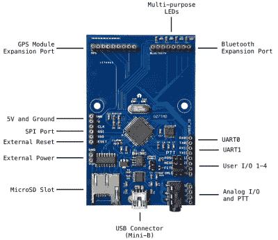

# 面向现代的开放式硬件调制解调器

> 原文：<https://hackaday.com/2020/06/09/an-open-hardware-modem-for-the-modern-era/>

一定年龄的读者无疑会记得曾经坐在电脑旁边的外置调制解调器，疯狂闪烁的 led 和熟悉的刺耳尖叫宣告着你即将连接到一个无限可能的领域。相比之下，如今连接互联网就像打开厨房的灯一样令人兴奋。或许更少。

但是，虽然我们不再使用它们将我们的设备连接到互联网，但这并不意味着模拟调制解调器完全没有用。由[Mark Qvist]开发的 [OpenModem 是一款开放的硬件和软件音频频移键控(AFSK)调制解调器](https://unsigned.io/openmodem/)，它让人想起了那些早期设备的一些魅力(和连接速度)。

 它主要用于分组无线电通信，因此被设计成通过标准的 3.5 毫米插孔连接器来配合无线电的一键通功能。对 AES-128 加密的支持意味着窃听你的通信需要比 RTL-SDR 多一点的时间。虽然如果你真的担心其他人监听，项目页面说你甚至可以像过去一样通过有线连接使用 OpenModem。

如果你只是想要一个简单可靠的方法来获得一个安全的 AFSK 通信链路，OpenModem 看起来会是一个很好的选择。不仅如此，它还为学习和实验提供了一个引人注目的平台。硬件与 Arduino IDE 兼容，因此如果您想在这款经典的通信设备上运行自己的软件，您甚至可以编写自己的固件。

OpenModem 是几年前[Mark]开发的微型调制解调器的演变，很明显这个项目从那时起已经走过了很长的路。当然，如果你对外观比对底层技术更感兴趣，你总是可以[把一个 WiFi 接入点放进一个老式模拟调制解调器](https://hackaday.com/2018/02/26/old-modem-new-internet/)的盒子里。

【感谢 Boofdas 的提示。]