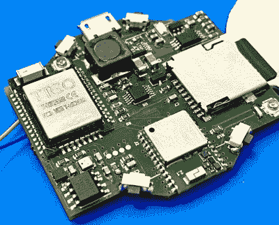

# 你会戴的开源智能手表

> 原文：<https://hackaday.com/2021/04/08/an-open-source-smart-watch-youd-actually-wear/>

这些年来，我们已经看到了许多开源智能手表，虽然从技术角度来看，它们确实令人印象深刻，但它们在适合度和光洁度方面往往还有待改进。暴露在外的多氯联苯和单色的有机发光二极管显示器可能适合去黑客空间，但它不会是我们约会晚装的首选。

从【pauls _ 3d _ things】进入[开放式智能手表。这款由 ESP32 供电的手表在一个 3D 打印外壳内封装了一个华丽的圆形 240×240 TFT 显示屏、DS323M RTC、BMA400 三轴加速度计和 450 mAh 电池，可以在普通台式机上生产。ESP32 提供 WiFi 和蓝牙连接，但也有一个增强版的 PCB，增加了另外 4 MB 的 RAM，一个微型 SD 插槽和一个 Quectel L96 GPS 接收器。](https://open-smartwatch.github.io/)

The GPS edition of the PCB

由于这是一个开源项目，你可以免费下载 PCB 设计文件，并自行生产电路板，但[pauls_3d_things]实际上已经与 LILYGO 合作进行了一系列开放式智能手表电子产品，你现在就可以在全球速卖通买到这些产品，价格仅为 24 美元。你仍然需要单独订购电池，并 3D 打印你自己的外壳，但对我们来说，这仍然是一笔非常划算的交易。

在软件方面，现在事情还很简单。这款手表可以使用预先配置的 WiFi 网络从 NTP 更新时间，还包括蓝牙媒体控制器和秒表。当然，随着越来越多的人将硬件拿在手中(或戴在手腕上，视情况而定)，我们可能会开始看到更多的功能添加到核心操作系统中。

虽然让我们自己的代码在商业生产的智能手表上运行很有希望，但开放式智能手表可以说是两个世界中最好的。与 LILYGO 的合作为开放硬件项目带来了专业的制作，GPLv3 授权的固件已经成熟，可以进行黑客攻击了。我们非常兴奋地看到社区采取这个项目，并完全期待开始看到这些手表在野外，一旦我们可以再次有适当的缺点。

 [https://www.youtube.com/embed/H_wIBtgMt6c?version=3&rel=1&showsearch=0&showinfo=1&iv_load_policy=1&fs=1&hl=en-US&autohide=2&wmode=transparent](https://www.youtube.com/embed/H_wIBtgMt6c?version=3&rel=1&showsearch=0&showinfo=1&iv_load_policy=1&fs=1&hl=en-US&autohide=2&wmode=transparent)

