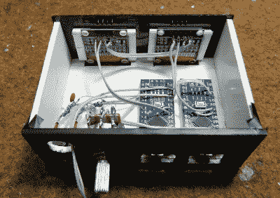

# 模拟式 VU 仪表，带 Arduino 和有机发光二极管显示器

> 原文：<https://hackaday.com/2021/07/14/analog-style-vu-meter-with-arduino-and-oled-display/>

寻找经典模拟音量单位(VU)仪表的数字再现？如果你有一个 Arduino、一些无源元件和一个 SSD1306 有机发光二极管，[那么[mircemk]可能有你想要的答案](https://hackaday.io/project/180719-diy-arduino-analog-vu-meter-on-i2c-oleds)。正如你在下面的视频中看到的，他的代码将一些廉价的零件变成了一个有吸引力的功能性音频显示器。

 该项目的黑客日。IO page 解释说，这个想法是基于[stevenart]的工作，代码适用于 SSD1306 显示器，并对电路进行了一些调整。虽然[mircemk]说只要两个显示器没有冲突的 I2C 地址，就可以为立体声修改代码，但他决定简单地为每个通道复制整个设置，以保持简单。尽管这些零件现在很便宜，但很难责怪他。

[mircemk]提供了几种不同风格的 VU 指示器的源代码，这些指示器的颜色可以根据您的喜好轻松反转。他还澄清说，在视频中看到的虚拟“针”的不平稳运动是由于相机；在现实生活中，它像真正的文章一样流畅。

很像旨在[用电子纸显示器](https://hackaday.com/2020/09/18/radon-monitor-recreates-steam-gauge-with-e-ink/)重建真实的“蒸汽表”的项目，这是一项优秀的技术，可以存档以供将来使用。与真正的模拟仪表相比，这些数字娱乐实现起来越来越快，加上走这条路线[防止任何古董硬件上砧板](https://hackaday.com/2020/08/15/vintage-ammeter-becomes-plant-moisture-gauge/)。

 [https://www.youtube.com/embed/Wsuehxhob-c?version=3&rel=1&showsearch=0&showinfo=1&iv_load_policy=1&fs=1&hl=en-US&autohide=2&wmode=transparent](https://www.youtube.com/embed/Wsuehxhob-c?version=3&rel=1&showsearch=0&showinfo=1&iv_load_policy=1&fs=1&hl=en-US&autohide=2&wmode=transparent)

