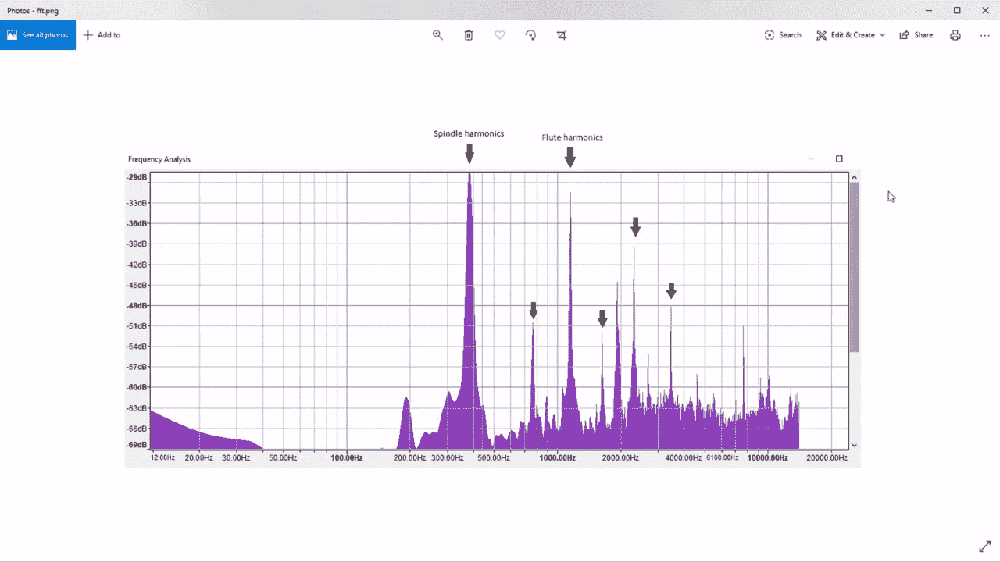

# 大胆分析数控刀具颤振

> 原文：<https://hackaday.com/2020/01/16/analyzing-cnc-tool-chatter-with-audacity/>

当你操作一台足以将坚固的金属块撕成碎片的机器时，关注细节是有好处的。现代数控机床主轴的角动量如果以错误的方式释放，可能会带来麻烦，这就是为什么几代机械师已经发展出一只耳朵来听即将到来的厄运的警告信号:颤振。

为了帮助开发这种耳朵，[Zachary Tong]在他的新数控机器的“第一个芯片”亮相期间，对其声音进行了频谱分析。台式机器也不逊色 Avid Pro 2436，配有 3 马力 S30C 换刀主轴。但像任何台式机器一样，它缺乏减少振动所需的绝对质量，并且刀具颤振可能是一个问题。

 分析开始于下面视频中大约 5:13 的标记处，在那里[扎克]将他视频的配乐输入 Audacity。从波形模式切换到频谱模式，他能够识别大约 5000 赫兹的强信号，对应于主轴达到速度。喷雾冷却系统的白噪声也清晰可见，就像频谱上下的谐波振动一样。不过，最有趣的是切割过程中频率的轻微下降，这表明主轴上有负载。[Zach]然后在频域中分析来自切割的数据，并找到预期的主轴谐波，以及来自刀具上三个凹槽的谐波。混杂在这些信号中的是尖峰信号，表明存在震颤——虽然不严重，但仍足以测量。

Audacity 已经被证明是一个非常有用的工具，具有广泛的应用。无论是[寻找蝙蝠](https://hackaday.com/2019/10/17/worried-about-bats-in-your-belfry-a-tale-of-two-bat-detectors/)、[倾倒 rom](https://hackaday.com/2016/04/12/dump-your-old-computers-rom-using-audacity/)、[探测雷击](https://hackaday.com/2017/06/10/detect-lightning-strikes-with-audio-equipment/)，还是[克隆遥控器](https://hackaday.com/2019/12/11/cloned-gate-remote-does-it-slightly-better/)，Audacity 经常是黑客的首选工具。

 [https://www.youtube.com/embed/qiM20-woEOk?version=3&rel=1&showsearch=0&showinfo=1&iv_load_policy=1&fs=1&hl=en-US&autohide=2&wmode=transparent](https://www.youtube.com/embed/qiM20-woEOk?version=3&rel=1&showsearch=0&showinfo=1&iv_load_policy=1&fs=1&hl=en-US&autohide=2&wmode=transparent)

