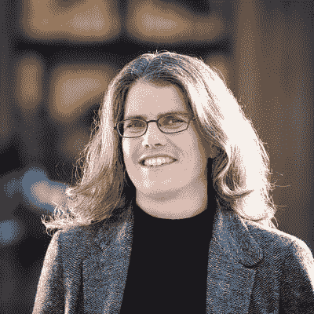
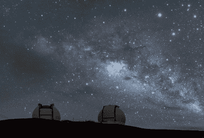

# 安德里亚·盖兹凝视着我们星系的黑洞

> 原文：<https://hackaday.com/2020/10/13/andrea-ghez-gazes-into-our-galaxys-black-hole/>

几十年前，爱因斯坦预言了他不相信的东西的存在——黑洞。从那以后，人们一直试图一瞥这些代表我们对物理学理解极限的塌缩恒星。

在过去的 25 年里，安德里亚·盖兹将目光投向了我们银河系中心的黑洞，人马座 A *，试图最终证明它的存在。在早期，她的提议被完全驳回。然后她开始因此受到称赞。安德里亚在 2008 年获得了麦克阿瑟奖学金。2012 年，她是第一位获得瑞典皇家科学院颁发的克拉福德奖的女性。

Image via [SciTech Daily](https://scitechdaily.com/andrea-ghez-wins-share-of-2020-nobel-prize-for-discoveries-in-black-hole-physics/)

现在，安德里亚成为了第四位因她的发现而获得诺贝尔物理学奖的女性。她与罗杰·彭罗斯和莱因哈德·根泽尔因为发现了黑洞而分享了该奖。加州大学洛杉矶分校发布了她成为诺贝尔奖得主的优雅反应。

## 一个明星的诞生

安德里亚·米娅·盖兹 1965 年 6 月 16 日出生于纽约市，但在芝加哥的海德公园区长大。她对天文学的热爱是和阿波罗计划一起开始的。有一次她看到了登月，她告诉父母她想成为第一个女宇航员。他们给她买了一架望远镜，从那以后她就一直关注着星星。现在，安德里亚每年六次参观世界上最大的凯克望远镜。

安德里亚从小就对数学和科学感兴趣，经常会问一些关于宇宙的大问题。她于 1987 年获得麻省理工学院学士学位，1992 年获得加州理工学院博士学位。当她还在研究生院的时候，她就有了一个关于恒星形成的重大发现——大多数恒星都有伴星。从加州理工学院毕业后，安德里亚成为了加州大学洛杉矶分校的物理学和天文学教授，这样她就可以使用夏威夷莫纳克亚山上的凯克望远镜。

The Keck telescopes and the Milky Way. Image via [Flickr](https://www.flickr.com/photos/bpcooper/27449080264/)

## 银河系的中心

自 1995 年以来，安德里亚将凯克望远镜对准了我们银河系的中心，距离我们大约 25000 光年。有很多气体和尘埃遮住了视线，所以她和她的团队不得不创造性地使用一种叫做[自适应光学](https://en.wikipedia.org/wiki/Adaptive_optics)的东西。这种方法通过实时变形望远镜的反射镜来克服大气中的波动。

多亏了自适应光学，Andrea 和她的团队能够捕捉到比以前清晰 10-30 倍的图像。通过研究悬挂在中心附近的恒星的轨道，她能够确定那里一定存在一个质量是太阳 400 万倍的超大质量黑洞。多亏了这台望远镜，安德里亚和其他科学家将能够在家研究黑洞对重力和星系的影响。你可以在休息后的视频中观看她简要说明她的工作。恭喜你，盖兹博士，为又一个 25 年卓有成效的研究干杯。

 [https://www.youtube.com/embed/AZ66KPm3k-U?version=3&rel=1&showsearch=0&showinfo=1&iv_load_policy=1&fs=1&hl=en-US&autohide=2&wmode=transparent](https://www.youtube.com/embed/AZ66KPm3k-U?version=3&rel=1&showsearch=0&showinfo=1&iv_load_policy=1&fs=1&hl=en-US&autohide=2&wmode=transparent)

