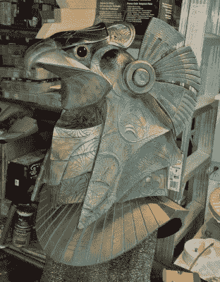

# 宣布:2022 年 Hackaday.io 科幻竞赛

> 原文：<https://hackaday.com/2022/03/10/announcing-the-2022-hackaday-io-sci-fi-contest/>

女士们先生们，有意识的机器人，来自遥远未来的旅行者，或者来自外环的外星人，是时候[进入 2022 年 Hackaday.io 科幻大赛](https://hackaday.io/contest/184314-sci-fi-contest)了！

我们[上次举办科幻竞赛](https://hackaday.io/submissions/2017-sci-fi-contest/list)是在很久很久以前——在 Voigt-Kampff 机器在 2019 年洛杉矶的砂砾街道上检测复制人之前。当时，我们有一些来自这个世界之外的条目。续集时间到了。

感谢比赛的赞助商 Digi-Key，你最好的爆破手、你最酷的服装或你最正直的机器人可以为你赢得在他们的零件仓库进行的三次价值 150 美元的购物狂欢中的一次。创建一个 [Hackaday.io 项目](https://hackaday.io/project/46-hackadayio-project/log/460-everything-101)，将它加入竞赛，就大功告成了。你最好现在就做，但比赛将于 4 月 25 日结束。

 科幻是关于外表的，所以如果纯粹是装饰性的，一定要用科学(虚构)蒙蔽我们。如果您的项目实际运行，那就更好了！当然，我们想知道它是如何工作的，你是如何制作的，所以项目的文档是另一个重要的得分类别。不管它是什么，它必须是科幻的，而且必须有一些电子设备在里面。

如果你正在寻找灵感，你可以做得比看看[杰罗姆·凯尔蒂]的[电子动画星际之门头盔](https://hackaday.io/project/7142-animatronic-stargate-helmet)更糟糕，它在上一次获得大奖并非巧合。这是一个集艺术和工程于一身的杰作，关于它是如何制造的描述也同样广泛。[Jochen Alt][保罗](https://hackaday.io/project/20045-paul)“机器人并没有脱离我们所知的任何特定科幻特许经营，但在一个球上滚动和背诵机器人诗歌，它绝对应该是。

### 荣誉奖

除了总奖项，我们还将表彰以下荣誉奖类别中的最佳项目:

*   无论你是“把我传送出去”还是“使用原力”，任何一个“明星”系列的粉丝都有资格获得这项荣誉奖。
*   **ExoSuit** :这个类别认可你可以穿的科幻作品。服装和盔甲适合这里。
*   从片场偷来的:如果你的爆破枪和韩·索罗的一模一样，你就是赢家。这是你的最佳道具复制品的类别。
*   **生活在未来**:如果你的科幻设备在想象时纯粹是幻想，但现在已经可以实现了，那你就是生活在未来。一个正常工作的三录仪或一个正常工作的机器人伴侣在这里会很合适。
*   最重要的设备:没有功能，但看起来确实有。[只是来回闪烁的闪光灯，然而政府却为此花费了数百万美元](https://www.youtube.com/watch?v=phPp5oYnps0)。

你不必告诉我们你的项目适合哪里。我们会掩护你的。

## 交战！

现在就开始在 Hackaday.io 上创建一个项目页面。在您的项目页面的左侧栏中，使用“提交项目至”按钮来参加 2022 年科幻竞赛。

从现在到 2022 年 4 月 25 日，你必须完成它。当然，如果你的时光机真的*工作*，你随时都可以完成。查看 [Hackaday.io 竞赛页面](https://hackaday.io/contest/184314-sci-fi-contest)了解所有的细则。