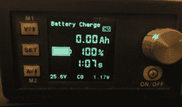

# 另一个 DPS5005 替代固件

> 原文：<https://hackaday.com/2022/01/22/another-dps5005-alternative-firmware/>

这些便宜的中国制造的可编程电源并不新鲜，我们已经用了很多年了。它们不是特别好的电源，因为电流反馈是在软件中，但对于一些任务来说，它们非常适合，你不能否认价格。替代固件项目也已经有一段时间了，但我们还没有见过像[Profi-max]的这个[最新 DPS 固件项目](https://profimaxblog.ru/dps_update/)这样有能力和完善的。]我们还没有碰到源代码，但至少二进制图像是[免费下载的](https://profimaxblog.ru/dps_fw_flashing/)。 

该固件有一些有趣的功能，如用于电池充电应用的可编程预置。事实上，有一个专用的电池充电模式屏幕。然而，我们想警告的是，用这个给锂离子电池充电可能一点也不明智，至少是因为缺乏适当的保护硬件。这样很容易损坏设备或使电池过热！然而，如果你必须这样做，有一些功能可以帮助你，比如一个方便的“计数器”屏幕显示大约的费用。

像往常一样，远程可编程性是通过容易侵入的串行端口，如果有线 USB 串行不适合，则固件支持蓝牙串行模块。对于那些喜欢以不同方式安装东西的人来说，屏幕可以在通电时按住一个键来旋转，或者如果你连接一个 MPU6050 加速度计/陀螺仪模块，它甚至会自动旋转！

要更新库存 DPS 装置，唯一的要求是访问 ST-Link 兼容的编程器加密狗，以 STM32 SWD 编程接口和 [STM32CubeProgrammer](https://www.st.com/en/development-tools/stm32cubeprog.html) 实用程序为目标。除此之外，开源替代方案也是可用的， [stlink](https://github.com/stlink-org/stlink) 是一个不错的选择。一旦将模块 PCB 从其塑料外壳中取出，只需将三根电线固定在一组方便的衬垫上，即可完成与编程器加密狗的连接。很简单的东西。

如果你正在寻找一个类似的项目，源代码立即可用，那么检查一下我们几年前覆盖的 [OpenDPS 项目](https://hackaday.com/2017/03/07/open-source-firmware-for-a-cheap-programmable-power-supply/)，如果你想疯狂地建立一个 DIY 开源电子实验室，[我们让你覆盖](https://hackaday.com/2020/05/25/a-diy-electronics-lab-you-can-show-off-with-pride/)。

 [https://www.youtube.com/embed/gDQz1P9-P6w?version=3&rel=1&showsearch=0&showinfo=1&iv_load_policy=1&fs=1&hl=en-US&autohide=2&wmode=transparent](https://www.youtube.com/embed/gDQz1P9-P6w?version=3&rel=1&showsearch=0&showinfo=1&iv_load_policy=1&fs=1&hl=en-US&autohide=2&wmode=transparent)

谢谢[卢克]的提示！